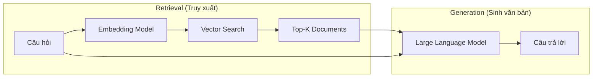
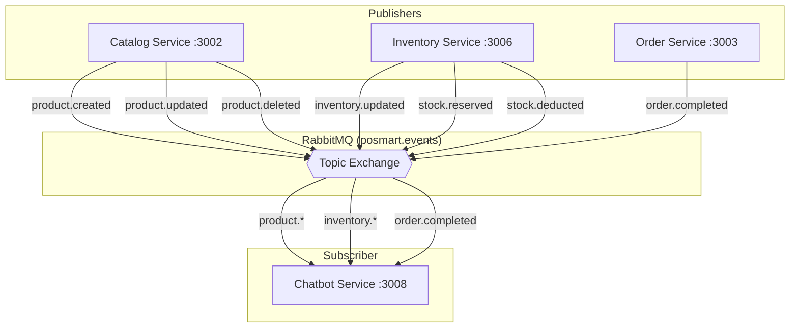
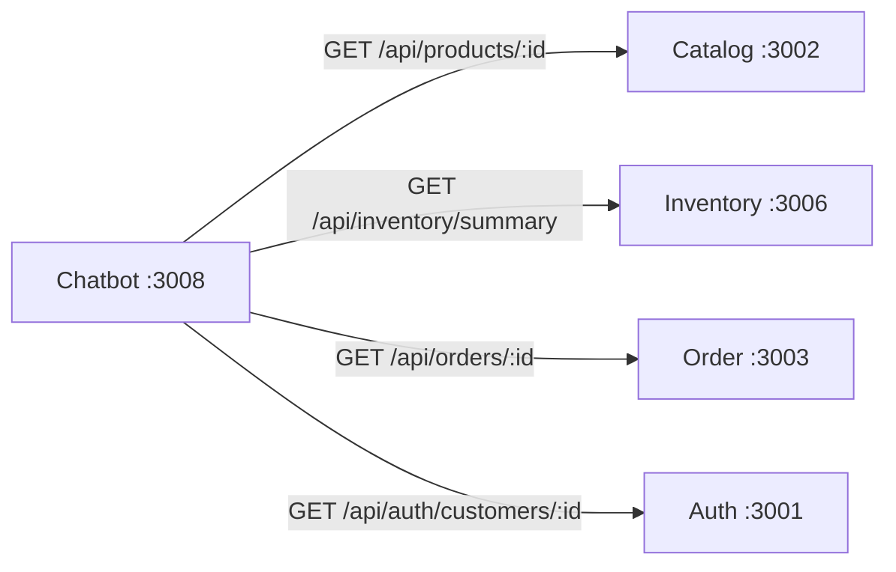
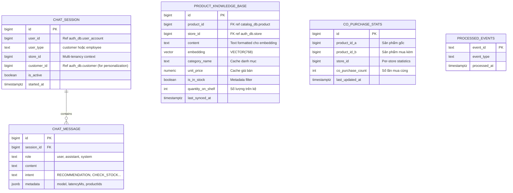
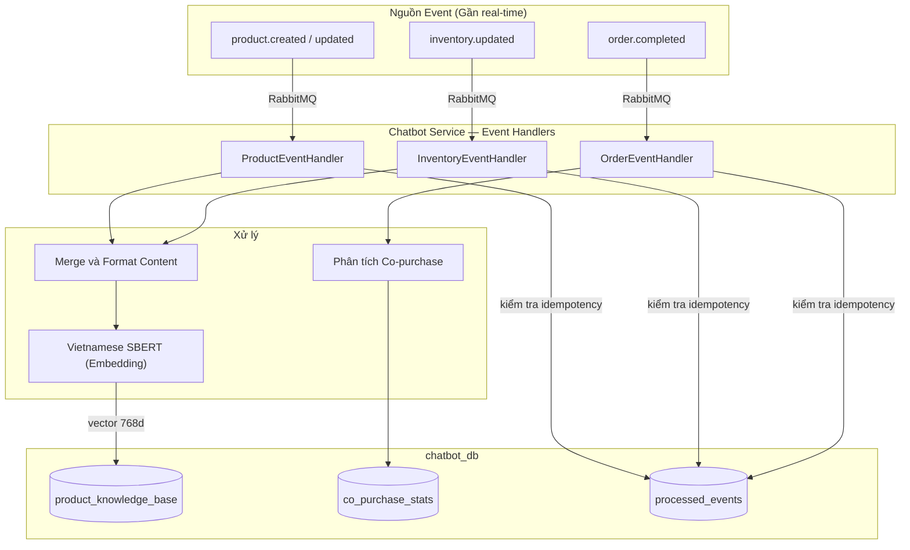
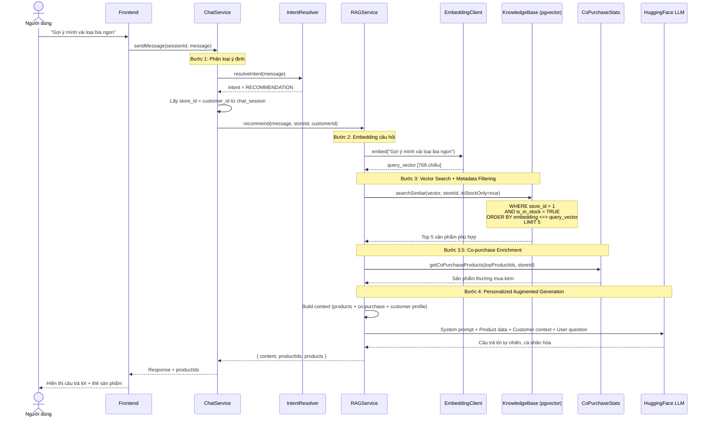
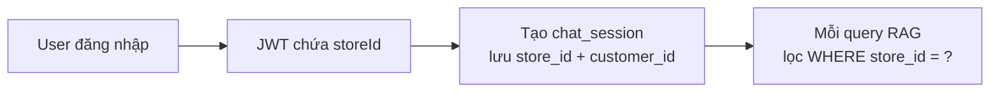
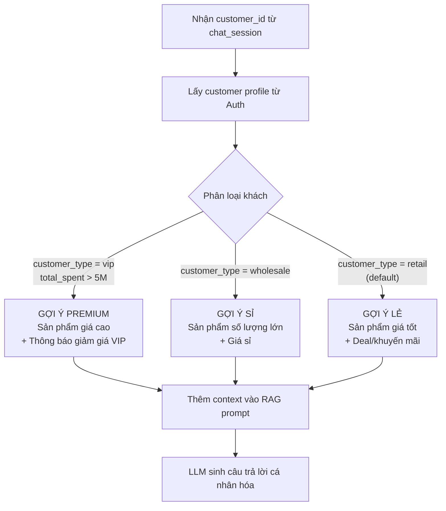
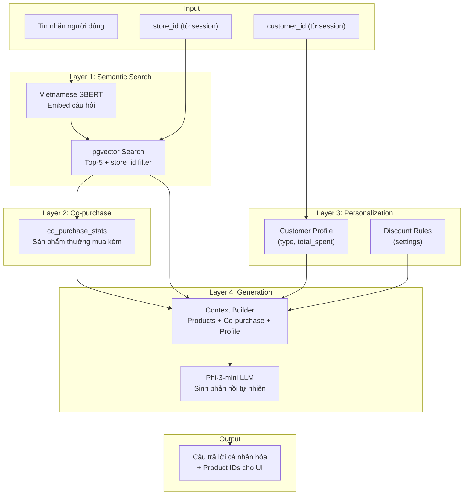

# BÁO CÁO ĐỒ ÁN: MODULE CHATBOT AI SỬ DỤNG RAG
## Hệ thống Quản lý Chuỗi Siêu thị Mini — POSMART

---

## MỤC LỤC

1. [Yêu cầu nghiệp vụ](#1-yêu-cầu-nghiệp-vụ)
2. [Nền tảng lý thuyết](#2-nền-tảng-lý-thuyết)
3. [Giao tiếp với các service khác](#3-giao-tiếp-với-các-service-khác)
4. [Thiết kế cơ sở dữ liệu](#4-thiết-kế-cơ-sở-dữ-liệu)
5. [Pipeline xử lý dữ liệu cho RAG (Event-Driven)](#5-pipeline-xử-lý-dữ-liệu-cho-rag-event-driven)
6. [Luồng xử lý truy vấn RAG](#6-luồng-xử-lý-truy-vấn-rag)
7. [Các nghiệp vụ Chatbot xử lý](#7-các-nghiệp-vụ-chatbot-xử-lý)
8. [Tích hợp Multi-Tenancy](#8-tích-hợp-multi-tenancy)
9. [Mở rộng: Personalization và Recommendation nâng cao](#9-mở-rộng-personalization-và-recommendation-nâng-cao)

---

## 1. YÊU CẦU NGHIỆP VỤ

1. **Gợi ý sản phẩm theo ngữ nghĩa:** Hiểu ý định người dùng kể cả khi không dùng đúng tên sản phẩm.
2. **Chỉ gợi ý hàng còn trên kệ:** Lọc theo `is_in_stock = TRUE` và `store_id` cụ thể.
3. **Multi-tenancy:** Mỗi chi nhánh có tồn kho riêng. Kết quả gợi ý phải đúng chi nhánh mà khách đang chọn.
4. **Phản hồi tự nhiên bằng tiếng Việt:** Kết hợp dữ liệu thực với mô hình ngôn ngữ lớn (LLM) để sinh câu trả lời thân thiện.
5. **Đồng bộ dữ liệu gần real-time:** Sử dụng Event-Driven Sync (RabbitMQ) để cập nhật knowledge base ngay khi sản phẩm hoặc tồn kho thay đổi.
6. **Cá nhân hóa gợi ý:** Dựa trên loại khách hàng (VIP, sỉ, lẻ) và lịch sử mua hàng để điều chỉnh kết quả recommendation.

---

## 2. NỀN TẢNG LÝ THUYẾT

### 2.1 RAG — Retrieval-Augmented Generation

RAG là kỹ thuật kết hợp hai thành phần:



- **Retrieval:** Chuyển câu hỏi thành vector, tìm kiếm các tài liệu có ngữ nghĩa gần nhất trong cơ sở tri thức.
- **Generation:** Đưa tài liệu tìm được vào prompt của LLM, giúp model sinh câu trả lời dựa trên **dữ liệu thực** thay vì chỉ dựa vào kiến thức huấn luyện.

**Ưu điểm RAG so với Fine-tuning:**
- Không cần huấn luyện lại mô hình khi dữ liệu thay đổi.
- Dữ liệu luôn cập nhật (qua pipeline đồng bộ).
- Chi phí thấp hơn đáng kể.

### 2.2 Vector Embedding và Cosine Similarity

**Embedding** là quá trình chuyển đổi văn bản thành vector số trong không gian nhiều chiều (768 chiều trong dự án này). Các văn bản có ngữ nghĩa tương tự sẽ có vector **gần nhau** trong không gian embedding.

**Cosine Similarity** đo độ tương đồng giữa hai vector:

```
similarity(A, B) = (A . B) / (||A|| x ||B||)
```

Giá trị từ -1 đến 1, trong đó 1 = hoàn toàn giống nhau.

### 2.3 pgvector và HNSW Index

**pgvector** là extension cho PostgreSQL hỗ trợ kiểu dữ liệu `VECTOR` và các phép toán vector search.

| Tham số | Giá trị trong dự án | Giải thích |
|---------|---------------------|------------|
| Dimension | 768 | Số chiều embedding (khớp với Vietnamese SBERT) |
| Distance metric | Cosine (`<=>`) | Phù hợp cho NLP embeddings đã normalize |
| Index type | **HNSW** | Hierarchical Navigable Small World — nhanh hơn IVFFlat cho dataset < 1M records |

### 2.4 Mô hình Embedding: Vietnamese SBERT

Dự án sử dụng `keepitreal/vietnamese-sbert` — mô hình Sentence-BERT được huấn luyện riêng cho tiếng Việt.

| Đặc điểm | Chi tiết |
|-----------|----------|
| Base model | PhoBERT |
| Output dimension | 768 |
| Ngôn ngữ | Tiếng Việt (tối ưu) |
| Runtime | `@xenova/transformers` (ONNX, chạy trên CPU) |
| Quantization | INT8 (giảm 4x kích thước, giữ 99% accuracy) |

### 2.5 Mô hình sinh văn bản: Phi-3-mini-4k-instruct

| Đặc điểm | Chi tiết |
|-----------|----------|
| Provider | Microsoft (via HuggingFace Inference API) |
| Parameters | 3.8B |
| Context window | 4096 tokens |
| Vai trò | Nhận dữ liệu sản phẩm từ RAG, sinh phản hồi tự nhiên |

---

## 3. GIAO TIẾP VỚI CÁC SERVICE KHÁC

Chatbot tương tác với các service qua **hai cơ chế**:

### 3.1 Event-Driven (RabbitMQ) — Đồng bộ dữ liệu



| Event | Publisher | Xử lý tại Chatbot |
|-------|----------|-------------------|
| `product.created` | Catalog | Tạo record mới trong knowledge base, embed và lưu vector |
| `product.updated` | Catalog | Cập nhật content, re-embed vector |
| `product.deleted` | Catalog | Xóa record khỏi knowledge base |
| `inventory.updated` | Inventory | Cập nhật `is_in_stock`, `quantity_on_shelf` |
| `stock.deducted` | Inventory | Cập nhật số lượng tồn kho sau bán hàng |
| `order.completed` | Order | Ghi nhận co-purchase data (sản phẩm mua cùng nhau) |

### 3.2 HTTP Internal — Truy vấn theo yêu cầu



| Call | Mục đích | Khi nào |
|------|----------|---------|
| Catalog | Lấy chi tiết sản phẩm | User hỏi về sản phẩm cụ thể |
| Inventory | Lấy tồn kho real-time | User kiểm tra hàng còn không |
| Order | Tra cứu đơn hàng | User hỏi trạng thái đơn |
| Auth | Lấy thông tin khách hàng (customer_type, total_spent) | Personalization gợi ý |

---

## 4. THIẾT KẾ CƠ SỞ DỮ LIỆU

### 4.1 Sơ đồ ERD — chatbot_db



### 4.2 Chi tiết bảng product_knowledge_base

Bảng trung tâm của hệ thống RAG, lưu trữ embedding vector cho mỗi sản phẩm tại mỗi chi nhánh.

**Thiết kế SQL:**

```sql
CREATE TABLE product_knowledge_base (
    id BIGINT PRIMARY KEY GENERATED ALWAYS AS IDENTITY,
    product_id BIGINT NOT NULL,
    store_id BIGINT NOT NULL,
    content TEXT NOT NULL,
    embedding VECTOR(768),
    category_name TEXT,
    unit_price NUMERIC DEFAULT 0,
    is_in_stock BOOLEAN DEFAULT TRUE,
    quantity_on_shelf INT DEFAULT 0,
    last_synced_at TIMESTAMPTZ DEFAULT NOW(),
    UNIQUE (product_id, store_id)
);
```

**Chiến lược Index:**

| Index | Kiểu | Mục đích |
|-------|------|----------|
| `idx_pkb_embedding` | HNSW (`vector_cosine_ops`) | Tăng tốc vector similarity search |
| `idx_pkb_store_stock` | B-Tree (partial: `WHERE is_in_stock = TRUE`) | Tối ưu metadata filtering theo store + tồn kho |
| `idx_pkb_product_store` | B-Tree | Tối ưu UPSERT khi đồng bộ dữ liệu |

### 4.3 Bảng co_purchase_stats (Recommendation nâng cao)

Lưu trữ thống kê "sản phẩm thường mua cùng nhau", được cập nhật từ event `order.completed`:

```sql
CREATE TABLE co_purchase_stats (
    id BIGINT PRIMARY KEY GENERATED ALWAYS AS IDENTITY,
    product_id_a BIGINT NOT NULL,
    product_id_b BIGINT NOT NULL,
    store_id BIGINT NOT NULL,
    co_purchase_count INT DEFAULT 1,
    last_updated_at TIMESTAMPTZ DEFAULT NOW(),
    UNIQUE (product_id_a, product_id_b, store_id)
);

CREATE INDEX idx_copurchase_lookup
    ON co_purchase_stats(product_id_a, store_id)
    WHERE co_purchase_count >= 3;
```

Khi có event `order.completed` chứa nhiều sản phẩm, hệ thống sẽ:
1. Lấy danh sách sản phẩm trong đơn hàng.
2. Tạo tất cả các cặp (A, B) và UPSERT vào `co_purchase_stats`.
3. Khi gợi ý sản phẩm, kết hợp Top-K vector search với co-purchase data.

### 4.4 Cột content — Template cho Embedding

Cột `content` lưu trữ văn bản đã được format theo mẫu chuẩn, dùng làm đầu vào cho embedding model:

```
Sản phẩm "Coca Cola", danh mục "Nước giải khát", giá 12.000 VND,
nhà cung cấp "Coca-Cola Vietnam", hiện còn 48 sản phẩm trên kệ.
```

Mẫu này được thiết kế **tối ưu cho Vietnamese SBERT** vì:
- Sử dụng ngôn ngữ tự nhiên tiếng Việt thay vì key-value.
- Bao gồm cả ngữ cảnh (danh mục, giá, tình trạng) giúp embedding nắm bắt đa chiều thông tin.
- Khi user hỏi "nước ngọt giá rẻ", embedding sẽ gần với các record có content chứa "nước giải khát" + giá thấp.

---

## 5. PIPELINE XỬ LÝ DỮ LIỆU CHO RAG (EVENT-DRIVEN)

### 5.1 Tổng quan Pipeline



### 5.2 Cơ chế đồng bộ: Event-Driven Sync

Hệ thống sử dụng **Event-Driven Sync** qua RabbitMQ làm cơ chế đồng bộ chính:

```
┌─────────────────────────────────────────────────────────────┐
│  EVENT-DRIVEN SYNC (gần real-time)                          │
│                                                             │
│  Khi Catalog thay đổi sản phẩm:                            │
│    1. Catalog publish event (product.created/updated)       │
│    2. Chatbot nhận event qua RabbitMQ                       │
│    3. Kiểm tra idempotency (processed_events)               │
│    4. Lấy inventory data cho sản phẩm đó                   │
│    5. Format content → Embed → UPSERT knowledge base       │
│                                                             │
│  Khi Inventory thay đổi tồn kho:                            │
│    1. Inventory publish event (inventory.updated)           │
│    2. Chatbot cập nhật is_in_stock, quantity_on_shelf       │
│    3. Re-embed nếu content thay đổi đáng kể                │
│                                                             │
│  Khi Đơn hàng hoàn thành:                                   │
│    1. Order publish event (order.completed)                 │
│    2. Chatbot phân tích cặp sản phẩm trong đơn             │
│    3. UPSERT co_purchase_stats                              │
│                                                             │
│  FALLBACK: Cron */30 * * * * full-sync để xử lý            │
│            trường hợp mất event hoặc service restart        │
└─────────────────────────────────────────────────────────────┘
```

**Lý do chọn Event-Driven Sync làm cơ chế chính:**
- Đồng bộ gần real-time — khách luôn thấy sản phẩm mới nhất.
- Phù hợp với kiến trúc Microservices hiện tại (đã có RabbitMQ).
- Chỉ xử lý sản phẩm thay đổi, không cần full-scan toàn bộ catalog.
- Fallback cron 30 phút đảm bảo tính nhất quán nếu mất event.

### 5.3 Xử lý giá sản phẩm

Hệ thống có **hai mức giá**:
- **Catalog** (`product.unit_price`): Giá niêm yết toàn chuỗi.
- **Inventory** (`product_batch.unit_price`): Giá bán thực tế tại từng chi nhánh (có thể khác).

Pipeline ưu tiên lấy giá từ Inventory (nếu có), fallback về giá Catalog.

---

## 6. LUỒNG XỬ LÝ TRUY VẤN RAG

### 6.1 Sequence Diagram hoàn chỉnh



### 6.2 Giải thích từng bước

**Bước 1 — Intent Resolution:**
Hệ thống keyword matching quét message tìm các từ khóa như "gợi ý", "recommend", "tư vấn", "nên mua gì", "có gì ngon"... Khi phát hiện, classify intent = `RECOMMENDATION` và chuyển sang RAGService.

**Bước 2 — Query Embedding:**
Câu hỏi của user được chuyển thành vector 768 chiều bằng Vietnamese SBERT. Mô hình chạy **local trên CPU** thông qua ONNX Runtime (thư viện `@xenova/transformers`), không cần GPU hay gọi API bên ngoài.

**Bước 3 — Vector Search với Metadata Filtering:**
Truy vấn pgvector kết hợp:
- **Vector similarity:** `ORDER BY embedding <=> query_vector` (cosine distance)
- **Metadata filter:** `WHERE store_id = X AND is_in_stock = TRUE`
- **Top-K:** `LIMIT 5` (trả về 5 sản phẩm gần nhất)

Đây là điểm mạnh cốt lõi: kết quả luôn **đúng chi nhánh** và **chỉ hàng còn trên kệ**.

**Bước 3.5 — Co-purchase Enrichment:**
Sau khi có Top-5 sản phẩm, hệ thống truy vấn `co_purchase_stats` để tìm sản phẩm thường mua kèm. Ví dụ: Tìm thấy Bia Tiger → Thêm gợi ý "Đá viên" và "Khô bò" (thường mua cùng).

**Bước 4 — Personalized Augmented Generation:**
Dữ liệu Top-5 sản phẩm + co-purchase + thông tin khách hàng (customer_type, total_spent) được format thành context, ghép vào prompt gửi cho LLM. LLM sinh câu trả lời tự nhiên, cá nhân hóa theo từng khách.

---

## 7. CÁC NGHIỆP VỤ CHATBOT XỬ LÝ

### 7.1 Bảng Intent — Phân loại ý định

| Intent | Từ khóa kích hoạt | Handler | Nguồn dữ liệu | Phương thức |
|--------|-------------------|---------|---------------|-------------|
| **RECOMMENDATION** | gợi ý, recommend, tư vấn, nên mua, có gì ngon | `_handleRecommendation()` | knowledge_base + co_purchase_stats + customer profile | **RAG** (vector search + personalization + LLM) |
| **CHECK_STOCK** | tồn kho, còn hàng, hết hàng, có còn | `_handleCheckStock()` | Catalog API, Inventory API | HTTP internal |
| **CHECK_PRICE** | giá, bao nhiêu, giá bán | `_handleCheckPrice()` | Catalog API (top 5 kết quả) | HTTP internal |
| **ORDER_STATUS** | đơn hàng, order, tracking, mã đơn | `_handleOrderStatus()` | Order API (by ID) | HTTP internal |
| **SEARCH_PRODUCT** | tìm, search, sản phẩm nào | `_handleSearchProduct()` | Catalog API (`ILIKE`) | HTTP internal |
| **HELP** | help, giúp, hướng dẫn | `_handleHelp()` | Static text | Local |
| **FREE_CHAT** | *(fallback)* | `_handleFreeChat()` | HuggingFace LLM | LLM only |

### 7.2 Ví dụ tương tác theo từng nghiệp vụ

#### Nghiệp vụ 1: Gợi ý sản phẩm (RAG + Personalization)

**Khách VIP (total_spent > 5M):**
```
User: "Tối nay muốn nướng BBQ, gợi ý đồ uống đi kèm nhé"
Bot: "Chào anh! Là khách VIP, em gợi ý một số đồ uống premium cho buổi BBQ:
    1. Bia Heineken Silver (22.000đ/lon) — còn 18 lon
    2. Bia Tiger Crystal (18.000đ/lon) — còn 30 lon
    3. Coca-Cola Zero (15.000đ/lon) — còn 24 lon
    Anh được giảm 5% cho đơn từ 200.000đ trở lên!
    Tip: Khách mua bia thường mua kèm Đá viên và Khô bò nữa đó anh!"
```

**Khách lẻ:**
```
User: "Có gì ngon giá rẻ không?"
Bot: "Chào bạn! Hôm nay mình có một số sản phẩm giá tốt:
    1. Mì Hảo Hảo (4.500đ/gói) — còn 120 gói
    2. Nước suối Aquafina (5.000đ/chai) — còn 48 chai
    3. Bánh mì sandwich (12.000đ) — còn 15 cái
    Các sản phẩm này đều đang có mặt tại chi nhánh của bạn!"
```

**Điểm khác biệt:** Khách VIP được gợi ý sản phẩm premium + thông tin giảm giá. Khách lẻ được gợi ý sản phẩm giá tốt.

#### Nghiệp vụ 2: Kiểm tra tồn kho

```
User: "Sữa TH True Milk còn không?"
Bot: "Sữa TH True Milk 1L hiện còn 12 hộp trên kệ tại chi nhánh của bạn."
```

#### Nghiệp vụ 3: Tra cứu đơn hàng

```
User: "Kiểm tra đơn hàng #5 giúp tôi"
Bot: "Đơn hàng ORD-0005:
    - Trạng thái: Đã giao
    - Thanh toán: Đã thanh toán
    - Tổng tiền: 245.000đ"
```

### 7.3 So sánh SEARCH_PRODUCT cũ vs RECOMMENDATION mới

| Tiêu chí | SEARCH_PRODUCT (cũ) | RECOMMENDATION (RAG + Personalization) |
|----------|---------------------|----------------------------------------|
| Thuật toán | `ILIKE '%keyword%'` (text match) | Vector Cosine Similarity |
| Hiểu ngữ nghĩa | Chỉ khớp chuỗi | Hiểu synonym, ngữ cảnh |
| Lọc tồn kho | Không lọc | `is_in_stock = TRUE` |
| Lọc chi nhánh | Không lọc | `store_id` filtering |
| Ranking | Không xếp hạng | Theo similarity score |
| Co-purchase | Không có | "Thường mua kèm: ..." |
| Cá nhân hóa | Không có | VIP/sỉ/lẻ → gợi ý khác nhau |
| Đồng bộ dữ liệu | Real-time API call | Event-driven (gần real-time) |
| Augmentation | Raw data cho LLM | Context-enriched + customer profile cho LLM |

---

## 8. TÍCH HỢP MULTI-TENANCY

### 8.1 Luồng xác định store_id



1. Khi user đăng nhập, JWT token chứa `storeId` (chi nhánh mà user thuộc về hoặc đang chọn).
2. Khi tạo phiên chat mới, `store_id` và `customer_id` được lưu vào bảng `chat_session`.
3. Mọi truy vấn RAG sẽ tự động lọc `WHERE store_id = X`, đảm bảo kết quả chỉ bao gồm sản phẩm tại chi nhánh đó.

### 8.2 Ví dụ minh họa

Sản phẩm "Bia Tiger" có 2 records trong `product_knowledge_base`:

| product_id | store_id | is_in_stock | quantity_on_shelf |
|-----------|----------|-------------|-------------------|
| 42 | 1 (Chi nhánh A) | TRUE | 24 |
| 42 | 2 (Chi nhánh B) | FALSE | 0 |

Khi khách hàng tại chi nhánh B hỏi "Gợi ý bia", hệ thống sẽ **không gợi ý Bia Tiger** vì `is_in_stock = FALSE` tại `store_id = 2`.

---

## 9. MỞ RỘNG: PERSONALIZATION VÀ RECOMMENDATION NÂNG CAO

### 9.1 Personalization — Cá nhân hóa gợi ý

#### Nguồn dữ liệu cá nhân hóa

| Dữ liệu | Service | Bảng/Field | Mục đích |
|---------|---------|-----------|----------|
| Loại khách hàng | Auth :3001 | `customer.customer_type` | Phân biệt VIP / sỉ / lẻ |
| Tổng chi tiêu | Auth :3001 | `customer.total_spent` | Xác định mức VIP |
| Chiết khấu theo loại | Settings :3004 | `sales_settings.discount_vip/wholesale/retail` | Thông báo khuyến mãi |

#### Logic Personalization



**Prompt template cho từng loại khách:**

| Loại khách | Prompt bổ sung |
|-----------|----------------|
| **VIP** | "Khách hàng VIP, ưu tiên gợi ý sản phẩm chất lượng cao. Thông báo giảm {discount_vip}% cho đơn từ 200.000đ." |
| **Wholesale** | "Khách sỉ, ưu tiên sản phẩm số lượng lớn, giá sỉ. Gợi ý đơn vị thùng/lốc thay vì lẻ." |
| **Retail** | "Khách lẻ, ưu tiên sản phẩm giá tốt, deal hôm nay. Gợi ý sản phẩm phổ thông." |

### 9.2 Co-purchase Recommendation — Gợi ý mua kèm

#### Nguồn dữ liệu

Phân tích `sale_order_detail` từ event `order.completed`. Khi một đơn hàng chứa nhiều sản phẩm, hệ thống tạo các cặp (A, B) và đếm tần suất xuất hiện.

#### Logic xử lý event `order.completed`

```
Khi nhận event order.completed:
  1. Lấy danh sách sản phẩm trong đơn: [Bia Tiger, Đá viên, Khô bò]
  2. Tạo tất cả các cặp:
     - (Bia Tiger, Đá viên), (Bia Tiger, Khô bò), (Đá viên, Khô bò)
  3. UPSERT vào co_purchase_stats:
     - (Bia Tiger, Đá viên, store_id=1) → count += 1
     - (Bia Tiger, Khô bò, store_id=1) → count += 1
     - (Đá viên, Khô bò, store_id=1) → count += 1
```

#### Truy vấn Co-purchase khi gợi ý

```sql
-- Tìm sản phẩm thường mua cùng product X
SELECT product_id_b, co_purchase_count
FROM co_purchase_stats
WHERE product_id_a = $1
  AND store_id = $2
  AND co_purchase_count >= 3
ORDER BY co_purchase_count DESC
LIMIT 3;
```

#### Ví dụ kết quả

```
Khách hỏi: "Gợi ý bia ngon"

RAG kết quả:
  1. Bia Tiger (15.000đ) — similarity: 92%
  2. Bia Heineken (22.000đ) — similarity: 88%

Co-purchase enrichment:
  "Khách mua Bia Tiger thường mua kèm:
   - Đá viên (85% đơn hàng)
   - Khô bò (62% đơn hàng)
   - Hạt điều (41% đơn hàng)"

LLM sinh ra:
  "Chào bạn! Mình gợi ý:
   1. Bia Tiger (15.000đ/lon) — còn 24 lon
   2. Bia Heineken (22.000đ/lon) — còn 18 lon
   Tip: Khách mua bia thường lấy thêm Đá viên và Khô bò nữa đó bạn!"
```

### 9.3 Tổng hợp luồng Recommendation hoàn chỉnh



**4 tầng xử lý:**
1. **Semantic Search:** Tìm sản phẩm phù hợp với ngữ nghĩa câu hỏi + lọc store_id + is_in_stock.
2. **Co-purchase:** Bổ sung sản phẩm thường mua kèm, tăng giá trị đơn hàng.
3. **Personalization:** Điều chỉnh gợi ý theo loại khách hàng, thông báo khuyến mãi phù hợp.
4. **Generation:** LLM tổng hợp tất cả thông tin thành câu trả lời tự nhiên.

---

## TÀI LIỆU THAM KHẢO KỸ THUẬT

| Tài liệu | Đường dẫn |
|----------|-----------|
| Kế hoạch triển khai chi tiết | `docs/chatbot/chatbot-rag-implementation-plan.md` |
| Sơ đồ thiết kế hệ thống tổng thể | `docs/system-design-diagrams.md` |
| Schema SQL tổng hợp | `supabase_init_all.sql` |
| Event types | `shared/event-bus/eventTypes.js` |
