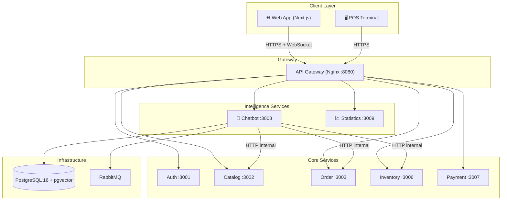
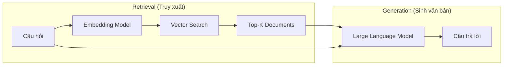
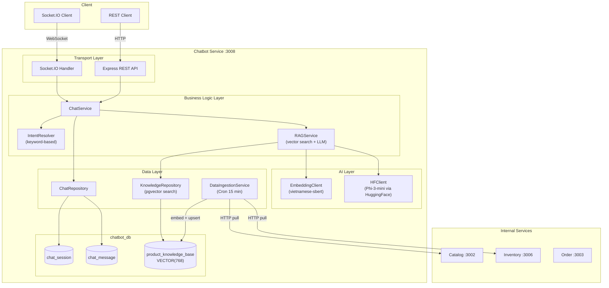
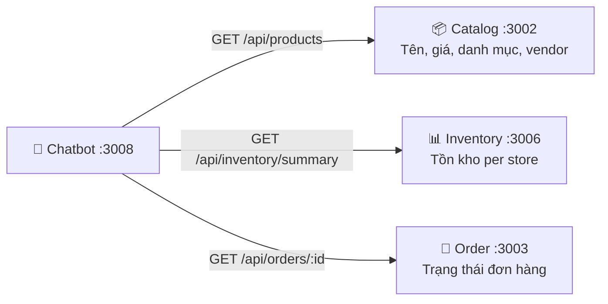
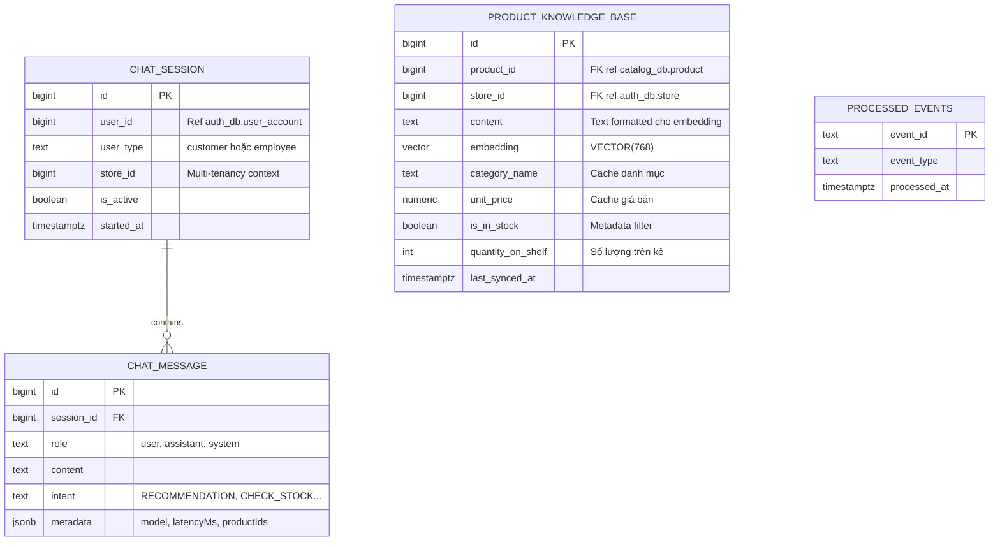
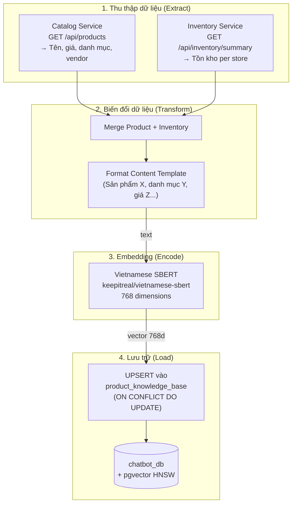
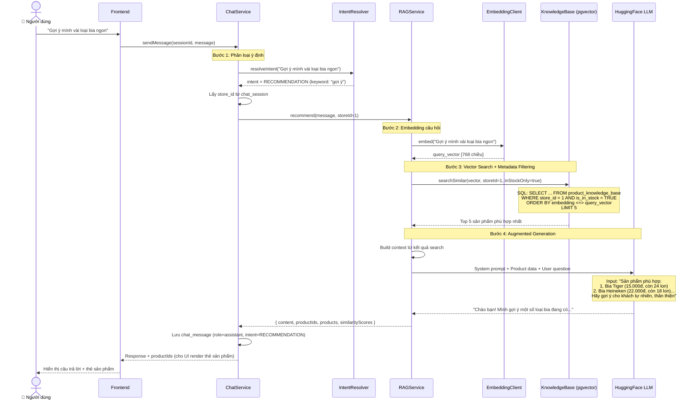
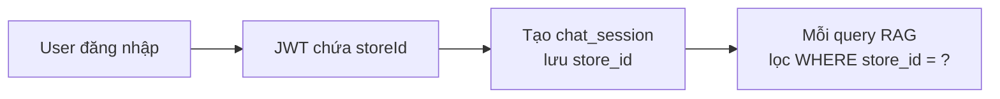

# BÁO CÁO ĐỒ ÁN: MODULE CHATBOT AI SỬ DỤNG RAG
## Hệ thống Quản lý Chuỗi Siêu thị Mini — POSMART

---

## MỤC LỤC

1. [Giới thiệu tổng quan](#1-giới-thiệu-tổng-quan)
2. [Bài toán và động lực triển khai](#2-bài-toán-và-động-lực-triển-khai)
3. [Nền tảng lý thuyết](#3-nền-tảng-lý-thuyết)
4. [Kiến trúc hệ thống Chatbot trong Microservices](#4-kiến-trúc-hệ-thống-chatbot-trong-microservices)
5. [Thiết kế cơ sở dữ liệu](#5-thiết-kế-cơ-sở-dữ-liệu)
6. [Pipeline xử lý dữ liệu cho RAG](#6-pipeline-xử-lý-dữ-liệu-cho-rag)
7. [Luồng xử lý truy vấn RAG](#7-luồng-xử-lý-truy-vấn-rag)
8. [Các nghiệp vụ Chatbot xử lý](#8-các-nghiệp-vụ-chatbot-xử-lý)
9. [Tích hợp Multi-Tenancy](#9-tích-hợp-multi-tenancy)
10. [Phân tích ưu nhược điểm](#10-phân-tích-ưu-nhược-điểm)
11. [Kế hoạch mở rộng](#11-kế-hoạch-mở-rộng)

---

## 1. GIỚI THIỆU TỔNG QUAN

### 1.1 Bối cảnh dự án

POSMART là hệ thống quản lý chuỗi siêu thị mini được xây dựng trên kiến trúc **Microservices**, bao gồm 9 service độc lập giao tiếp qua **API Gateway (Nginx)** và **Event Bus (RabbitMQ)**. Hệ thống phục vụ cả kênh bán hàng tại quầy (POS) lẫn đặt hàng trực tuyến (O2O — Online-to-Offline).

Module **AI Chatbot** (Service 8, port 3008) được thiết kế như một service độc lập có nhiệm vụ hỗ trợ khách hàng và nhân viên thông qua giao diện hội thoại tự nhiên. Trong phạm vi đồ án, nhóm tập trung vào việc tích hợp kỹ thuật **RAG (Retrieval-Augmented Generation)** để nâng cao khả năng gợi ý sản phẩm (Product Recommendation) theo ngữ nghĩa tiếng Việt, đồng thời đảm bảo kết quả chỉ bao gồm sản phẩm thực sự còn hàng tại chi nhánh mà người dùng đang tương tác.

### 1.2 Vị trí Chatbot trong hệ thống tổng thể



Chatbot service hoạt động **hoàn toàn độc lập** với database riêng (`chatbot_db`), không chia sẻ kết nối với bất kỳ service nào khác. Điều này đảm bảo:
- Các truy vấn vector nặng không ảnh hưởng đến hiệu suất giao dịch bán hàng.
- Service có thể được scale riêng khi lượng request tăng.

---

## 2. BÀI TOÁN VÀ ĐỘNG LỰC TRIỂN KHAI

### 2.1 Hạn chế của chatbot truyền thống (Keyword-based)

Trước khi áp dụng RAG, chatbot POSMART sử dụng phương pháp **so khớp từ khóa (keyword matching)** kết hợp gọi API trực tiếp:

| Bước | Cách thức | Hạn chế |
|------|-----------|---------|
| 1. Nhận tin nhắn | Socket.IO / REST | — |
| 2. Phân loại ý định | `intent.resolver.js` — regex/keyword | Không hiểu ngữ nghĩa, chỉ khớp chuỗi ký tự |
| 3. Lấy dữ liệu | Gọi HTTP đến Catalog (`ILIKE '%keyword%'`) | Không hiểu synonym, không ranking |
| 4. Sinh phản hồi | Gửi raw data cho LLM | LLM không có đủ ngữ cảnh sản phẩm |

**Ví dụ minh họa hạn chế:**
- Người dùng hỏi: *"Có loại nước ngọt nào giải khát không?"*
- Hệ thống cũ: Tìm `ILIKE '%nước ngọt%'` → **Bỏ sót** Coca-Cola, Pepsi, Sprite (vì tên sản phẩm không chứa "nước ngọt").
- Hệ thống RAG: Embedding hiểu "nước ngọt giải khát" ≈ "Coca-Cola", "Pepsi", "7Up" → **Trả về đúng sản phẩm**.

### 2.2 Yêu cầu nghiệp vụ

1. **Gợi ý sản phẩm theo ngữ nghĩa:** Hiểu ý định người dùng kể cả khi không dùng đúng tên sản phẩm.
2. **Chỉ gợi ý hàng còn trên kệ:** Lọc theo `is_in_stock = TRUE` và `store_id` cụ thể.
3. **Multi-tenancy:** Mỗi chi nhánh có tồn kho riêng. Kết quả gợi ý phải đúng chi nhánh mà khách đang chọn.
4. **Phản hồi tự nhiên bằng tiếng Việt:** Kết hợp dữ liệu thực với mô hình ngôn ngữ lớn (LLM) để sinh câu trả lời thân thiện.
5. **Không gây áp lực lên database giao dịch:** Chatbot phải sử dụng kho dữ liệu riêng, đồng bộ định kỳ.

---

## 3. NỀN TẢNG LÝ THUYẾT

### 3.1 RAG — Retrieval-Augmented Generation

RAG là kỹ thuật kết hợp hai thành phần:



- **Retrieval:** Chuyển câu hỏi thành vector, tìm kiếm các tài liệu có ngữ nghĩa gần nhất trong cơ sở tri thức.
- **Generation:** Đưa tài liệu tìm được vào prompt của LLM, giúp model sinh câu trả lời dựa trên **dữ liệu thực** thay vì chỉ dựa vào kiến thức huấn luyện.

**Ưu điểm RAG so với Fine-tuning:**
- Không cần huấn luyện lại mô hình khi dữ liệu thay đổi.
- Dữ liệu luôn cập nhật (qua pipeline đồng bộ).
- Chi phí thấp hơn đáng kể.

### 3.2 Vector Embedding và Cosine Similarity

**Embedding** là quá trình chuyển đổi văn bản thành vector số trong không gian nhiều chiều (768 chiều trong dự án này). Các văn bản có ngữ nghĩa tương tự sẽ có vector **gần nhau** trong không gian embedding.

**Cosine Similarity** đo độ tương đồng giữa hai vector:

```
similarity(A, B) = (A · B) / (||A|| × ||B||)
```

Giá trị từ -1 đến 1, trong đó 1 = hoàn toàn giống nhau.

### 3.3 pgvector và HNSW Index

**pgvector** là extension cho PostgreSQL hỗ trợ kiểu dữ liệu `VECTOR` và các phép toán vector search.

| Tham số | Giá trị trong dự án | Giải thích |
|---------|---------------------|------------|
| Dimension | 768 | Số chiều embedding (khớp với Vietnamese SBERT) |
| Distance metric | Cosine (`<=>`) | Phù hợp cho NLP embeddings đã normalize |
| Index type | **HNSW** | Hierarchical Navigable Small World — nhanh hơn IVFFlat cho dataset < 1M records |

### 3.4 Mô hình Embedding: Vietnamese SBERT

Dự án sử dụng `keepitreal/vietnamese-sbert` — mô hình Sentence-BERT được huấn luyện riêng cho tiếng Việt.

| Đặc điểm | Chi tiết |
|-----------|----------|
| Base model | PhoBERT |
| Output dimension | 768 |
| Ngôn ngữ | Tiếng Việt (tối ưu) |
| Runtime | `@xenova/transformers` (ONNX, chạy trên CPU) |
| Quantization | INT8 (giảm 4x kích thước, giữ 99% accuracy) |

### 3.5 Mô hình sinh văn bản: Phi-3-mini-4k-instruct

| Đặc điểm | Chi tiết |
|-----------|----------|
| Provider | Microsoft (via HuggingFace Inference API) |
| Parameters | 3.8B |
| Context window | 4096 tokens |
| Vai trò | Nhận dữ liệu sản phẩm từ RAG → Sinh phản hồi tự nhiên |

---

## 4. KIẾN TRÚC HỆ THỐNG CHATBOT TRONG MICROSERVICES

### 4.1 Kiến trúc tổng thể Service 8



### 4.2 Các thành phần chính

| Thành phần | File | Chức năng |
|-----------|------|-----------|
| **ChatService** | `chat.service.js` | Orchestrator chính — nhận tin nhắn, phân loại intent, điều phối xử lý |
| **IntentResolver** | `intent.resolver.js` | Phân loại ý định người dùng bằng keyword matching |
| **RAGService** | `rag.service.js` | Pipeline RAG: embed query → vector search → augmented generation |
| **EmbeddingClient** | `embedding.client.js` | Chạy Vietnamese SBERT local để sinh vector 768 chiều |
| **HFClient** | `hf.client.js` | Gọi HuggingFace Inference API (Phi-3-mini) để sinh văn bản |
| **DataIngestionService** | `data-ingestion.service.js` | Cron job 15 phút: pull data → embed → upsert knowledge base |
| **KnowledgeRepository** | `knowledge.repository.js` | Thực hiện vector similarity search trên pgvector |
| **ApiClient** | `api.client.js` | Gọi HTTP nội bộ đến Catalog, Inventory, Order service |

### 4.3 Giao tiếp với các service khác

Chatbot tương tác với 3 service qua HTTP nội bộ (không qua Gateway):



| Call | Mục đích | Tần suất |
|------|----------|----------|
| Catalog → `GET /api/products` | Lấy master data sản phẩm cho knowledge base | Mỗi 15 phút (Cron) |
| Inventory → `GET /api/inventory/summary` | Lấy tồn kho per-store | Mỗi 15 phút (Cron) |
| Order → `GET /api/orders/:id` | Tra cứu đơn hàng theo yêu cầu user | Real-time (per request) |

---

## 5. THIẾT KẾ CƠ SỞ DỮ LIỆU

### 5.1 Sơ đồ ERD — chatbot_db



### 5.2 Chi tiết bảng product_knowledge_base

Bảng trung tâm của hệ thống RAG, lưu trữ embedding vector cho mỗi sản phẩm tại mỗi chi nhánh.

**Thiết kế SQL:**

```sql
CREATE TABLE product_knowledge_base (
    id BIGINT PRIMARY KEY GENERATED ALWAYS AS IDENTITY,
    product_id BIGINT NOT NULL,           -- Ref → catalog_db.product.id
    store_id BIGINT NOT NULL,             -- Ref → auth_db.store.id
    content TEXT NOT NULL,                -- "Sản phẩm Coca Cola, danh mục Nước giải khát, giá 12.000 VND..."
    embedding VECTOR(768),               -- Vietnamese-SBERT output
    category_name TEXT,
    unit_price NUMERIC DEFAULT 0,
    is_in_stock BOOLEAN DEFAULT TRUE,
    quantity_on_shelf INT DEFAULT 0,
    last_synced_at TIMESTAMPTZ DEFAULT NOW(),
    UNIQUE (product_id, store_id)
);
```

**Chiến lược Index:**

| Index | Kiểu | Mục đích |
|-------|------|----------|
| `idx_pkb_embedding` | HNSW (`vector_cosine_ops`) | Tăng tốc vector similarity search |
| `idx_pkb_store_stock` | B-Tree (partial: `WHERE is_in_stock = TRUE`) | Tối ưu metadata filtering theo store + tồn kho |
| `idx_pkb_product_store` | B-Tree | Tối ưu UPSERT khi đồng bộ dữ liệu |

**Lý do thiết kế UNIQUE (product_id, store_id):**
- Cùng một sản phẩm (vd: Coca-Cola) tại chi nhánh A có thể **hết hàng**, nhưng tại chi nhánh B vẫn **còn hàng**.
- Mỗi record đại diện cho trạng thái của 1 sản phẩm tại 1 chi nhánh cụ thể.
- Khi pipeline đồng bộ chạy, dùng `ON CONFLICT ... DO UPDATE` (UPSERT) để cập nhật.

### 5.3 Cột content — Template cho Embedding

Cột `content` lưu trữ văn bản đã được format theo mẫu chuẩn, dùng làm đầu vào cho embedding model:

```
Sản phẩm "Coca Cola", danh mục "Nước giải khát", giá 12.000 VND, 
nhà cung cấp "Coca-Cola Vietnam", hiện còn 48 sản phẩm trên kệ.
```

Mẫu này được thiết kế **tối ưu cho Vietnamese SBERT** vì:
- Sử dụng ngôn ngữ tự nhiên tiếng Việt thay vì key-value.
- Bao gồm cả ngữ cảnh (danh mục, giá, tình trạng) giúp embedding nắm bắt đa chiều thông tin.
- Khi user hỏi "nước ngọt giá rẻ", embedding sẽ gần với các record có content chứa "nước giải khát" + giá thấp.

---

## 6. PIPELINE XỬ LÝ DỮ LIỆU CHO RAG

### 6.1 Tổng quan Pipeline



### 6.2 Cơ chế đồng bộ: Cron Polling

Pipeline chạy tự động mỗi **15 phút** thông qua `node-cron`:

```
┌─────────────────────────────────────────────────────────┐
│  ⏰  */15 * * * *  (mỗi 15 phút)                       │
│                                                         │
│  1. Lấy danh sách stores từ Auth Service                │
│  2. Lấy toàn bộ products từ Catalog Service             │
│  3. Với mỗi store:                                      │
│     a. Lấy inventory summary cho store đó               │
│     b. Với mỗi product (active):                        │
│        - Format content text                            │
│        - Embed via Vietnamese SBERT → vector[768]       │
│        - UPSERT vào product_knowledge_base              │
│  4. Log kết quả: synced / skipped / duration            │
└─────────────────────────────────────────────────────────┘
```

**Lý do chọn Cron Polling thay vì Event-Driven:**
- Catalog Service hiện tại chưa publish events khi CRUD sản phẩm.
- Cron polling đơn giản, dễ debug, phù hợp cho Phase 1.
- Dữ liệu sản phẩm ít thay đổi (không cần real-time).
- Có thể nâng cấp lên Hybrid (Event + Cron fallback) trong Phase 2.

### 6.3 Xử lý giá sản phẩm

Hệ thống có **hai mức giá**:
- **Catalog** (`product.unit_price`): Giá niêm yết toàn chuỗi.
- **Inventory** (`product_batch.unit_price`): Giá bán thực tế tại từng chi nhánh (có thể khác).

Pipeline ưu tiên lấy giá từ Inventory (nếu có), fallback về giá Catalog.

---

## 7. LUỒNG XỬ LÝ TRUY VẤN RAG

### 7.1 Sequence Diagram hoàn chỉnh



### 7.2 Giải thích từng bước

**Bước 1 — Intent Resolution:**
Hệ thống keyword matching quét message tìm các từ khóa như "gợi ý", "recommend", "tư vấn", "nên mua gì", "có gì ngon"... Khi phát hiện, classify intent = `RECOMMENDATION` và chuyển sang RAGService.

**Bước 2 — Query Embedding:**
Câu hỏi của user được chuyển thành vector 768 chiều bằng Vietnamese SBERT. Mô hình chạy **local trên CPU** thông qua ONNX Runtime (thư viện `@xenova/transformers`), không cần GPU hay gọi API bên ngoài.

**Bước 3 — Vector Search với Metadata Filtering:**
Truy vấn pgvector kết hợp:
- **Vector similarity:** `ORDER BY embedding <=> query_vector` (cosine distance)
- **Metadata filter:** `WHERE store_id = X AND is_in_stock = TRUE`
- **Top-K:** `LIMIT 5` (trả về 5 sản phẩm gần nhất)

Đây là điểm mạnh cốt lõi: kết quả luôn **đúng chi nhánh** và **chỉ hàng còn trên kệ**.

**Bước 4 — Augmented Generation:**
Dữ liệu Top-5 sản phẩm được format thành context text, ghép vào prompt gửi cho LLM (Phi-3-mini). LLM sinh câu trả lời tự nhiên dựa trên **dữ liệu thực**, không hallucinate.

---

## 8. CÁC NGHIỆP VỤ CHATBOT XỬ LÝ

### 8.1 Bảng Intent — Phân loại ý định

| Intent | Từ khóa kích hoạt | Handler | Nguồn dữ liệu | Phương thức |
|--------|-------------------|---------|---------------|-------------|
| **RECOMMENDATION** | gợi ý, recommend, tư vấn, nên mua, có gì ngon | `_handleRecommendation()` | `product_knowledge_base` (pgvector) | **RAG** (vector search + LLM) |
| **CHECK_STOCK** | tồn kho, còn hàng, hết hàng, có còn | `_handleCheckStock()` | Catalog API → Inventory API | HTTP internal |
| **CHECK_PRICE** | giá, bao nhiêu, giá bán | `_handleCheckPrice()` | Catalog API (top 5 kết quả) | HTTP internal |
| **ORDER_STATUS** | đơn hàng, order, tracking, mã đơn | `_handleOrderStatus()` | Order API (by ID) | HTTP internal |
| **SEARCH_PRODUCT** | tìm, search, sản phẩm nào | `_handleSearchProduct()` | Catalog API (`ILIKE`) | HTTP internal |
| **HELP** | help, giúp, hướng dẫn | `_handleHelp()` | Static text | Local |
| **FREE_CHAT** | *(fallback)* | `_handleFreeChat()` | HuggingFace LLM | LLM only |

### 8.2 Ví dụ tương tác theo từng nghiệp vụ

#### Nghiệp vụ 1: Gợi ý sản phẩm (RAG Recommendation)

```
👤 User: "Tối nay muốn nướng BBQ, gợi ý đồ uống đi kèm nhé"
🤖 Bot: "Chào bạn! Cho buổi BBQ tối nay, mình gợi ý một số đồ uống:
    1. 🍺 Bia Tiger (15.000đ/lon) — còn 24 lon
    2. 🍺 Bia Heineken (22.000đ/lon) — còn 18 lon  
    3. 🥤 Coca-Cola (12.000đ/lon) — còn 36 lon
    Nếu mua từ 2 thùng bia trở lên, bạn có thể được giảm giá sỉ đấy!"
```

→ **Luồng xử lý:** Intent = RECOMMENDATION → Embed "BBQ đồ uống" → Vector search tìm sản phẩm liên quan → LLM format thành câu tư vấn.

#### Nghiệp vụ 2: Kiểm tra tồn kho

```
👤 User: "Sữa TH True Milk còn không?"
🤖 Bot: "Sữa TH True Milk 1L hiện còn 12 hộp trên kệ tại chi nhánh của bạn."
```

→ **Luồng xử lý:** Intent = CHECK_STOCK → Catalog search → Inventory summary → LLM format.

#### Nghiệp vụ 3: Tra cứu đơn hàng

```
👤 User: "Kiểm tra đơn hàng #5 giúp tôi"
🤖 Bot: "Đơn hàng ORD-0005:
    - Trạng thái: Đã giao ✅
    - Thanh toán: Đã thanh toán
    - Tổng tiền: 245.000đ"
```

→ **Luồng xử lý:** Intent = ORDER_STATUS → Order API by ID → LLM format.

### 8.3 So sánh SEARCH_PRODUCT cũ vs RECOMMENDATION mới

| Tiêu chí | SEARCH_PRODUCT (cũ) | RECOMMENDATION (RAG) |
|----------|---------------------|---------------------|
| Thuật toán | `ILIKE '%keyword%'` (text match) | Vector Cosine Similarity |
| Hiểu ngữ nghĩa | ❌ Chỉ khớp chuỗi | ✅ Hiểu synonym, ngữ cảnh |
| Lọc tồn kho | ❌ Không lọc | ✅ `is_in_stock = TRUE` |
| Lọc chi nhánh | ❌ Không lọc | ✅ `store_id` filtering |
| Ranking | Không xếp hạng | Theo similarity score |
| Tốc độ | Phụ thuộc Catalog API | Truy vấn trực tiếp local DB |
| Augmentation | Raw data → LLM | Context-enriched → LLM |

---

## 9. TÍCH HỢP MULTI-TENANCY

### 9.1 Luồng xác định store_id



1. Khi user đăng nhập, JWT token chứa `storeId` (chi nhánh mà user thuộc về hoặc đang chọn).
2. Khi tạo phiên chat mới, `store_id` được lưu vào bảng `chat_session`.
3. Mọi truy vấn RAG sẽ tự động lọc `WHERE store_id = X`, đảm bảo kết quả chỉ bao gồm sản phẩm tại chi nhánh đó.

### 9.2 Ví dụ minh họa

Sản phẩm "Bia Tiger" có 2 records trong `product_knowledge_base`:

| product_id | store_id | is_in_stock | quantity_on_shelf |
|-----------|----------|-------------|-------------------|
| 42 | 1 (Chi nhánh A) | TRUE | 24 |
| 42 | 2 (Chi nhánh B) | FALSE | 0 |

Khi khách hàng tại chi nhánh B hỏi "Gợi ý bia", hệ thống sẽ **không gợi ý Bia Tiger** vì `is_in_stock = FALSE` tại `store_id = 2`.

---

## 10. PHÂN TÍCH ƯU NHƯỢC ĐIỂM

### 10.1 Ưu điểm

| # | Ưu điểm | Giải thích |
|---|---------|------------|
| 1 | **Hiểu ngữ nghĩa tiếng Việt** | Vietnamese SBERT được huấn luyện riêng cho tiếng Việt, hiểu synonym và ngữ cảnh |
| 2 | **Không gợi ý hàng ảo** | Metadata filtering `is_in_stock + store_id` đảm bảo kết quả chính xác |
| 3 | **Tách biệt hoàn toàn** | Database riêng, không ảnh hưởng giao dịch bán hàng |
| 4 | **Chạy local, không tốn API** | Embedding model chạy trên CPU (ONNX), chỉ LLM mới cần API |
| 5 | **Dễ mở rộng** | Thêm sản phẩm mới = thêm record, không cần thay đổi code |
| 6 | **Graceful degradation** | Nếu RAG lỗi, fallback về SEARCH_PRODUCT (text search) |

### 10.2 Hạn chế và hướng cải thiện

| # | Hạn chế | Hướng cải thiện (Phase 2) |
|---|---------|--------------------------|
| 1 | Dữ liệu delay tối đa 15 phút | Event-driven sync (RabbitMQ subscribe) |
| 2 | Chưa có personalization | Tích hợp customer_type + purchase history |
| 3 | Chưa gợi ý mua kèm | Co-purchase analysis từ sale_order_detail |
| 4 | Embedding model chiếm RAM | Sử dụng model nhỏ hơn hoặc external embedding API |
| 5 | LLM phụ thuộc HuggingFace API | Self-hosted LLM hoặc fallback multiple providers |

---

## 11. KẾ HOẠCH MỞ RỘNG

### Phase 2A: Event-Driven Sync

Catalog Service publish events (`product.created`, `product.updated`) → Chatbot subscribe → Cập nhật knowledge base **gần real-time** thay vì chờ 15 phút.

### Phase 2B: Personalization

Tích hợp dữ liệu khách hàng (từ Auth Service):
- **VIP khách** (total_spent > 5M): Gợi ý sản phẩm premium.
- **Khách sỉ**: Gợi ý sản phẩm số lượng lớn.
- **Khách lẻ**: Gợi ý deal/khuyến mãi.

### Phase 2C: Co-purchase Recommendation

Phân tích bảng `sale_order_detail` để tìm "sản phẩm thường mua cùng nhau":

```
"Khách mua Bia Tiger thường mua kèm:
 1. Đá viên (85% đơn hàng)
 2. Khô bò (62% đơn hàng)
 3. Hạt điều (41% đơn hàng)"
```

---

## TÀI LIỆU THAM KHẢO KỸ THUẬT

| Tài liệu | Đường dẫn |
|-----------|-----------|
| Kế hoạch triển khai chi tiết | `docs/chatbot/chatbot-rag-implementation-plan.md` |
| Sơ đồ thiết kế hệ thống tổng thể | `docs/system-design-diagrams.md` |
| Kiến trúc Chatbot ban đầu | `docs/chatbot/chatbot.md` |
| Schema SQL tổng hợp | `supabase_init_all.sql` |
| Event types | `shared/event-bus/eventTypes.js` |
