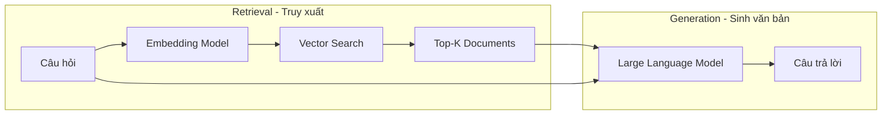
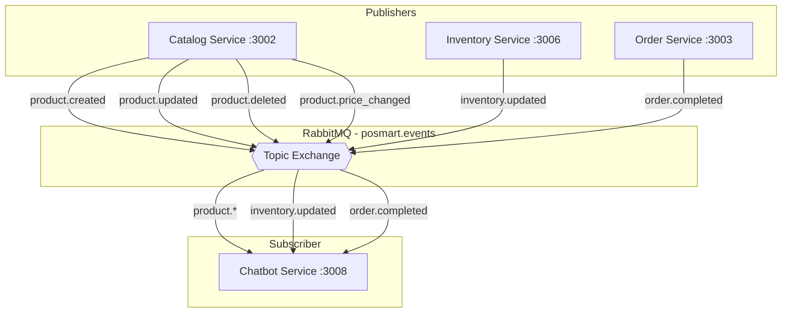
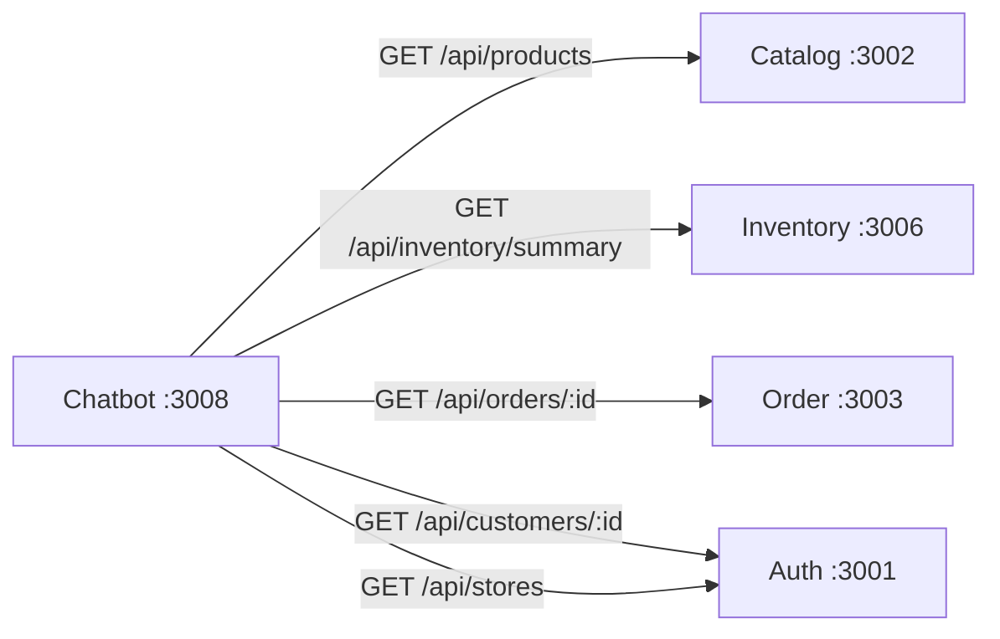
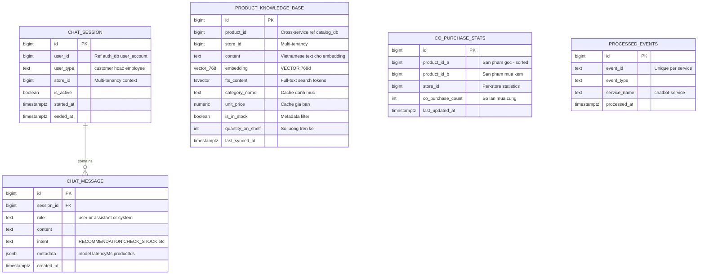
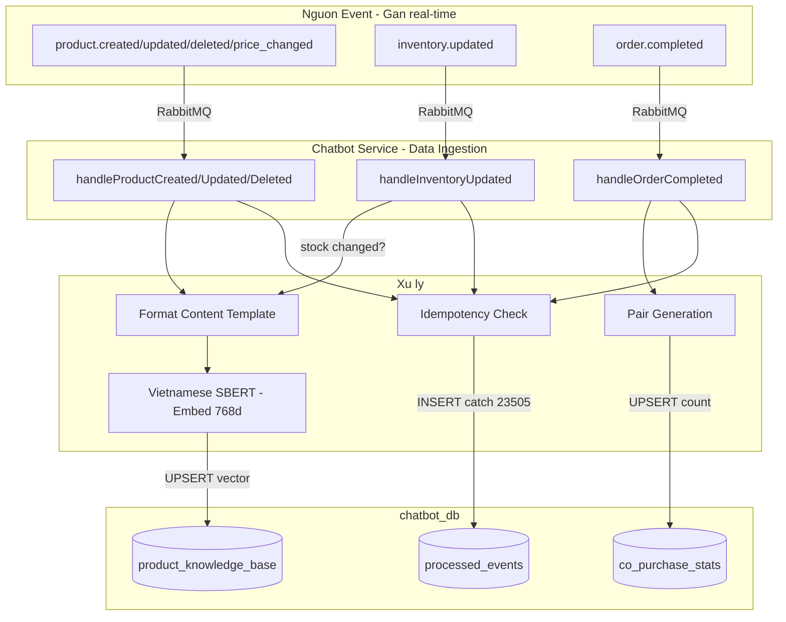
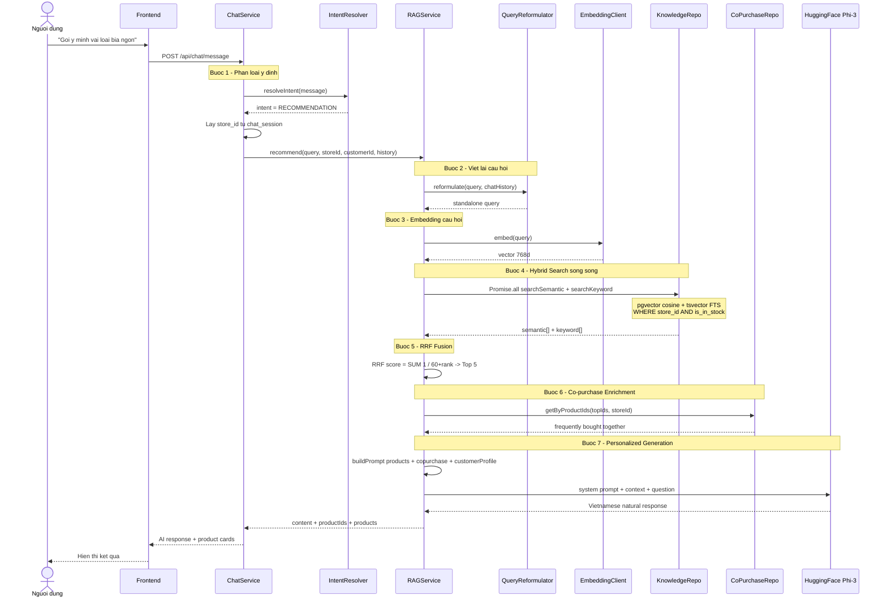
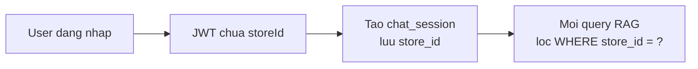
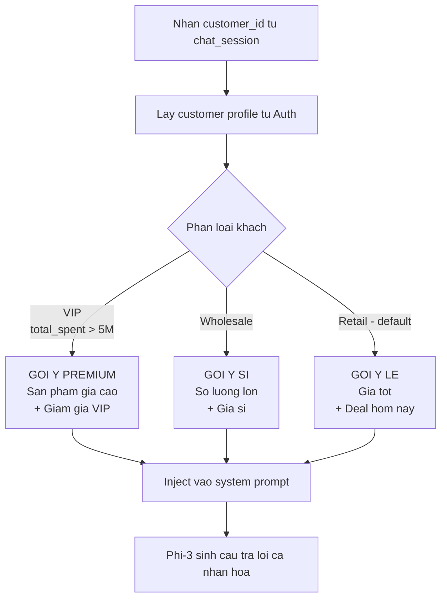
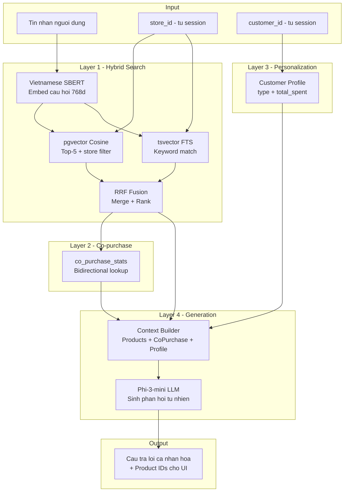

# BÁO CÁO ĐỒ ÁN: MODULE CHATBOT AI SỬ DỤNG RAG
## Hệ thống Quản lý Chuỗi Siêu thị Mini — POSMART

---

## MỤC LỤC

1. [Yêu cầu nghiệp vụ](#1-yêu-cầu-nghiệp-vụ)
2. [Nền tảng lý thuyết](#2-nền-tảng-lý-thuyết)
3. [Giao tiếp với các service khác](#3-giao-tiếp-với-các-service-khác)
4. [Thiết kế cơ sở dữ liệu](#4-thiết-kế-cơ-sở-dữ-liệu)
5. [Pipeline xử lý dữ liệu cho RAG (Event-Driven)](#5-pipeline-xử-lý-dữ-liệu-cho-rag-event-driven)
6. [Luồng xử lý truy vấn RAG](#6-luồng-xử-lý-truy-vấn-rag)
7. [Các nghiệp vụ Chatbot xử lý](#7-các-nghiệp-vụ-chatbot-xử-lý)
8. [Tích hợp Multi-Tenancy](#8-tích-hợp-multi-tenancy)
9. [Mở rộng: Personalization và Recommendation nâng cao](#9-mở-rộng-personalization-và-recommendation-nâng-cao)

---

## 1. YÊU CẦU NGHIỆP VỤ

1. **Gợi ý sản phẩm theo ngữ nghĩa:** Hiểu ý định người dùng kể cả khi không dùng đúng tên sản phẩm. Ví dụ: "có gì giải khát" → gợi ý Coca-Cola, Pepsi mà không cần gõ chính xác tên.
2. **Chỉ gợi ý hàng còn trên kệ:** Lọc theo `is_in_stock = TRUE` và `store_id` cụ thể, đảm bảo khách không được gợi ý sản phẩm đã hết.
3. **Multi-tenancy:** Mỗi chi nhánh có tồn kho riêng. Kết quả gợi ý phải đúng chi nhánh mà khách đang chọn.
4. **Phản hồi tự nhiên bằng tiếng Việt:** Kết hợp dữ liệu thực với mô hình ngôn ngữ lớn (LLM) để sinh câu trả lời thân thiện, tự nhiên.
5. **Đồng bộ dữ liệu gần real-time:** Sử dụng Event-Driven Sync (RabbitMQ) để cập nhật knowledge base ngay khi sản phẩm hoặc tồn kho thay đổi, kết hợp Cron fallback 30 phút đảm bảo tính nhất quán.
6. **Cá nhân hóa gợi ý:** Dựa trên loại khách hàng (VIP, sỉ, lẻ) và lịch sử mua hàng để điều chỉnh phong cách tư vấn và kết quả recommendation.

---

## 2. NỀN TẢNG LÝ THUYẾT

### 2.1 RAG — Retrieval-Augmented Generation

RAG là kỹ thuật kết hợp hai thành phần:



- **Retrieval:** Chuyển câu hỏi thành vector, tìm kiếm các tài liệu có ngữ nghĩa gần nhất trong cơ sở tri thức.
- **Generation:** Đưa tài liệu tìm được vào prompt của LLM, giúp model sinh câu trả lời dựa trên **dữ liệu thực** thay vì chỉ dựa vào kiến thức huấn luyện.

**Ưu điểm RAG so với Fine-tuning:**
- Không cần huấn luyện lại mô hình khi dữ liệu thay đổi.
- Dữ liệu luôn cập nhật (qua pipeline đồng bộ event-driven).
- Chi phí thấp hơn đáng kể — không cần GPU cho training.

### 2.2 Vector Embedding và Cosine Similarity

**Embedding** là quá trình chuyển đổi văn bản thành vector số trong không gian nhiều chiều (768 chiều trong dự án này). Các văn bản có ngữ nghĩa tương tự sẽ có vector **gần nhau** trong không gian embedding.

**Cosine Similarity** đo độ tương đồng giữa hai vector:

```
similarity(A, B) = (A · B) / (||A|| × ||B||)
```

Giá trị từ -1 đến 1, trong đó 1 = hoàn toàn giống nhau.

### 2.3 pgvector và HNSW Index

**pgvector** là extension cho PostgreSQL hỗ trợ kiểu dữ liệu `VECTOR` và các phép toán vector search.

| Tham số | Giá trị trong dự án | Giải thích |
|---------|---------------------|------------|
| Dimension | 768 | Số chiều embedding (khớp với Vietnamese SBERT) |
| Distance metric | Cosine (`<=>`) | Phù hợp cho NLP embeddings đã normalize |
| Index type | **HNSW** | Hierarchical Navigable Small World — nhanh hơn IVFFlat cho dataset < 1M records |

### 2.4 tsvector — Full-text Search bản địa PostgreSQL

**tsvector** là kiểu dữ liệu của PostgreSQL cho phép tìm kiếm từ khóa chính xác (keyword search). Kết hợp với pgvector tạo thành **Hybrid Search**:

| Phương pháp | Giải quyết bài toán | Ví dụ |
|-------------|---------------------|-------|
| Vector Search (pgvector) | Tìm kiếm **ngữ nghĩa** — hiểu "nước ngọt" ≈ "Coca-Cola" | "Có gì giải khát không?" → Coca-Cola, Pepsi |
| Keyword Search (tsvector) | Tìm kiếm **chính xác** — khớp tên, SKU, thương hiệu | "tiger" → Bia Tiger (chính xác 100%) |

### 2.5 Reciprocal Rank Fusion (RRF)

RRF là thuật toán trộn kết quả từ nhiều nguồn tìm kiếm khác nhau:

```
RRF_score(d) = SUM( 1 / (k + rank_i(d)) )    với k = 60
```

Sản phẩm xuất hiện ở **cả hai luồng** (semantic + keyword) sẽ có điểm RRF cao nhất → được ưu tiên trong Top-5.

### 2.6 Mô hình Embedding: Vietnamese SBERT

Dự án sử dụng `keepitreal/vietnamese-sbert` — mô hình Sentence-BERT được huấn luyện riêng cho tiếng Việt.

| Đặc điểm | Chi tiết |
|-----------|----------|
| Base model | PhoBERT |
| Output dimension | 768 |
| Ngôn ngữ | Tiếng Việt (tối ưu) |
| Runtime | `@xenova/transformers` (ONNX, chạy trên CPU) |
| Quantization | INT8 (giảm 4x kích thước, giữ 99% accuracy) |
| Pooling | Mean Pooling + L2 Normalization |

### 2.7 Mô hình sinh văn bản: Phi-3-mini-4k-instruct

| Đặc điểm | Chi tiết |
|-----------|----------|
| Provider | Microsoft (via HuggingFace Inference API) |
| Parameters | 3.8B |
| Context window | 4096 tokens |
| Vai trò | Sinh phản hồi tự nhiên + Viết lại câu hỏi mơ hồ (Query Reformulation) |

---

## 3. GIAO TIẾP VỚI CÁC SERVICE KHÁC

Chatbot Service (Port 3008) tương tác với các service qua **hai cơ chế**:

### 3.1 Event-Driven (RabbitMQ) — Đồng bộ dữ liệu



| Event | Publisher | Xử lý tại Chatbot |
|-------|----------|-------------------|
| `product.created` | Catalog | Tạo record mới trong knowledge base, embed content và lưu vector 768d |
| `product.updated` | Catalog | Cập nhật content text, re-embed vector |
| `product.deleted` | Catalog | Xóa record khỏi knowledge base |
| `product.price_changed` | Catalog | Re-embed (giá thay đổi ảnh hưởng đến content text) |
| `inventory.updated` | Inventory | Cập nhật `is_in_stock`, `quantity_on_shelf`. Re-embed nếu trạng thái stock thay đổi |
| `order.completed` | Order | Phân tích co-purchase pairs, UPSERT vào `co_purchase_stats` |

### 3.2 HTTP Internal — Truy vấn theo yêu cầu



| Service | Endpoint | Mục đích | Khi nào |
|---------|----------|----------|---------|
| Catalog | `GET /api/products` | Danh sách toàn bộ sản phẩm | Cron full-sync 30 phút, on-demand search |
| Inventory | `GET /api/inventory/summary` | Tồn kho tổng hợp per store | Sync + kiểm tra stock real-time |
| Order | `GET /api/orders/:id` | Tra cứu đơn hàng | Nghiệp vụ ORDER_STATUS |
| Auth | `GET /api/customers/:id` | Customer profile (type, total_spent) | Personalization khi gợi ý |
| Auth | `GET /api/stores` | Danh sách chi nhánh | Sync knowledge base cho tất cả stores |

**Lưu ý response format:**
- Catalog: `{ success: true, data: { products: [...] } }` — camelCase fields (`unitPrice`, `categoryName`)
- Inventory: `{ success: true, data: [...] }` — direct array, camelCase (`quantityOnShelf`, `productId`)
- Auth: `{ status: 'success', data: { stores: [...] } }` — khác format (dùng `status` thay `success`)

---

## 4. THIẾT KẾ CƠ SỞ DỮ LIỆU

### 4.1 Sơ đồ ERD — chatbot_db



### 4.2 Chi tiết bảng product_knowledge_base

Bảng trung tâm của hệ thống RAG, lưu trữ embedding vector cho mỗi sản phẩm tại mỗi chi nhánh.

**Thiết kế SQL:**

```sql
CREATE EXTENSION IF NOT EXISTS vector;

CREATE TABLE product_knowledge_base (
    id BIGINT PRIMARY KEY GENERATED ALWAYS AS IDENTITY,
    product_id BIGINT NOT NULL,
    store_id BIGINT NOT NULL,
    content TEXT NOT NULL,
    embedding VECTOR(768),
    fts_content TSVECTOR,                    -- Full-text search tokens (Hybrid Search)
    category_name TEXT,
    unit_price NUMERIC DEFAULT 0,
    is_in_stock BOOLEAN DEFAULT TRUE,
    quantity_on_shelf INT DEFAULT 0,
    last_synced_at TIMESTAMPTZ DEFAULT NOW(),
    UNIQUE (product_id, store_id)
);
```

**Chiến lược Index:**

| Index | Kiểu | Mục đích |
|-------|------|----------|
| `idx_pkb_embedding` | HNSW (`vector_cosine_ops`) | Tăng tốc vector similarity search |
| `idx_pkb_fts` | GIN (`fts_content`) | Tăng tốc keyword full-text search |
| `idx_pkb_store_stock` | B-Tree partial (`WHERE is_in_stock = TRUE`) | Tối ưu metadata filtering theo store + tồn kho |
| `idx_pkb_product_store` | B-Tree UNIQUE | Tối ưu UPSERT khi đồng bộ dữ liệu |

### 4.3 Bảng co_purchase_stats (Recommendation nâng cao)

Lưu trữ thống kê "sản phẩm thường mua cùng nhau", được cập nhật từ event `order.completed`:

```sql
CREATE TABLE co_purchase_stats (
    id BIGINT PRIMARY KEY GENERATED ALWAYS AS IDENTITY,
    product_id_a BIGINT NOT NULL,
    product_id_b BIGINT NOT NULL,
    store_id BIGINT NOT NULL,
    co_purchase_count INT DEFAULT 1,
    last_updated_at TIMESTAMPTZ DEFAULT NOW(),
    UNIQUE (product_id_a, product_id_b, store_id)
);

-- Chỉ index các cặp đã đủ threshold để gợi ý
CREATE INDEX idx_copurchase_lookup
    ON co_purchase_stats(product_id_a, store_id)
    WHERE co_purchase_count >= 3;
```

Khi có event `order.completed` chứa nhiều sản phẩm, hệ thống sẽ:
1. Lấy danh sách product_id trong đơn hàng.
2. Tạo tất cả các cặp (A, B) với A < B (sorted để tránh trùng).
3. UPSERT vào `co_purchase_stats` — tăng `co_purchase_count`.

### 4.4 Bảng processed_events (Idempotency)

Đảm bảo mỗi event chỉ được xử lý **đúng một lần**, theo pattern thống nhất với các service Inventory, Order, Payment:

```sql
CREATE TABLE processed_events (
    id BIGINT PRIMARY KEY GENERATED ALWAYS AS IDENTITY,
    event_id TEXT NOT NULL,
    event_type TEXT NOT NULL,
    service_name TEXT NOT NULL DEFAULT 'chatbot-service',
    processed_at TIMESTAMPTZ NOT NULL DEFAULT NOW(),
    UNIQUE(event_id, service_name)
);
```

**Pattern:** `INSERT ... catch duplicate (23505) → skip`. Không dùng SELECT trước INSERT (race condition).

### 4.5 Cột content — Template cho Embedding

Cột `content` lưu trữ văn bản đã được format theo mẫu chuẩn, dùng làm đầu vào cho cả embedding model lẫn keyword search:

```
Sản phẩm "Coca Cola", danh mục "Nước giải khát", giá 12.000 VND,
nhà cung cấp "Coca-Cola Vietnam", hiện còn 48 sản phẩm trên kệ.
Từ khóa: coca, cola, coca-cola, nuoc giai khat.
```

Mẫu này được thiết kế **tối ưu cho Hybrid Search** vì:
- **Câu văn tự nhiên** → Vietnamese SBERT nắm bắt ngữ nghĩa đa chiều (giá, danh mục, trạng thái).
- **"Từ khóa:"** → tsvector bắt chính xác tên sản phẩm, thương hiệu, **tên không dấu** (cho user gõ không dấu).
- Khi user hỏi "coca cola" → keyword search bắt chính xác. Hỏi "nước ngọt giá rẻ" → vector search bắt ngữ nghĩa.

---

## 5. PIPELINE XỬ LÝ DỮ LIỆU CHO RAG (EVENT-DRIVEN)

### 5.1 Tổng quan Pipeline



### 5.2 Cơ chế đồng bộ: Primary (Event) + Fallback (Cron)

```
┌────────────────────────────────────────────────────────────────┐
│  PRIMARY: EVENT-DRIVEN SYNC (gần real-time)                    │
│                                                                │
│  Khi Catalog thay đổi sản phẩm:                               │
│    1. ProductService publish event (product.created/updated)   │
│    2. Chatbot nhận event qua RabbitMQ                          │
│    3. Kiểm tra idempotency (INSERT catch 23505)                │
│    4. Lấy inventory data cho sản phẩm đó                      │
│    5. Format content → Vietnamese SBERT embed → UPSERT KB     │
│                                                                │
│  Khi Inventory thay đổi tồn kho:                               │
│    1. Inventory publish event (inventory.updated)              │
│    2. Chatbot kiểm tra is_in_stock thay đổi không              │
│    3. Nếu thay đổi → re-embed. Nếu chỉ qty → light update    │
│                                                                │
│  Khi Đơn hàng hoàn thành:                                      │
│    1. Order publish event (order.completed)                    │
│    2. Chatbot tạo tất cả cặp sản phẩm (A,B) sorted            │
│    3. UPSERT co_purchase_stats: count += 1                     │
│                                                                │
│  FALLBACK: Cron */30 * * * * full-sync                         │
│    - Gọi GET /api/products + GET /api/inventory/summary        │
│    - UPSERT toàn bộ knowledge base                             │
│    - Đảm bảo nhất quán nếu mất event hoặc service restart     │
│                                                                │
│  STARTUP: Initial sync sau 10s delay                           │
│    - Chờ các service khác boot xong                            │
│    - Full-sync lần đầu khi chatbot khởi động                   │
└────────────────────────────────────────────────────────────────┘
```

**Lý do chọn Event-Driven Sync làm cơ chế chính:**
- Đồng bộ gần real-time — khách luôn thấy sản phẩm mới nhất.
- Phù hợp với kiến trúc Microservices hiện tại (đã có RabbitMQ cho Saga).
- Chỉ xử lý sản phẩm thay đổi, không cần full-scan toàn bộ catalog.
- Fallback cron 30 phút + startup sync đảm bảo tính nhất quán.

### 5.3 Tối ưu Inventory Update

Khi nhận event `inventory.updated`, hệ thống **không luôn re-embed**:
- Nếu chỉ `quantity_on_shelf` thay đổi nhưng `is_in_stock` không đổi → **light update** (chỉ UPDATE 2 cột, không gọi SBERT).
- Nếu `is_in_stock` thay đổi (hết hàng ↔ còn hàng) → **re-embed** vì content text thay đổi ("hiện còn..." vs "hiện đã hết hàng").

Điều này giảm đáng kể số lần gọi embedding model (chậm trên CPU).

---

## 6. LUỒNG XỬ LÝ TRUY VẤN RAG

### 6.1 Sequence Diagram hoàn chỉnh



### 6.2 Giải thích từng bước

**Bước 1 — Intent Resolution:**
Hệ thống keyword matching quét message tìm các từ khóa như "gợi ý", "recommend", "tư vấn", "nên mua gì", "có gì ngon", "best seller", "bán chạy"... Khi phát hiện, classify intent = `RECOMMENDATION` và chuyển sang RAGService.

**Bước 2 — Query Reformulation:**
Kiểm tra xem câu hỏi có chứa đại từ mơ hồ ("nó", "cái đó", "loại này") không. Nếu có và lịch sử chat tồn tại, gọi Phi-3 viết lại thành câu độc lập:
- VD: "Nó giá bao nhiêu?" → "Bia Tiger 330ml giá bao nhiêu?"
- Nếu không mơ hồ → giữ nguyên câu hỏi gốc (tiết kiệm 1 LLM call).

**Bước 3 — Query Embedding:**
Câu hỏi (đã viết lại nếu cần) được chuyển thành vector 768 chiều bằng Vietnamese SBERT. Mô hình chạy **local trên CPU** thông qua ONNX Runtime (`@xenova/transformers`), sử dụng **Mean Pooling + L2 Normalization**.

**Bước 4 — Hybrid Search (song song):**
Chạy đồng thời 2 luồng tìm kiếm trên PostgreSQL bằng `Promise.all()`:
- **Semantic:** pgvector cosine distance — bắt ngữ nghĩa ("nước ngọt" ≈ Coca-Cola)
- **Keyword:** tsvector full-text search — bắt chính xác tên/SKU ("tiger" → Bia Tiger)

Cả hai luồng đều lọc `WHERE store_id = X AND is_in_stock = TRUE`.

**Bước 5 — RRF Fusion:**
Trộn kết quả 2 luồng bằng Reciprocal Rank Fusion: `score(d) = SUM(1/(60+rank))`. Sản phẩm xuất hiện ở cả semantic lẫn keyword sẽ có điểm cao nhất. Lấy Top 5.

**Bước 6 — Co-purchase Enrichment:**
Sau khi có Top-5, truy vấn `co_purchase_stats` (bidirectional: cả A→B lẫn B→A) để tìm sản phẩm thường mua kèm (threshold ≥ 3 lần). VD: Bia Tiger → "Đá viên" + "Khô bò".

**Bước 7 — Personalized Augmented Generation:**
Dữ liệu Top-5 + co-purchase + thông tin khách hàng (customer_type, total_spent) được format thành context, ghép vào system prompt tùy biến theo loại khách. Phi-3 LLM sinh câu trả lời tự nhiên, cá nhân hóa.

---

## 7. CÁC NGHIỆP VỤ CHATBOT XỬ LÝ

### 7.1 Bảng Intent — Phân loại ý định

| Intent | Từ khóa kích hoạt | Handler | Nguồn dữ liệu | Phương thức |
|--------|-------------------|---------|---------------|-------------|
| **RECOMMENDATION** | gợi ý, recommend, tư vấn, nên mua, có gì ngon, best seller, bán chạy, phổ biến | `_handleRecommendation()` | knowledge_base + co_purchase_stats + customer profile | **RAG** (Hybrid Search + RRF + Personalization + LLM) |
| **CHECK_STOCK** | tồn kho, còn hàng, hết hàng, có còn, số lượng còn | `_handleCheckStock()` | Inventory API | HTTP internal |
| **CHECK_PRICE** | giá, bao nhiêu, giá bán, giá tiền, chi phí | `_handleCheckPrice()` | Catalog API | HTTP internal |
| **ORDER_STATUS** | đơn hàng, order, tracking, mã đơn, trạng thái đơn | `_handleOrderStatus()` | Order API | HTTP internal |
| **SEARCH_PRODUCT** | tìm, search, sản phẩm nào, loại nào, tìm kiếm | `_handleSearchProduct()` | Catalog API (`ILIKE`) | HTTP internal |
| **HELP** | help, giúp, hướng dẫn, làm sao, hỗ trợ | `_handleHelp()` | Static text | Local |
| **FREE_CHAT** | *(fallback — không match intent nào)* | `_handleFreeChat()` | HuggingFace LLM | LLM only |

### 7.2 Ví dụ tương tác theo từng nghiệp vụ

#### Nghiệp vụ 1: Gợi ý sản phẩm (RAG + Personalization)

**Khách VIP (total_spent > 5M):**
```
User: "Tối nay muốn nướng BBQ, gợi ý đồ uống đi kèm nhé"
Bot: "Chào anh! Là khách VIP, em gợi ý một số đồ uống premium cho buổi BBQ:
    1. Bia Heineken Silver (22.000đ/lon) — còn 18 lon
    2. Bia Tiger Crystal (18.000đ/lon) — còn 30 lon
    3. Coca-Cola Zero (15.000đ/lon) — còn 24 lon
    Anh được giảm 5% cho đơn từ 200.000đ trở lên!
    Tip: Khách mua bia thường mua kèm Đá viên và Khô bò nữa đó anh!"
```

**Khách lẻ:**
```
User: "Có gì ngon giá rẻ không?"
Bot: "Chào bạn! Hôm nay mình có một số sản phẩm giá tốt:
    1. Mì Hảo Hảo (4.500đ/gói) — còn 120 gói
    2. Nước suối Aquafina (5.000đ/chai) — còn 48 chai
    3. Bánh mì sandwich (12.000đ) — còn 15 cái
    Các sản phẩm này đều đang có mặt tại chi nhánh của bạn!"
```

**Điểm khác biệt:** Khách VIP được gợi ý sản phẩm premium + thông tin giảm giá. Khách lẻ được gợi ý sản phẩm giá tốt.

#### Nghiệp vụ 2: Kiểm tra tồn kho

```
User: "Sữa TH True Milk còn không?"
Bot: "Sữa TH True Milk 1L hiện còn 12 hộp trên kệ tại chi nhánh của bạn."
```

#### Nghiệp vụ 3: Tra cứu đơn hàng

```
User: "Kiểm tra đơn hàng #5 giúp tôi"
Bot: "Đơn hàng ORD-0005:
    - Trạng thái: Đã giao
    - Thanh toán: Đã thanh toán
    - Tổng tiền: 245.000đ"
```

### 7.3 So sánh SEARCH_PRODUCT cũ vs RECOMMENDATION mới

| Tiêu chí | SEARCH_PRODUCT (cũ) | RECOMMENDATION (RAG) |
|----------|---------------------|----------------------|
| Thuật toán | `ILIKE '%keyword%'` (text match) | Hybrid: Vector Cosine + tsvector FTS + RRF |
| Hiểu ngữ nghĩa | Chỉ khớp chuỗi | Hiểu synonym, ngữ cảnh |
| Lọc tồn kho | Không lọc | `is_in_stock = TRUE` |
| Lọc chi nhánh | Không lọc | `store_id` filtering |
| Ranking | Không xếp hạng | RRF score mixing 2 sources |
| Co-purchase | Không có | "Thường mua kèm: ..." |
| Cá nhân hóa | Không có | VIP/sỉ/lẻ → gợi ý khác nhau |
| Dữ liệu | Real-time API call mỗi lần hỏi | Event-driven sync — dữ liệu sẵn local |
| Augmentation | Raw data → LLM | Context-enriched + customer profile → LLM |

---

## 8. TÍCH HỢP MULTI-TENANCY

### 8.1 Luồng xác định store_id



1. Khi user đăng nhập, JWT token chứa `storeId` (chi nhánh mà user thuộc về hoặc đang chọn).
2. Khi tạo phiên chat mới, `store_id` được lưu vào bảng `chat_session`.
3. Mọi truy vấn RAG sẽ tự động lọc `WHERE store_id = X`, đảm bảo kết quả chỉ bao gồm sản phẩm tại chi nhánh đó.

### 8.2 Knowledge Base per Store

Bảng `product_knowledge_base` có `UNIQUE(product_id, store_id)`, nghĩa là cùng một sản phẩm sẽ có **record riêng cho mỗi chi nhánh**:

| product_id | store_id | is_in_stock | quantity_on_shelf | content |
|-----------|----------|-------------|-------------------|---------|
| 42 | 1 (Chi nhánh A) | TRUE | 24 | "...hiện còn 24 sản phẩm trên kệ" |
| 42 | 2 (Chi nhánh B) | FALSE | 0 | "...hiện đã hết hàng" |

Khi khách hàng tại chi nhánh B hỏi "Gợi ý bia", hệ thống sẽ **không gợi ý sản phẩm #42** vì `is_in_stock = FALSE` tại `store_id = 2`.

### 8.3 Co-purchase cũng per Store

Thống kê `co_purchase_stats` cũng theo `store_id`, vì hành vi mua sắm có thể khác nhau giữa các chi nhánh (khu dân cư vs khu công nghiệp).

---

## 9. MỞ RỘNG: PERSONALIZATION VÀ RECOMMENDATION NÂNG CAO

### 9.1 Personalization — Cá nhân hóa gợi ý

#### Nguồn dữ liệu cá nhân hóa

| Dữ liệu | Service | Bảng/Field | Mục đích |
|---------|---------|-----------|----------|
| Loại khách hàng | Auth :3001 | `customer.customer_type` | Phân biệt VIP / sỉ / lẻ |
| Tổng chi tiêu | Auth :3001 | `customer.total_spent` | Xác định mức VIP (> 5M) |
| Chiết khấu theo loại | Settings :3004 | `sales_settings.discount_*` | Thông báo khuyến mãi phù hợp |

#### Logic Personalization



**Prompt template cho từng loại khách:**

| Loại khách | Prompt bổ sung |
|-----------|----------------|
| **VIP** | "Khách hàng VIP — ưu tiên gợi ý sản phẩm chất lượng cao, nhập khẩu. Thông báo giảm {discount_vip}% cho đơn từ 200.000đ." |
| **Wholesale** | "Khách sỉ — ưu tiên sản phẩm số lượng lớn, giá sỉ. Gợi ý đơn vị thùng/lốc thay vì lẻ." |
| **Retail** | "Khách lẻ — ưu tiên sản phẩm giá tốt, deal hôm nay. Gợi ý sản phẩm phổ thông, phù hợp túi tiền." |

### 9.2 Co-purchase Recommendation — Gợi ý mua kèm

#### Nguồn dữ liệu

Phân tích danh sách sản phẩm từ event `order.completed`. Khi một đơn hàng chứa nhiều sản phẩm, hệ thống tạo các cặp (A, B) sorted và đếm tần suất xuất hiện.

#### Logic xử lý event `order.completed`

```
Khi nhận event order.completed:
  items = [Bia Tiger, Đá viên, Khô bò]

  1. Sort product IDs: [15, 22, 37]
  2. Tạo tất cả các cặp (A < B):
     - (15, 22), (15, 37), (22, 37)
  3. UPSERT vào co_purchase_stats:
     - (15, 22, store_id=1) → count += 1
     - (15, 37, store_id=1) → count += 1
     - (22, 37, store_id=1) → count += 1
```

#### Truy vấn Co-purchase (Bidirectional)

Khi gợi ý, query **cả hai chiều** A→B và B→A vì cặp được sorted:

```sql
SELECT product_id_b AS related_id, co_purchase_count
FROM co_purchase_stats
WHERE product_id_a = $1 AND store_id = $2 AND co_purchase_count >= 3
UNION
SELECT product_id_a AS related_id, co_purchase_count
FROM co_purchase_stats
WHERE product_id_b = $1 AND store_id = $2 AND co_purchase_count >= 3
ORDER BY co_purchase_count DESC
LIMIT 3;
```

#### Ví dụ kết quả

```
Khách hỏi: "Gợi ý bia ngon"

RAG Hybrid Search kết quả (RRF Top-5):
  1. Bia Tiger (15.000đ) — RRF score: 0.032
  2. Bia Heineken (22.000đ) — RRF score: 0.029

Co-purchase enrichment:
  "Khách mua Bia Tiger thường mua kèm:
   - Đá viên (15 lần mua cùng)
   - Khô bò (8 lần mua cùng)"

Phi-3 LLM sinh ra (khách lẻ):
  "Chào bạn! Mình gợi ý:
   1. Bia Tiger (15.000đ/lon) — còn 24 lon
   2. Bia Heineken (22.000đ/lon) — còn 18 lon
   Tip: Khách mua bia thường lấy thêm Đá viên và Khô bò nữa đó bạn!"
```

### 9.3 Tổng hợp luồng Recommendation hoàn chỉnh



**4 tầng xử lý:**
1. **Hybrid Search:** Kết hợp Vector (ngữ nghĩa) + Keyword (chính xác) → RRF fusion → Top-5 sản phẩm phù hợp nhất, đã lọc store_id + is_in_stock.
2. **Co-purchase:** Bổ sung sản phẩm thường mua kèm (threshold ≥ 3), tăng giá trị đơn hàng.
3. **Personalization:** Điều chỉnh gợi ý theo loại khách hàng (VIP/sỉ/lẻ), thông báo khuyến mãi phù hợp.
4. **Generation:** Phi-3 LLM tổng hợp tất cả thông tin thành câu trả lời tự nhiên bằng tiếng Việt.

---

## CÔNG NGHỆ SỬ DỤNG

| Thành phần | Công nghệ | Vai trò |
|-----------|-----------|---------|
| Runtime | Node.js | Backend server |
| Database | PostgreSQL + pgvector | Lưu trữ + Vector search + FTS |
| Message Bus | RabbitMQ | Event-driven sync (Topic Exchange) |
| Embedding | `keepitreal/vietnamese-sbert` | Chuyển text → vector 768d (local CPU, ONNX) |
| LLM | `microsoft/Phi-3-mini-4k-instruct` | Sinh câu trả lời tự nhiên (cloud API) |
| WebSocket | Socket.IO | Real-time chat |
| Scheduler | node-cron | Cron fallback sync |
| API Gateway | Express.js | REST API + rate limiting |

## TÀI LIỆU THAM KHẢO KỸ THUẬT

| Tài liệu | Đường dẫn |
|----------|-----------|
| Kế hoạch triển khai chi tiết | `docs/chatbot/chatbot-rag-implementation-plan.md` |
| Sơ đồ thiết kế hệ thống tổng thể | `docs/system-design-diagrams.md` |
| README kỹ thuật (cho developer) | `services/chatbot/README.md` |
| Schema SQL tổng hợp | `supabase_init_all.sql` |
| Event type constants | `shared/event-bus/eventTypes.js` |
