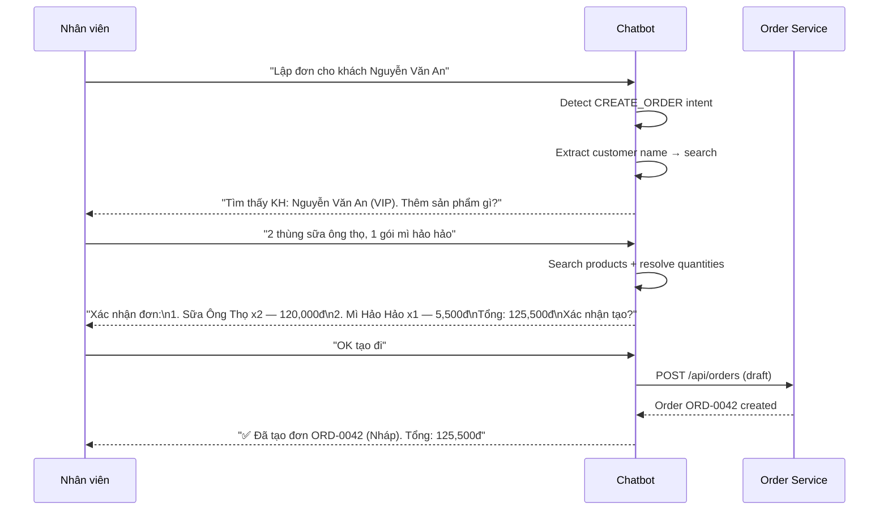

# 🚀 Chatbot AI - Kế hoạch Cải tiến & Roadmap

> Tài liệu này mô tả kế hoạch cải tiến dài hạn cho Chatbot AI của POSMART, hướng tới mục tiêu biến chatbot thành một **nhân viên ảo** có khả năng tương tác đầy đủ với hệ thống.

---

## 📋 Trạng thái hiện tại (v1.2 — 04/2026)

### Capabilities đã có

| Intent | Employee | Customer | Mức độ |
|--------|----------|----------|--------|
| `CHECK_STOCK` | ✅ Full data (on-hand, shelf, reserved) | ✅ Simplified (onShelf only) | ⭐⭐⭐ |
| `CHECK_PRICE` | ✅ Raw price + Product ID | ✅ Price + O2O stock + co-purchase | ⭐⭐⭐⭐ |
| `ORDER_STATUS` | ✅ Full detail + status + payment + items | ✅ Friendly view + delivery info | ⭐⭐⭐⭐ |
| `RECOMMENDATION` | ✅ RAG Pipeline (Hybrid Search + RRF) | ✅ + Personalization (VIP/sỉ/lẻ) | ⭐⭐⭐⭐⭐ |
| `SEARCH_PRODUCT` | ✅ RAG semantic search | ✅ Same | ⭐⭐⭐⭐ |
| `FREE_CHAT` | ✅ Streaming LLM | ✅ Same | ⭐⭐⭐ |

### Architecture

```
┌─── Frontend (React) ───────────────┐
│  ChatWidget → Socket.IO → /ws/chat │
└─────────────┬──────────────────────┘
              │ JWT Token (roleName, storeId)
┌─────────────▼──────────────────────┐
│        Chatbot Service (3008)       │
│  ┌─────────────┐  ┌──────────────┐ │
│  │ IntentResolver│  │  ChatService │ │
│  └──────┬──────┘  └──────┬───────┘ │
│         │                │         │
│  ┌──────▼──────┐  ┌──────▼───────┐ │
│  │  RAGService  │  │  HFClient    │ │
│  │ (pgvector)   │  │ (Qwen 7B)   │ │
│  └─────────────┘  └──────────────┘ │
│         │                          │
│  ┌──────▼──────────────────┐       │
│  │  ApiClient (Cross-svc)  │       │
│  │  → Catalog, Inventory   │       │
│  │  → Order, Auth          │       │
│  └─────────────────────────┘       │
└────────────────────────────────────┘
```

---

## 🎯 Phase 2: Order Intelligence (Tiếp theo)

> **Mục tiêu**: Chatbot có thể **thao tác** với đơn hàng, không chỉ **đọc**.

### 2.1 Intents mới cần thêm

| Intent mới | Keyword triggers | Mô tả | Priority |
|-----------|-----------------|-------|----------|
| `CREATE_ORDER` | "tạo đơn", "lập hóa đơn", "đặt hàng" | Tạo draft order từ cuộc hội thoại | 🔴 High |
| `CANCEL_ORDER` | "hủy đơn", "cancel", "bỏ đơn" | Hủy đơn hàng (chỉ draft/shipping) | 🔴 High |
| `UPDATE_ORDER` | "sửa đơn", "thêm sản phẩm vào đơn", "bỏ bớt" | Cập nhật items trong draft order | 🟡 Medium |
| `PAYMENT_CHECK` | "thanh toán", "payment", "đã trả tiền chưa" | Check/update payment status | 🟡 Medium |
| `REFUND_ORDER` | "hoàn tiền", "refund", "trả hàng" | Xử lý hoàn tiền đơn hàng | 🟢 Low |

### 2.2 Luồng `CREATE_ORDER` (Employee-only, Multi-turn)



**Yêu cầu kỹ thuật:**
- Multi-turn conversation state (lưu `pending_order` trong session metadata)
- Confirmation step bắt buộc trước khi gọi API
- Chỉ Employee mới có quyền (permission check)
- FEFO batch allocation tự động (đã có trong order.service)

### 2.3 Luồng `CANCEL_ORDER`

```
NV: "Hủy đơn ORD-0042"
CB: Kiểm tra status. Chỉ hủy được draft/shipping.
    → Nếu đã delivered/completed: "Không thể hủy. Bạn muốn hoàn tiền?"
    → Nếu draft/shipping: "Xác nhận hủy ORD-0042? (Tổng: 125,500đ)"
NV: "Xác nhận"  
CB: PATCH /api/orders/42/status { status: 'cancelled' }
    → "✅ Đã hủy ORD-0042"
```

### 2.4 Thay đổi code cần thiết

| File | Thay đổi |
|------|----------|
| `intent.resolver.js` | Thêm 5 intent patterns mới |
| `chat.service.js` | Thêm handlers: `_handleCreateOrder`, `_handleCancelOrder`, `_handleUpdateOrder` |
| `api.client.js` | Thêm: `createOrder()`, `cancelOrder()`, `updateOrderStatus()` |
| `chat.handler.js` | Xử lý multi-turn confirmation via socket events |
| `init.sql` | Thêm trường `metadata JSONB` cho `chat_session` (pending order state) |

### 2.5 Bảo mật & Phân quyền

| Action | Employee | Customer |
|--------|----------|----------|
| Tạo đơn | ✅ (cần permission `manage_orders`) | ❌ (redirect ra web) |
| Hủy đơn | ✅ (chỉ draft/shipping) | ⚠️ (chỉ đơn của mình, chỉ draft) |
| Cập nhật items | ✅ (chỉ draft) | ❌ |
| Hoàn tiền | ✅ (cần permission) | ❌ (yêu cầu qua NV) |
| Xem đơn | ✅ (tất cả đơn của store) | ✅ (chỉ đơn của mình) |

---

## 🎯 Phase 3: Customer Self-Service (Tương lai xa)

### 3.1 Capabilities

| Tính năng | Mô tả | Complexity |
|-----------|-------|-----------|
| **Đặt hàng online** | Customer đặt hàng qua chatbot → tạo order delivery | 🔴 High |
| **Theo dõi giao hàng** | Realtime shipping status updates | 🟡 Medium |
| **Đánh giá sản phẩm** | "Sữa ông thọ có ngon không?" → review data | 🟢 Low |
| **Lịch sử mua** | "Tháng trước tôi mua gì?" → order history analysis | 🟡 Medium |
| **Khuyến mãi cá nhân** | "Có deal gì cho khách VIP?" → promotion engine | 🔴 High |

### 3.2 Yêu cầu hạ tầng

- **Session State Machine**: Chuyển từ stateless → stateful multi-turn conversation
- **Permission Middleware trong ChatService**: Kiểm tra `session.permissions` trước mỗi write action
- **Audit Log**: Mọi thao tác write (tạo/hủy/sửa đơn) phải được log với user_id + session_id
- **Rate Limiting**: Giới hạn write actions per session (tránh abuse)
- **Confirmation Protocol**: Bắt buộc explicit confirmation trước mọi thao tác thay đổi data

---

## 🎯 Phase 4: Analytics & Insights

### 4.1 Cho Employee (Dashboard Bot)

```
NV: "Báo cáo doanh thu hôm nay"
CB: → Gọi Report API → "Hôm nay đã bán 45 đơn, tổng 12,500,000đ. Top 3 SP: ..."

NV: "So sánh với tuần trước"
CB: → Multi-turn context → "Tăng 15% so với cùng kỳ tuần trước"
```

### 4.2 Cho Customer (Shopping Assistant)

```
KH: "Tôi hay mua gì nhất?"
CB: → Order history analysis → "Bạn hay mua sữa và mì gói. Tuần này có khuyến mãi..."
```

---

## 📊 Timeline ước tính

| Phase | Nội dung | Effort | Target |
|-------|----------|--------|--------|
| ✅ **v1.0** | Core: Intent + RAG + Streaming | 3 tuần | Done |
| ✅ **v1.2** | Employee/Customer differentiation + Order fix | 1 tuần | Done |
| 🔜 **v2.0** | Order Intelligence (CREATE/CANCEL/UPDATE) | 2-3 tuần | Q2 2026 |
| 📋 **v3.0** | Customer Self-Service (đặt hàng, tracking) | 3-4 tuần | Q3 2026 |
| 📋 **v4.0** | Analytics & Insights | 2-3 tuần | Q3 2026 |

---

## ⚠️ Rủi ro & Mitigation

| Rủi ro | Giải pháp |
|--------|----------|
| Multi-turn state phức tạp | Dùng session metadata JSONB, auto-expire sau 5 phút |
| Write action sai (tạo đơn nhầm) | Confirmation protocol bắt buộc |
| LLM hallucination (bịa data) | Chỉ dùng LLM format text, data luôn từ API |
| Abuse (spam tạo đơn) | Rate limiting + permission check |
| Latency tăng (nhiều API calls) | Parallel requests + caching |
