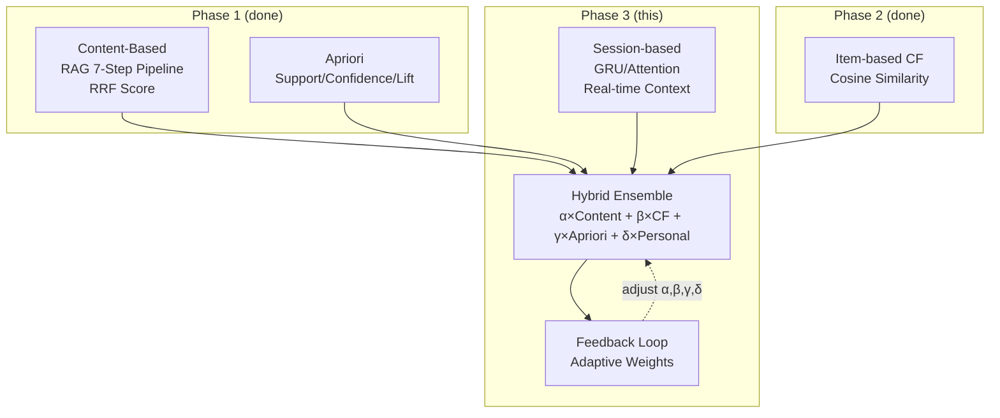

# Phase 3 — Hybrid Ensemble + Session-based Recommendation Plan ✅ COMPLETE

> **Status**: ✅ **DONE** — 12/12 tests PASS, all gaps closed (2026-04-21)  
> **Prerequisite**: Phase 1 ✅ + Phase 2 ✅ (8/8 tests PASS)  
> **Tham chiếu**: `implementation_plan.md` root → Section 3A + 3B  
> **Kết quả**: Ensemble α+β+γ+δ=1, Session Context (5 clusters), Feedback API, Auto-tracking, WeightLearner wired

---

## Kiến trúc tổng quan



---

## Phần A — Hybrid Ensemble Model

### Mục tiêu

Hiện tại 3 engines hoạt động **độc lập**: RAG trả kết quả riêng, CF inject thêm, Apriori inject thêm.  
Phase 3A **hợp nhất** tất cả thành 1 score duy nhất cho mỗi product:

```
final_score(user, item) = 
    α × content_score(RAG RRF)       → 0.40 (search-first chatbot)
  + β × cf_score(Item-CF)             → 0.25 (hành vi mua tương tự)
  + γ × apriori_score(Confidence)     → 0.25 (cross-sell co-purchase)
  + δ × personalization_bonus         → 0.10 (VIP/Wholesale boost)

Tổng: α + β + γ + δ = 1.0
```

### Task 1: Schema — Feedback Tracking Table

#### [MODIFY] `chatbot/src/db/init.sql`

```sql
-- Phase 3: Recommendation feedback (for adaptive weight learning)
CREATE TABLE IF NOT EXISTS recommendation_feedback (
    id BIGSERIAL PRIMARY KEY,
    user_id BIGINT,
    product_id BIGINT,
    store_id BIGINT NOT NULL,
    source TEXT NOT NULL,              -- 'content', 'cf', 'apriori', 'session'
    action TEXT NOT NULL,              -- 'recommended', 'clicked', 'added_to_cart', 'purchased'
    session_id TEXT,                   -- chat session
    recommendation_score NUMERIC,     -- ensemble score tại thời điểm gợi ý
    created_at TIMESTAMPTZ DEFAULT NOW()
);

CREATE INDEX IF NOT EXISTS idx_feedback_user
    ON recommendation_feedback(user_id, store_id, created_at DESC);

-- Ensemble weight configuration (per store, tunable)
CREATE TABLE IF NOT EXISTS ensemble_weights (
    store_id BIGINT PRIMARY KEY,
    alpha NUMERIC DEFAULT 0.40,       -- Content-Based weight
    beta NUMERIC DEFAULT 0.25,        -- CF weight
    gamma NUMERIC DEFAULT 0.25,       -- Apriori weight
    delta NUMERIC DEFAULT 0.10,       -- Personalization weight
    updated_at TIMESTAMPTZ DEFAULT NOW()
);
```

---

### Task 2: Hybrid Service

#### [NEW] `chatbot/src/services/hybrid.service.js`

```
HybridRecommendationService:

constructor({ ragService, cfService, copurchaseRepo, pool }):
  - Load ensemble weights từ DB hoặc default

recommend(userId, storeId, query, chatHistory):
  1. Run ALL 3 engines in parallel (Promise.all):
     - contentResults ← ragService.recommend(query, storeId, userId, chatHistory)
     - cfResults ← cfService.getRecommendations(userId, storeId, 10)
     - aprioriResults ← copurchaseRepo.getRelatedFromTopProducts(contentProductIds, storeId)

  2. Normalize scores to [0, 1]:
     - content: RRF score → min-max normalize
     - cf: prediction_score → min-max normalize
     - apriori: confidence → already [0, 1]

  3. Ensemble scoring:
     - Merge by product_id
     - final = α×content + β×cf + γ×apriori + δ×personalization
     - Sort DESC → top K

  4. Track sources (for feedback):
     - Mỗi result ghi lại source channel (nào đóng góp nhiều nhất)

  5. Return enriched results

loadWeights(storeId):
  - SELECT * FROM ensemble_weights WHERE store_id = $1
  - Fallback: { α:0.40, β:0.25, γ:0.25, δ:0.10 }
```

**⚠ Edge Cases:**
- **CF cold start (no user history)**: β = 0, redistribute to α
- **No Apriori data**: γ = 0, redistribute to α + β  
- **All engines fail**: Fallback to content-only (α = 1.0)

---

### Task 3: Adaptive Weight Learning

#### [NEW] `chatbot/src/services/weight-learner.js`

```
Nightly batch job (cron: 4:00 AM, sau CF compute):

1. Query recommendation_feedback:
   - GROUP BY source WHERE action = 'purchased' AND created_at > 30 days ago
   - Count conversions per source

2. Compute new weights:
   - conversion_rate(source) = purchased / recommended
   - new_weight(source) = conversion_rate(source) / SUM(all conversion_rates)

3. Smoothing (tránh dao động quá mạnh):
   - smoothed = 0.8 × current_weight + 0.2 × new_weight
   - Clamp: min=0.05, max=0.60 (không cho 1 source dominate)

4. UPDATE ensemble_weights SET alpha = $1, beta = $2, ...
```

---

### Task 4: Wire into RAG Pipeline

#### [MODIFY] `rag.service.js`

Thay thế 3 steps riêng lẻ bằng 1 call `hybridService.recommend()`:

```diff
  // Current (Phase 2): 3 engines chạy riêng
- Step 5: Co-purchase Enrichment
- Step 5.5: CF Enrichment
- Step 6: Personalization
- Step 7: Generate(products, coPurchase, cf, personal)

  // Phase 3: 1 unified call
+ Step 5: Hybrid Ensemble
+   results = await hybridService.recommend(userId, storeId, query, chatHistory)
+ Step 6: Generate(results.products, results.explanation)
```

**Lưu ý**: Giữ nguyên fallback mode — nếu `hybridService` null → dùng pipeline cũ.

---

### Task 5: Feedback Collection API

#### [MODIFY] `chat.handler.js` hoặc `app.js`

```
POST /api/chatbot/feedback
Body: { userId, productId, storeId, source, action, sessionId }

→ INSERT INTO recommendation_feedback
```

Gọi khi:
- Frontend user click vào SP gợi ý → action='clicked'
- User thêm vào giỏ hàng → action='added_to_cart'
- Order confirmed có SP đã gợi ý → action='purchased' (via event)

---

## Phần B — Session-based Context (GRU)

> ⚠ **Phần này phức tạp hơn đáng kể**: cần training data, model inference.  
> Recommend: implement **B1 (rule-based session context)** trước, **B2 (GRU)** sau khi có đủ data.

### Task 6: Session Context Extractor (Rule-based — B1)

#### [NEW] `chatbot/src/services/session-context.service.js`

```
SessionContextService:

extractProductSequence(chatHistory):
  - Duyệt chatHistory, tìm productIds đã mention/recommend
  - Return: [p1, p2, ..., pt] (ordered by time)

inferSessionIntent(productSequence):
  - Nếu products thuộc cùng cluster → return cluster name
  - Ví dụ: [Bò(1), Nấm(2)] → "lau_bo" cluster
  - [BánhMì(7), Sữa(8)] → "bua_sang" cluster
  - Mixed → "exploring"

boostBySessionContext(products, sessionIntent):
  - Nếu sessionIntent = "lau_bo" → boost products in LAU_BO cluster +0.15
  - Nếu sessionIntent = "exploring" → no boost (diverse)
```

**Cluster definitions** (reuse from mock-interactions):

```js
const SESSION_CLUSTERS = {
  lau_bo: [1, 2, 3, 4, 5, 24, 25, 26, 27, 28],
  bua_sang: [7, 8, 9, 10, 11],
  giai_khat: [17, 18, 19, 20, 21, 22],
  gia_vi: [4, 13, 16, 23, 49, 52, 53]
};
```

---

### Task 7: GRU Model (B2 — Future)

> **Điều kiện**: ≥5000 chat sessions với product interactions  
> **Runtime**: Cần ONNX Runtime hoặc TF.js  
> **Không implement ngay** — chỉ document kiến trúc

```
Kiến trúc:
  Input → Product Embedding (64d) → GRU (128h, 2 layers) → Attention → Score vector

Training data:
  - Positive: products user mua/click sau khi xem
  - Negative: random sampling
  - Format: ([p1,p2,...,pt-1], pt) → predict next product

Inference:
  - Input: chuỗi product IDs trong session hiện tại
  - Output: top-K predicted products
```

---

## Task Breakdown — Execution Order

| # | Task | File(s) | Priority | Complexity |
|---|---|---|---|---|
| 1 | Schema: feedback + weights | `init.sql` | 🔴 P0 | Low |
| 2 | Hybrid service (ensemble) | **[NEW]** `hybrid.service.js` | 🔴 P0 | **High** |
| 3 | Weight learner (batch) | **[NEW]** `weight-learner.js` | 🟡 P1 | Medium |
| 4 | Wire into RAG pipeline | `rag.service.js`, `index.js` | 🟡 P1 | Medium |
| 5 | Feedback API | `chat.handler.js` / `app.js` | 🟡 P1 | Low |
| 6 | Session context (rule-based) | **[NEW]** `session-context.service.js` | 🟢 P2 | Medium |
| 7 | GRU model (future) | Deferred | ⚪ P3 | **Very High** |

---

## Test Cases

> Tham chiếu: `implementation_plan.md` → Section 3B.4

| TC | Scenario | Expected | Metric |
|---|---|---|---|
| TC-HY-1 | Query "mua bò" + User 50 (Nội trợ) | Ensemble: Bò score = α×content + β×cf + γ×apriori | final_score > content_only_score |
| TC-HY-2 | Query "gợi ý" + User 200 (Sinh viên) | CF items boosted, Apriori items present | β contribution > 0 |
| TC-HY-3 | Cold start user + query "mua gì ngon" | α dominates (content-only), β ≈ 0 | Graceful fallback |
| TC-HY-4 | Weight adjustment after feedback | α changes by ≤ 5% | Weight stability |
| TC-SES-1 | Session [Bò(1) → Nấm(2) → "mua gì nữa?"] | Session context = "lau_bo" → boost Gia vị, Bún | Cluster precision > 80% |
| TC-SES-2 | Session [BánhMì(7) → Sữa(8) → "thiếu gì?"] | Session context = "bua_sang" → boost Trứng | Cluster recall > 70% |
| TC-SES-3 | Mixed session [Bò(1) → Sữa(8)] | Session context = "exploring" → diverse results | Diversity > 0.5 |

---

## Verification

```bash
# 1. Schema migration
docker compose up --build -d chatbot

# 2. Verify ensemble scoring
node docs/chatbot/seed-product/test-algorithm.js
# Expected: 11/11 PASS (8 Phase 1+2 + 3 Phase 3)

# 3. Verify feedback API
curl -X POST http://localhost:3008/api/chatbot/feedback \
  -H "Content-Type: application/json" \
  -d '{"userId":50,"productId":2,"storeId":1,"source":"cf","action":"purchased"}'

# 4. Verify weight learning (after collecting feedback)
node docs/chatbot/seed-product/weight-learner-batch.js
psql -c "SELECT * FROM ensemble_weights WHERE store_id = 1;"
```

---

## Blockers & Risks

| Blocker | Impact | Mitigation |
|---|---|---|
| **Feedback data = 0** | Weight learner chạy nhưng không có data | Default weights (α=0.40) |
| **Ensemble latency** | 3 engines parallel + scoring → có thể > 500ms | Pre-compute CF + Apriori nightly, chỉ content real-time |
| **GRU training data** | ≥5000 sessions chưa có | Defer Task 7, dùng rule-based Session Context |
| **Score normalization** | RRF/CF/Apriori score ranges khác nhau | Min-max normalize to [0,1] |

---

## Dependencies

```
Phase 3A (Hybrid):
  ├── Phase 1 ✅ (Apriori: support/confidence/lift)
  ├── Phase 2 ✅ (CF: Cosine Similarity + getRecommendations)
  └── Task 1-5 (schema + hybrid service + feedback)

Phase 3B (Session):
  ├── Phase 3A ✅ (Ensemble scoring)
  ├── Task 6 (rule-based session context) — implement immediately
  └── Task 7 (GRU model) — defer until ≥5000 sessions
```
