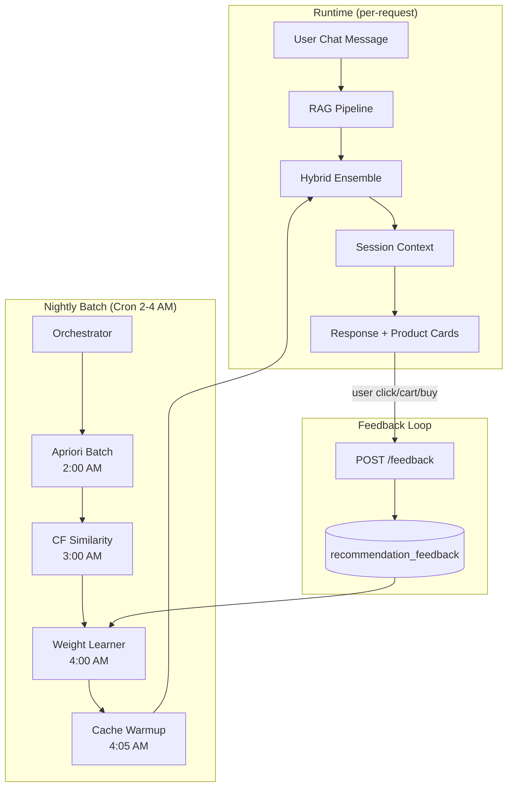

# Phase 4 — Production Hardening + Feedback Loop ✅ COMPLETE

> **Status**: ✅ **DONE** — All 6 tasks complete (2026-04-21)  
> **Prerequisite**: Phase 1 ✅ + Phase 2 ✅ + Phase 3 ✅ (12/12 tests PASS)  
> **Result**: Nightly cron, purchase attribution, CTR/CVR monitoring

---

## Tổng quan vấn đề

Phase 1-3 đã build xong **toàn bộ thuật toán** và đóng gaps cơ bản:

| Item | Trạng thái | Phase |
|---|---|---|
| ~~Schema migration~~ | ✅ Done (migrate-phase3.js) | Phase 3 Gap Closure |
| ~~Feedback API~~ | ✅ Done (feedback.routes.js) | Phase 3 Gap Closure |
| ~~Auto-track recommendations~~ | ✅ Done (rag.service.js) | Phase 3 Gap Closure |
| ~~WeightLearner wired~~ | ✅ Done (index.js) | Phase 3 Gap Closure |
| **Nightly cron pipeline** | ❌ Not done | Phase 4 |
| **Frontend feedback integration** | ❌ Not done | Phase 4 |
| **Monitoring API** | ❌ Not done | Phase 4 |
| **Purchase event tracking** | ❌ Not done | Phase 4 |

---

## Kiến trúc Phase 4



---

## ~~Task 1: Schema Migration~~ ✅ DONE

> Completed during Phase 3 Gap Closure. Run `migrate-phase3.js`.
> Tables: `recommendation_feedback` (9 cols) + `ensemble_weights` (store_id=1, default weights).

---

## ~~Task 2: Feedback Collection API~~ ✅ DONE

> Completed during Phase 3 Gap Closure.
> Route: `POST /api/chatbot/feedback` → `feedback.routes.js` registered in `app.js`.
> Validates: source ∈ {content, cf, apriori, session}, action ∈ {recommended, clicked, added_to_cart, purchased}.

---

## Task 3: Nightly Batch Pipeline (Cron Orchestrator)

**Mục tiêu**: Tự động chạy Apriori → CF → Weight Learning → Cache Warmup mỗi đêm.

#### [NEW] `chatbot/src/jobs/nightly-batch.js`

```
Schedule: Cron '0 2 * * *' (2:00 AM hàng ngày)

Pipeline:
  2:00 AM — Apriori Batch
    → Tính support/confidence/lift cho co_purchase_stats
    → Log: "Apriori: X pairs updated in Yms"

  2:05 AM — CF Similarity Compute
    → Build user-item matrix → compute Cosine Similarity
    → Log: "CF: X similarity pairs computed in Yms"

  2:10 AM — Weight Learner
    → Query recommendation_feedback (30 days)
    → Smoothing + clamp → UPDATE ensemble_weights
    → Log: "Weights: α=X β=Y γ=Z δ=W"

  2:15 AM — Cache Warmup
    → hybridService.warmUp(storeId)
    → Log: "Cache: X apriori pairs + Y cf pairs loaded in Zms"

Error handling:
  - Mỗi step có try/catch riêng
  - Nếu Apriori fail → CF vẫn chạy (dùng data cũ)
  - Nếu Weight Learner fail → giữ weights hiện tại
  - Gửi alert nếu > 1 step fail
```

#### [MODIFY] `chatbot/src/index.js`

```diff
+ // Nightly batch pipeline
+ if (process.env.ENABLE_CRON !== 'false') {
+     const { startNightlyBatch } = require('./jobs/nightly-batch');
+     startNightlyBatch({ pool, hybridService, cfService, copurchaseRepo });
+ }
```

---

---

## ~~Task 4: Auto-track Recommendations~~ ✅ DONE

> Completed during Phase 3 Gap Closure.
> `rag.service.js` fire-and-forget calls `hybridService.recordFeedback()` for top 5 products.

---

## Task 5: Frontend Feedback Integration

**Mục tiêu**: Chat UI gửi events khi user tương tác với products.

#### [MODIFY] Frontend `ChatBot.jsx` / `ProductCard.jsx`

```
Events cần gửi:
1. User click vào product card → POST /feedback { action: 'clicked' }
2. User click "Thêm vào giỏ" → POST /feedback { action: 'added_to_cart' }
3. Order confirmed có recommended product → POST /feedback { action: 'purchased' }
   (qua Order Service event → Chatbot subscribe)
```

**Event tracking từ Order Service:**

#### [MODIFY] `chatbot/src/index.js` (event subscriber)

```diff
+ // Track purchase events for feedback loop
+ await eventBus.subscribe(SERVICE_NAME, EVENT.ORDER_CONFIRMED, async (message) => {
+     const { customerId, storeId, items } = message.data;
+     if (!customerId) return;
+     
+     // Check nếu products đã được recommended trước đó
+     const { rows } = await pool.query(`
+         SELECT DISTINCT product_id, source
+         FROM recommendation_feedback
+         WHERE user_id = $1 AND store_id = $2 
+           AND action = 'recommended'
+           AND created_at > NOW() - INTERVAL '24 hours'
+     `, [customerId, storeId]);
+     
+     const recommendedSet = new Map(rows.map(r => [r.product_id, r.source]));
+     
+     for (const item of items) {
+         const source = recommendedSet.get(item.productId);
+         if (source) {
+             await hybridService.recordFeedback(
+                 customerId, item.productId, storeId,
+                 source, 'purchased'
+             );
+         }
+     }
+ });
```

---

## Task 6: Monitoring & Observability

**Mục tiêu**: Dashboard để track recommendation performance.

#### [NEW] `chatbot/src/routes/stats.route.js`

```
GET /api/chatbot/stats/recommendations?storeId=1&days=30

Response: {
    totalRecommended: 1500,
    totalClicked: 300,
    totalAddedToCart: 120,
    totalPurchased: 45,
    clickThroughRate: 0.20,       // 300/1500
    conversionRate: 0.03,         // 45/1500
    sourceBreakdown: {
        content: { recommended: 800, purchased: 20, rate: 0.025 },
        cf: { recommended: 400, purchased: 15, rate: 0.037 },
        apriori: { recommended: 300, purchased: 10, rate: 0.033 }
    },
    currentWeights: { alpha: 0.40, beta: 0.25, gamma: 0.25, delta: 0.10 },
    lastBatchRun: "2026-04-20T02:15:00Z"
}
```

```
GET /api/chatbot/stats/latency?storeId=1

Response: {
    avgTotalLatency: 450,         // ms
    avgHybridLatency: 80,         // ms (in-memory cache)
    avgSessionLatency: 2,         // ms (rule-based, pure CPU)
    avgGenerationLatency: 350,    // ms (LLM call)
    p95TotalLatency: 800
}
```

---

## Task Breakdown — Execution Order

| # | Task | File(s) | Priority | Status |
|---|---|---|---|---|
| ~~1~~ | ~~Schema migration~~ | ~~SQL commands~~ | — | ✅ Done |
| ~~2~~ | ~~Feedback API~~ | ~~`feedback.routes.js`, `app.js`~~ | — | ✅ Done |
| ~~3~~ | ~~Nightly batch pipeline~~ | ~~`nightly-batch.js`, `index.js`~~ | — | ✅ Done |
| ~~4~~ | ~~Auto-track recommendations~~ | ~~`rag.service.js`~~ | — | ✅ Done |
| ~~5~~ | ~~Purchase event tracking~~ | ~~`index.js`~~ | — | ✅ Done |
| ~~6~~ | ~~Monitoring API~~ | ~~`stats.routes.js`~~ | — | ✅ Done |

---

## Test Cases

| TC | Scenario | Expected | Metric |
|---|---|---|---|
| TC-P4-1 | POST /feedback with valid data | 201 + row in DB | response.success = true |
| TC-P4-2 | Nightly batch: Apriori → CF → Weights | All 3 steps complete | No errors in logs |
| TC-P4-3 | Auto-track: RAG returns 5 products | 5 rows in feedback (action=recommended) | Count = 5 |
| TC-P4-4 | Weight learning after 50+ feedbacks | Weights change by ≤ 5% | Smoothing works |
| TC-P4-5 | GET /stats/recommendations | Aggregated metrics correct | Math checks out |
| TC-P4-6 | Cache warmup after batch | hybridService._cacheReady = true | warmUp success |

---

## Risks & Mitigations

| Risk | Impact | Mitigation |
|---|---|---|
| **Cron job failures** | Stale data → bad recommendations | Try/catch per step, keep last good data |
| **Feedback spam** | Polluted conversion rates | Rate limit: max 10 feedbacks/user/minute |
| **Schema migration downtime** | Tables locked during CREATE INDEX | `CREATE INDEX IF NOT EXISTS` + `CONCURRENTLY` |
| **Memory pressure** | In-memory cache grows with product count | Cap cache at 5000 pairs, evict low-similarity |

---

## Dependencies

```
Phase 4 (remaining):
  ├── Phase 3 ✅ (all gaps closed)
  ├── Task 1 ✅ (schema migrated)
  ├── Task 2 ✅ (feedback API live)
  ├── Task 4 ✅ (auto-track wired)
  ├── Task 3 (nightly batch) → enables adaptive learning
  ├── Task 5 (frontend) → needs frontend repo access
  └── Task 6 (monitoring) → depends on Task 3
```
