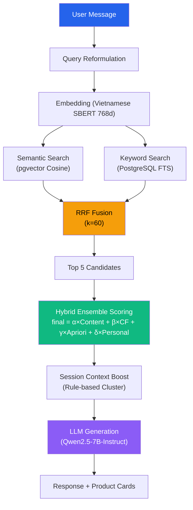
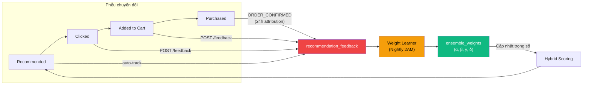
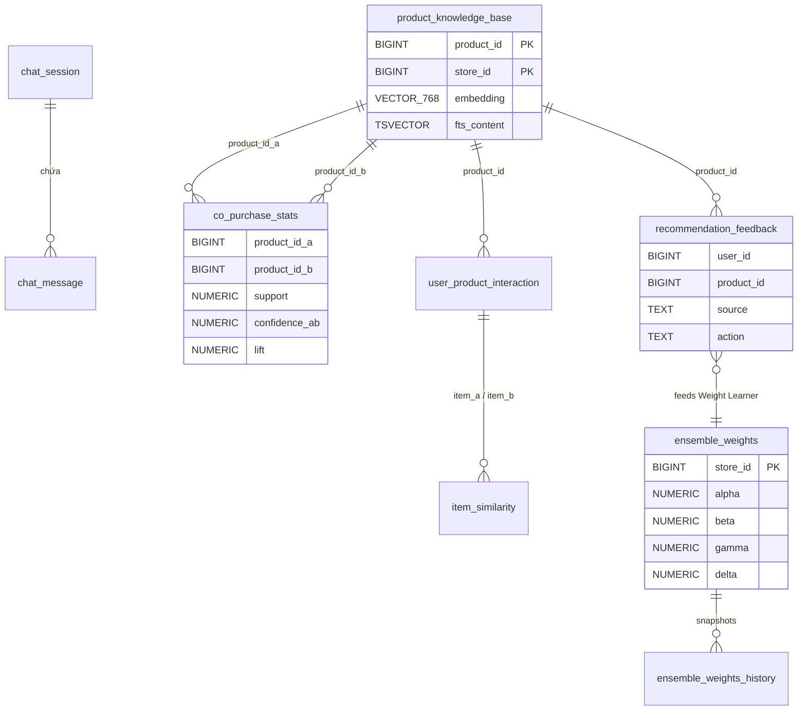
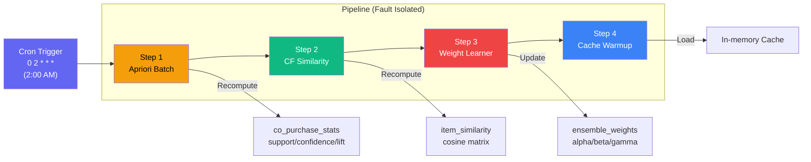

# BÁO CÁO ĐỒ ÁN: Hệ Thống Gợi Ý Sản Phẩm AI — POSMART

> **Sinh viên thực hiện**: [Tên SV]  
> **GVHD**: [Tên GV]  
> **Ngày**: 2026-04-23

---

## 1. TỔNG QUAN HỆ THỐNG

### 1.1 Mục tiêu

Xây dựng hệ thống chatbot bán hàng tích hợp AI Recommendation Engine, sử dụng kiến trúc **Hybrid Ensemble** kết hợp 4 thuật toán:

| # | Thuật toán | Ký hiệu | Mục đích |
|---|---|---|---|
| 1 | Content-Based (RAG + RRF) | α | Tìm sản phẩm phù hợp ngữ nghĩa với câu hỏi |
| 2 | Item-based Collaborative Filtering | β | Gợi ý dựa trên hành vi mua tương tự |
| 3 | Apriori (Association Rules) | γ | Phát hiện sản phẩm thường mua kèm |
| 4 | Session Personalization | δ | Cá nhân hóa theo loại khách hàng |

### 1.2 Kiến trúc tổng thể — RAG Pipeline



### 1.3 Sơ đồ Feedback Loop (Vòng lặp phản hồi)



### 1.4 Database Schema — Chi tiết

Hệ thống sử dụng **10 bảng** chia thành 5 nhóm chức năng. Dưới đây là giải thích ý nghĩa từng thuộc tính và cách chúng được sử dụng trong các thuật toán.

---

#### 1.4.1 Nhóm 1: Chat Session (Lưu trữ hội thoại)

**Bảng `chat_session`** — Quản lý phiên chat giữa user và chatbot:

| Thuộc tính | Kiểu | Ý nghĩa & Cách sử dụng |
|---|---|---|
| `id` | BIGINT (IDENTITY) | Khóa chính, tự tăng |
| `user_id` | BIGINT | ID của khách hàng hoặc nhân viên — liên kết cross-service (không FK vì khác DB) |
| `user_type` | TEXT | `'customer'` hoặc `'employee'` — xác định vai trò để điều hướng intent (khách hỏi sản phẩm vs. nhân viên kiểm kho) |
| `store_id` | BIGINT | Chi nhánh — hỗ trợ multi-tenancy, đảm bảo gợi ý đúng kho hàng |
| `started_at` | TIMESTAMPTZ | Thời điểm bắt đầu — dùng để phân tích session duration |
| `ended_at` | TIMESTAMPTZ | Thời điểm kết thúc (nullable) — session vẫn active nếu NULL |
| `is_active` | BOOLEAN | Partial index `WHERE is_active = TRUE` giúp query nhanh các session đang mở |

**Bảng `chat_message`** — Lưu từng tin nhắn trong phiên:

| Thuộc tính | Kiểu | Ý nghĩa & Cách sử dụng |
|---|---|---|
| `session_id` | BIGINT (FK) | Liên kết với `chat_session` — nhóm tin nhắn theo phiên |
| `role` | TEXT | `'user'`, `'assistant'`, `'system'` — xác định ai gửi tin nhắn |
| `content` | TEXT | Nội dung tin nhắn — dùng làm `chatHistory` cho Query Reformulation |
| `intent` | TEXT | Ý định đã phân loại (nullable) — VD: `'product_search'`, `'greeting'` |
| `metadata` | JSONB | Chứa `productIds`, `ensembleSources`, latency — dữ liệu có cấu trúc linh hoạt |

---

#### 1.4.2 Nhóm 2: RAG Knowledge Base (Cơ sở tri thức)

**Bảng `product_knowledge_base`** — Trung tâm của hệ thống RAG:

| Thuộc tính | Kiểu | Ý nghĩa & Cách sử dụng |
|---|---|---|
| `product_id` | BIGINT | Cross-service reference đến Catalog Service — không dùng FK vì khác database |
| `store_id` | BIGINT | Chi nhánh — kết hợp với `product_id` tạo `UNIQUE(product_id, store_id)` |
| `content` | TEXT | Chuỗi mô tả sản phẩm dạng tự nhiên — VD: `"Ba chỉ bò Mỹ" thuộc "Thịt tươi sống", giá 285000đ` |
| `embedding` | VECTOR(768) | **Vector ngữ nghĩa 768 chiều** từ Vietnamese SBERT — dùng cho Semantic Search qua HNSW index |
| `fts_content` | TSVECTOR | **Vector từ khóa** tạo từ `to_tsvector('simple', content)` — dùng cho Keyword Search qua GIN index |
| `category_name` | TEXT | Tên danh mục (cached) — tránh cross-service query khi tạo response |
| `unit_price` | NUMERIC | Giá bán (cached) — hiển thị trong Product Card |
| `is_in_stock` | BOOLEAN | Trạng thái tồn kho — **Partial index** `WHERE is_in_stock = TRUE` giúp loại bỏ sản phẩm hết hàng khỏi kết quả tìm kiếm |
| `quantity_on_shelf` | INT | Số lượng trên kệ (cached) — hiển thị "còn X sản phẩm" |
| `last_synced_at` | TIMESTAMPTZ | Thời điểm đồng bộ cuối — phát hiện data stale, cron sync mỗi 30 phút |

**Indexes quan trọng**:
- `idx_pkb_embedding` (HNSW, `vector_cosine_ops`) → Semantic Search: `O(log n)` thay vì `O(n)` scan toàn bộ
- `idx_pkb_fts` (GIN) → Keyword Search: full-text match hiệu quả
- `idx_pkb_store_stock` (B-Tree, partial) → Lọc nhanh sản phẩm còn hàng theo chi nhánh

---

#### 1.4.3 Nhóm 3: Apriori (Luật kết hợp)

**Bảng `co_purchase_stats`** — Lưu thống kê mua kèm giữa 2 sản phẩm:

| Thuộc tính | Kiểu | Ý nghĩa & Cách sử dụng |
|---|---|---|
| `product_id_a` | BIGINT | Sản phẩm A trong cặp — luôn có `product_id_a < product_id_b` để tránh trùng |
| `product_id_b` | BIGINT | Sản phẩm B trong cặp |
| `store_id` | BIGINT | Chi nhánh — mỗi chi nhánh có thống kê riêng |
| `co_purchase_count` | INT | **count(A ∧ B)** — số đơn hàng chứa cả A lẫn B. Tăng real-time khi nhận event `ORDER_COMPLETED` |
| `support` | NUMERIC | **count(A ∧ B) / tổng_đơn** — tần suất xuất hiện cùng nhau trong toàn bộ giao dịch |
| `confidence_ab` | NUMERIC | **count(A ∧ B) / count(A)** — xác suất mua B khi đã mua A. Dùng trực tiếp làm `apriori_score` trong Ensemble |
| `confidence_ba` | NUMERIC | **count(A ∧ B) / count(B)** — chiều ngược lại |
| `lift` | NUMERIC | **(count(A∧B) × total) / (count(A) × count(B))** — mức độ tương quan. `lift > 1` = mua kèm thật sự |
| `total_orders` | INT | Tổng số đơn hàng tại thời điểm tính — mẫu số của `support` |
| `last_updated_at` | TIMESTAMPTZ | Thời điểm batch cuối — theo dõi freshness |

**Bảng `product_order_frequency`** — Tần suất mua riêng lẻ:

| Thuộc tính | Kiểu | Ý nghĩa & Cách sử dụng |
|---|---|---|
| `product_id` | BIGINT | Sản phẩm |
| `store_id` | BIGINT | Chi nhánh |
| `order_count` | INT | **count(A)** — số đơn hàng chứa sản phẩm này. Làm mẫu số cho `confidence` |
| `last_computed_at` | TIMESTAMPTZ | Thời điểm tính cuối (nightly batch 2AM) |

**Index**: `idx_copurchase_lift WHERE lift > 1` → Partial index chỉ lưu các cặp có tương quan dương, loại bỏ noise.

---

#### 1.4.4 Nhóm 4: Collaborative Filtering (Lọc cộng tác)

**Bảng `user_product_interaction`** — Ma trận tương tác User×Product:

| Thuộc tính | Kiểu | Ý nghĩa & Cách sử dụng |
|---|---|---|
| `user_id` | BIGINT | Khách hàng — hàng trong ma trận R[u,i] |
| `product_id` | BIGINT | Sản phẩm — cột trong ma trận R[u,i] |
| `store_id` | BIGINT | Chi nhánh — ma trận riêng per store |
| `purchase_count` | INT | Số lần mua — thành phần chính của `interaction_score` |
| `total_quantity` | INT | Tổng số lượng đã mua — phản ánh mức độ yêu thích |
| `last_purchased_at` | TIMESTAMPTZ | Lần mua cuối — dùng để tính **recency decay** (mua gần đây = score cao hơn) |
| `interaction_score` | NUMERIC | **R[u,i]** — điểm tương tác tổng hợp = `f(purchase_count, total_quantity, recency)`. Đây là giá trị trực tiếp dùng trong Cosine Similarity |

**Bảng `item_similarity`** — Ma trận tương đồng Item×Item (pre-computed):

| Thuộc tính | Kiểu | Ý nghĩa & Cách sử dụng |
|---|---|---|
| `item_a` | BIGINT | Sản phẩm A |
| `item_b` | BIGINT | Sản phẩm B (luôn `item_a < item_b`) |
| `store_id` | BIGINT | Chi nhánh |
| `similarity` | NUMERIC | **sim(A,B)** — Cosine Similarity từ `_reciprocalRankFusion`. Chỉ lưu nếu `>= 0.05` |
| `common_users` | INT | Số user đã mua cả A lẫn B — dùng làm **confidence filter** (loại nếu < 2 common users) |
| `computed_at` | TIMESTAMPTZ | Thời điểm tính — nightly batch 2AM |

**Index**: `idx_item_sim_lookup WHERE similarity >= 0.3` → Chỉ truy vấn nhanh các cặp có độ tương đồng đủ cao.

---

#### 1.4.5 Nhóm 5: Feedback Loop & Weight Learning

**Bảng `recommendation_feedback`** — Ghi nhận mọi tương tác của user với recommendation:

| Thuộc tính | Kiểu | Ý nghĩa & Cách sử dụng |
|---|---|---|
| `user_id` | BIGINT | Khách hàng đã tương tác |
| `product_id` | BIGINT | Sản phẩm được gợi ý |
| `store_id` | BIGINT | Chi nhánh |
| `source` | TEXT | **Nguồn thuật toán** đã gợi ý sản phẩm này: `'content'`, `'cf'`, `'apriori'`. Weight Learner dùng field này để tính conversion rate per source |
| `action` | TEXT | **Hành động**: `'recommended'` → `'clicked'` → `'added_to_cart'` → `'purchased'`. Phễu chuyển đổi |
| `session_id` | TEXT | Session liên kết — nhóm feedback theo phiên chat |
| `recommendation_score` | NUMERIC | `final_score` từ Ensemble — đánh giá "độ tự tin" của hệ thống khi gợi ý |
| `created_at` | TIMESTAMPTZ | Thời điểm — dùng cho 24h attribution window khi nhận `ORDER_CONFIRMED` |

**Bảng `ensemble_weights`** — Trọng số hiện tại (1 row per store):

| Thuộc tính | Kiểu | Ý nghĩa & Cách sử dụng |
|---|---|---|
| `store_id` | BIGINT (PK) | Mỗi chi nhánh có bộ trọng số riêng |
| `alpha` | NUMERIC (default 0.40) | **α** — Trọng số Content-Based (RAG). Cao nhất vì là nguồn trả lời trực tiếp câu hỏi |
| `beta` | NUMERIC (default 0.25) | **β** — Trọng số Collaborative Filtering. Cá nhân hóa dựa trên hành vi mua |
| `gamma` | NUMERIC (default 0.25) | **γ** — Trọng số Apriori. Cross-sell dựa trên luật kết hợp |
| `delta` | NUMERIC (default 0.10) | **δ** — Trọng số Personalization (VIP/Retail/Wholesale). Cố định, không tham gia learning |
| `updated_at` | TIMESTAMPTZ | Lần cập nhật cuối — nightly batch hoặc Force Learn |

**Bảng `ensemble_weights_history`** — Lịch sử thay đổi trọng số:

| Thuộc tính | Kiểu | Ý nghĩa & Cách sử dụng |
|---|---|---|
| `store_id` | BIGINT | Chi nhánh |
| `alpha, beta, gamma, delta` | NUMERIC | Snapshot trọng số tại thời điểm log — hiển thị trên **WeightEvolutionChart** trong Dashboard |
| `feedback_count` | INT | Số feedbacks dùng để tính trọng số mới — nếu < 20 thì Weight Learner skip |
| `trigger_type` | TEXT | `'nightly'` (2AM batch) hoặc `'manual'` (Force Learn từ Dashboard) — phân biệt trên biểu đồ |
| `created_at` | TIMESTAMPTZ | Thời điểm log — trục X trên WeightEvolutionChart |

**Bảng `processed_events`** — Idempotency cho event-driven:

| Thuộc tính | Kiểu | Ý nghĩa & Cách sử dụng |
|---|---|---|
| `event_id` | TEXT | ID duy nhất của event từ RabbitMQ — `UNIQUE(event_id, service_name)` ngăn xử lý trùng |
| `event_type` | TEXT | Loại event: `'product.created'`, `'order.completed'`, `'inventory.updated'` |
| `service_name` | TEXT | `'chatbot-service'` — phân biệt khi nhiều service cùng consume 1 event |
| `processed_at` | TIMESTAMPTZ | Thời điểm xử lý — audit trail |

---

#### 1.4.6 Sơ đồ quan hệ giữa các bảng



---

## 2. THUẬT TOÁN 1: CONTENT-BASED FILTERING (RAG + RRF)

### 2.1 Mô tả

Sử dụng **Retrieval-Augmented Generation (RAG)** kết hợp tìm kiếm ngữ nghĩa (Semantic Search) và tìm kiếm từ khóa (Keyword Search), hợp nhất kết quả bằng **Reciprocal Rank Fusion (RRF)**.

### 2.2 Công thức

**Semantic Search** — Cosine Similarity qua pgvector:

```
score_semantic(q, d) = 1 - cosine_distance(embed(q), embed(d))
```

**Keyword Search** — PostgreSQL Full-Text Search:

```
score_keyword(q, d) = ts_rank(d.fts_content, plainto_tsquery('simple', q))
```

**Reciprocal Rank Fusion** — Hợp nhất 2 danh sách:

```
RRF_score(d) = SUM( 1/(k + rank_i(d)) )     với k = 60 (constant)
```

Trong đó `rank_i(d)` là thứ hạng của document `d` trong danh sách kết quả thứ `i`.

**Tại sao k = 60?** Giá trị `k=60` là hằng số chuẩn được đề xuất trong bài báo gốc về RRF (Cormack et al., 2009). Vai trò của `k` là **cân bằng ảnh hưởng giữa các thứ hạng**: giá trị `k` lớn giúp giảm sự chênh lệch điểm số giữa rank 1 và rank 10, tránh tình trạng kết quả rank cao ở 1 danh sách hoàn toàn áp đảo. Qua thực nghiệm trên nhiều bộ dữ liệu TREC, `k=60` cho kết quả fusion tốt nhất khi kết hợp 2-3 retrieval sources.

### 2.3 Implementation

**File**: `repositories/knowledge.repository.js`

```javascript
// Semantic search — pgvector cosine
SELECT product_id, 1 - (embedding <=> $1::vector) AS score
FROM product_knowledge_base
WHERE store_id = $2 AND is_in_stock = TRUE
ORDER BY embedding <=> $1::vector ASC LIMIT 10;

// Keyword search — tsvector
SELECT product_id, ts_rank(fts_content, plainto_tsquery('simple', $1)) AS score
FROM product_knowledge_base
WHERE fts_content @@ plainto_tsquery('simple', $1) LIMIT 10;
```

**File**: `services/rag.service.js` — RRF Fusion:

```javascript
_reciprocalRankFusion(semanticList, keywordList, k = 60) {
    const scoreMap = new Map();
    semanticList.forEach((item, rank) => {
        scoreMap.get(key).score += 1 / (k + rank + 1);
    });
    keywordList.forEach((item, rank) => {
        scoreMap.get(key).score += 1 / (k + rank + 1);
    });
    return [...scoreMap.values()].sort((a, b) => b.score - a.score);
}
```

### 2.4 Testcase minh họa

**Input**: User hỏi "có thịt bò không?"

| Step | Semantic Top 3 | Keyword Top 3 |
|---|---|---|
| rank 0 | Ba chỉ bò Mỹ (pid=1) | Thịt bò Úc (pid=2) |
| rank 1 | Thịt bò Úc (pid=2) | Ba chỉ bò Mỹ (pid=1) |
| rank 2 | Nấm kim châm (pid=3) | Bún bò (pid=5) |

**RRF Fusion** (k=60):

| Product | RRF Score | Calculation |
|---|---|---|
| Ba chỉ bò Mỹ (pid=1) | **0.0327** | 1/61 + 1/62 = 0.01639 + 0.01613 |
| Thịt bò Úc (pid=2) | **0.0327** | 1/62 + 1/61 = 0.01613 + 0.01639 |
| Nấm kim châm (pid=3) | **0.0159** | 1/63 + 0 = 0.01587 |
| Bún bò (pid=5) | **0.0159** | 0 + 1/63 = 0.01587 |

-> **Top 5** sau RRF được chuyển sang Hybrid Ensemble scoring.

---

## 3. THUẬT TOÁN 2: APRIORI (ASSOCIATION RULES)

### 3.1 Mô tả

Phân tích **luật kết hợp** từ lịch sử đơn hàng để phát hiện sản phẩm thường được mua cùng nhau. Sử dụng 3 metric: **Support**, **Confidence**, **Lift**.

### 3.2 Công thức

Cho 2 sản phẩm A và B, tập giao dịch T:

```
support(A,B)    = count(A AND B) / |T|
confidence(A->B) = count(A AND B) / count(A)
confidence(B->A) = count(A AND B) / count(B)
lift(A,B)       = count(A AND B) * |T| / (count(A) * count(B))
```

**Ý nghĩa Lift**:
- `lift > 1`: A và B có mối tương quan dương (mua kèm)
- `lift = 1`: Độc lập thống kê
- `lift < 1`: Tương quan nghịch

**Edge Case — Division by Zero**: Nếu `count(A)=0` hoặc `count(B)=0` -> `confidence=0, lift=0` (safe fallback).

### 3.3 Implementation

**File**: `docs/chatbot/seed-product/apriori-batch.js` + `jobs/nightly-batch.js`

```javascript
// Step 1: Total orders
const total = COUNT(*) FROM sale_order WHERE status='delivered' AND payment_status='paid';

// Step 2: Product frequency
const freqMap = new Map(); // "productId-storeId" -> order_count

// Step 3: Compute metrics in-memory
for (const pair of co_purchase_stats) {
    const countAB = pair.co_purchase_count;
    const countA  = freqMap.get(pair.product_id_a) || 0;
    const countB  = freqMap.get(pair.product_id_b) || 0;

    support      = countAB / total;
    confidenceAB = countA > 0 ? countAB / countA : 0;
    confidenceBA = countB > 0 ? countAB / countB : 0;
    lift         = (countA > 0 && countB > 0) ? (countAB * total) / (countA * countB) : 0;
}
```

### 3.4 Testcase minh họa

**Dữ liệu**: 100 đơn hàng đã giao

| Sản phẩm A | Sản phẩm B | count(A AND B) | count(A) | count(B) |
|---|---|---|---|---|
| Ba chỉ bò (1) | Nấm kim châm (3) | 15 | 25 | 20 |
| Bia Tiger (17) | Đậu phộng (20) | 12 | 30 | 18 |

**Tính toán**:

```
Pair (1, 3):  support = 15/100 = 0.15
              conf(1->3) = 15/25 = 0.60  (60% mua bò cũng mua nấm)
              conf(3->1) = 15/20 = 0.75  (75% mua nấm cũng mua bò)
              lift = (15 * 100) / (25 * 20) = 3.00  <- Tương quan mạnh!

Pair (17, 20): support = 12/100 = 0.12
               conf(17->20) = 12/30 = 0.40
               conf(20->17) = 12/18 = 0.67
               lift = (12 * 100) / (30 * 18) = 2.22  <- Tương quan dương
```

-> Khi user hỏi về "ba chỉ bò", Apriori sẽ boost Nấm kim châm (conf=0.60, lift=3.00).

---

## 4. THUẬT TOÁN 3: ITEM-BASED COLLABORATIVE FILTERING

### 4.1 Mô tả

Tính **Cosine Similarity** giữa các sản phẩm dựa trên vector hành vi mua của user. Plain Cosine được chọn vì phù hợp với **implicit feedback** (purchase count * recency).

### 4.2 Công thức

**Cosine Similarity** giữa item i và j:

```
sim(i,j) = SUM_u R[u,i] * R[u,j] / (||R[*,i]|| * ||R[*,j]||)
```

Trong đó `R[u,i]` = `interaction_score` của user u với item i.

**Prediction Score** cho user u với candidate item i:

```
pred(u, i) = SUM_j sim(i,j) * R[u,j] / SUM_j |sim(i,j)|
```

Chỉ xét items j mà user u đã mua, và `sim(i,j) >= 0.1`.

### 4.3 Tại sao Plain Cosine thay vì Adjusted Cosine?

Adjusted Cosine trừ mean: `R'[u,i] = R[u,i] - mean_u`. Khi users cùng cluster mua TẤT CẢ items primary đều đều -> `R[u,i] - mean ~ 0` -> `similarity ~ 0` (sai). Plain Cosine giữ nguyên magnitude -> items cùng cluster -> sim cao.

### 4.4 Implementation

**File**: `services/cf.service.js`

```javascript
// Step 1: Load R[user][item] matrix into memory
const userItems = new Map();  // userId -> Map<productId, score>
const itemUsers = new Map();  // productId -> Set<userId>

// Step 2: Pre-compute norms ||R[*,i]||
for (const [pid, users] of itemUsers) {
    let sumSq = 0;
    for (const uid of users) sumSq += score * score;
    itemNorms.set(pid, Math.sqrt(sumSq));
}

// Step 3: Cosine Similarity for each pair
for (i, j where i < j) {
    commonUsers = usersA INTERSECT usersB;
    if (commonUsers.length < minCommonUsers) continue;

    dotProduct = SUM R[u,i] * R[u,j] for u in commonUsers
    sim = dotProduct / (normA * normB);
    if (|sim| >= 0.05) -> save to item_similarity table
}
```

### 4.5 Testcase minh họa

**Ma trận tương tác** (interaction_score):

| | Bò (1) | Nấm (3) | Sữa (10) | Bia (17) |
|---|---|---|---|---|
| User A | 3.5 | 2.8 | 0 | 0 |
| User B | 4.0 | 3.2 | 0 | 1.5 |
| User C | 0 | 0 | 2.0 | 3.0 |

**Tính sim(Bò, Nấm)**:
- Common users: {A, B} (2 users >= minCommonUsers=2)
- dotProduct = 3.5*2.8 + 4.0*3.2 = 9.8 + 12.8 = 22.6
- normBò = sqrt(3.5^2 + 4.0^2) = sqrt(28.25) = 5.315
- normNấm = sqrt(2.8^2 + 3.2^2) = sqrt(18.08) = 4.252
- **sim(Bò, Nấm) = 22.6 / (5.315 * 4.252) = 0.9998**

---

## 5. THUẬT TOÁN 4: HYBRID ENSEMBLE SCORING

### 5.1 Công thức

```
final_score(product) = a * content_norm + b * cf_norm + g * apriori + d * personal
```

Trong đó:
- `content_norm = rrf_score / max(rrf_scores)` — Local Max normalization
- `cf_norm = prediction_score / max(prediction_scores)`
- `apriori = confidence(A->B)` — Đã trong khoảng [0,1]
- `personal = { VIP: 1.0, Wholesale: 0.8, Retail: 0.3 }`

**Default weights**: a=0.40, b=0.25, g=0.25, d=0.10

**Cold-start redistribution**: Nếu CF không có data -> `a += b; b = 0`.

### 5.2 Testcase

User VIP hỏi "có thịt bò không?", weights: a=0.40, b=0.25, g=0.25, d=0.10

| Product | Content | CF | Apriori | Personal | Final Score |
|---|---|---|---|---|---|
| Ba chỉ bò (1) | 1.00 | 0.80 | 0.00 | 1.0 | 0.40+0.20+0.00+0.10 = **0.70** |
| Nấm kim châm (3) | 0.49 | 0.60 | 0.60 | 1.0 | 0.196+0.15+0.15+0.10 = **0.596** |
| Bún bò (5) | 0.48 | 0.00 | 0.40 | 1.0 | 0.192+0.00+0.10+0.10 = **0.392** |

-> Nấm kim châm xếp cao hơn nhờ **Apriori boost** (conf=0.60).

---

## 6. HỌC TRỌNG SỐ TỰ ĐỘNG (ADAPTIVE WEIGHT LEARNING)

### 6.1 Công thức

**Weighted Conversion Score** per source:

```
score(source) = purchased*1.0 + added_to_cart*0.5 + clicked*0.2
rate(source)  = score(source) / recommended_count(source)
```

**New Weight**:

```
raw_weight(source) = rate(source) / SUM(rates) * (1.0 - delta)
```

**Exponential Smoothing**:

```
smoothed = 0.8 * current_weight + 0.2 * raw_weight
```

**Clamping**: `[0.05, 0.60]`

**Guard rails**:
- `MIN_FEEDBACK_COUNT = 20` -> bỏ qua nếu < 20 feedbacks
- `delta (personalization)` giữ nguyên, không tham gia learning

### 6.2 Testcase

**Feedback data** (30 days):

| Source | Recommended | Clicked | Added to Cart | Purchased |
|---|---|---|---|---|
| content | 800 | 120 | 30 | 8 |
| cf | 250 | 40 | 15 | 5 |
| apriori | 150 | 15 | 8 | 3 |

**Weighted conversion scores**:

```
content: 8*1.0 + 30*0.5 + 120*0.2 = 47   -> rate = 47/800  = 0.0588
cf:      5*1.0 + 15*0.5 + 40*0.2  = 20.5 -> rate = 20.5/250 = 0.0820
apriori: 3*1.0 + 8*0.5 + 15*0.2   = 10   -> rate = 10/150   = 0.0667
```

**Total rate** = 0.2075

**Raw new weights** (d=0.10, available=0.90):

```
a_raw = (0.0588 / 0.2075) * 0.90 = 0.2551
b_raw = (0.0820 / 0.2075) * 0.90 = 0.3556
g_raw = (0.0667 / 0.2075) * 0.90 = 0.2893
```

**Smoothing** (80% old + 20% new):

```
a_new = 0.8*0.40 + 0.2*0.2551 = 0.3710
b_new = 0.8*0.25 + 0.2*0.3556 = 0.2711
g_new = 0.8*0.25 + 0.2*0.2893 = 0.2579
```

-> CF (b) tăng từ 0.25->0.27 vì có conversion rate cao nhất.

---

## 7. SESSION CONTEXT BOOST

### 7.1 Clusters

| Cluster | Tên | Sản phẩm | Boost |
|---|---|---|---|
| lau_bo | Lẩu Bò / Nấu ăn | bò, nấm, rau, gia vị, bún | +0.15 |
| bua_sang | Bữa Sáng | bánh mì, sữa, trứng, xúc xích | +0.12 |
| an_vat | Ăn vặt / Sinh viên | mì gói, snack, nước ngọt | +0.12 |
| nhau | Nhậu / Giải khát | bia, khô, đậu phộng | +0.15 |
| gia_vi | Gia vị | nước mắm, muối, đường, dầu ăn | +0.10 |

### 7.2 Scoring

```
totalScore = productHits * 2 + keywordHits * 1
confidence = topScore / totalAllScores
```

Nếu `confidence < 0.4` hoặc top/second ratio < 1.5 -> trả về `exploring` (không boost).

---

## 8. THEO DÕI CHUYỂN ĐỔI (CONVERSION TRACKING)

### 8.1 Luồng dữ liệu

```
Chatbot recommend (auto)  -> INSERT action='recommended', score=final_score
User click ProductCard    -> POST /chatbot/feedback -> action='clicked'
User add to cart          -> POST /chatbot/feedback -> action='added_to_cart'
User purchase (24h)       -> ORDER_CONFIRMED event  -> action='purchased'
```

### 8.2 Purchase Attribution

Khi nhận event `ORDER_CONFIRMED`, hệ thống tra cứu `recommendation_feedback` trong **24 giờ gần nhất**:

```javascript
SELECT DISTINCT product_id, source FROM recommendation_feedback
WHERE user_id = $1 AND store_id = $2
  AND action = 'recommended'
  AND created_at > NOW() - INTERVAL '24 hours';

// If match -> record 'purchased' feedback
for (item of orderItems) {
    if (recommendedMap.has(item.productId)) {
        recordFeedback(customerId, item.productId, storeId, source, 'purchased');
    }
}
```

---

## 9. NIGHTLY BATCH PIPELINE

### 9.1 Sơ đồ Pipeline



### 9.2 Cách ly lỗi (Fault Isolation)

Mỗi step có **isolated try/catch** — nếu 1 step fail, các step khác vẫn chạy. Hệ thống fallback sang dữ liệu cũ (stale data) thay vì crash toàn bộ pipeline.

---

## 10. AI DASHBOARD (PHASE 5)

| Widget | Data Source | Mục đích |
|---|---|---|
| ConversionFunnel | /stats/recommendations | Recommended -> Click -> Cart -> Purchase |
| WeightEvolutionChart | /stats/weight-history | Biểu đồ đường a b g d theo thời gian |
| SourcePerformance | /stats/recommendations | CTR/CVR per algorithm |
| SystemHealth | /stats/latency | P95 latency + Batch status |
| LiveFeedbackStream | /stats/feedback-stream | Bảng tương tác real-time |
| Force Learn Button | POST /admin/force-learn | Kích hoạt học trọng số ngay lập tức |

---

## 11. TESTCASE TỔNG HỢP — KIỂM CHỨNG END-TO-END

### 11.1 Kịch bản

> User VIP (customerId=5) hỏi chatbot: "Tôi muốn nấu lẩu bò, cần mua gì?"

### 11.2 Pipeline Execution

**Step 1**: Query Reformulation -> "nguyên liệu lẩu bò thịt bò nấm rau gia vị"

**Step 2**: Embedding -> 768d vector qua Vietnamese SBERT

**Step 3**: Hybrid Search

| Semantic Top 5 | Keyword Top 5 |
|---|---|
| Ba chỉ bò Mỹ (1) | Ba chỉ bò Mỹ (1) |
| Thịt bò Úc (2) | Nấm kim châm (3) |
| Nấm kim châm (3) | Rau cải ngọt (4) |
| Viên bò Mỹ (24) | Bún tươi (5) |
| Rau cải ngọt (4) | Gia vị lẩu (25) |

**Step 4**: RRF Fusion -> Top 5: [1, 3, 4, 2, 5]

**Step 5**: Hybrid Ensemble (a=0.37, b=0.27, g=0.26, d=0.10)

| Product | Content | CF | Apriori | Personal (VIP) | Final |
|---|---|---|---|---|---|
| Ba chỉ bò (1) | 1.00 | 0.85 | 0.00 | 1.0 | **0.700** |
| Nấm kim châm (3) | 0.82 | 0.60 | 0.60 | 1.0 | **0.716** |
| Rau cải ngọt (4) | 0.65 | 0.00 | 0.40 | 1.0 | **0.444** |

**Step 6**: Session Context Boost (cluster=lau_bo, boost=+0.15)

| Product | Pre-boost | Boosted? | Final |
|---|---|---|---|
| Nấm kim châm (3) | 0.716 | Có +0.15 | **0.866** |
| Ba chỉ bò (1) | 0.700 | Có +0.15 | **0.850** |
| Rau cải ngọt (4) | 0.444 | Không | 0.444 |

**Step 7**: LLM Generation -> Qwen2.5-7B tạo response tự nhiên

### 11.3 Kết quả

```
Chatbot: "Chào anh/chị (khách VIP)! Để nấu lẩu bò, mình gợi ý:
1. Nấm kim châm - 35,000đ (còn 80 trên kệ)
2. Ba chỉ bò Mỹ - 285,000đ (còn 15 trên kệ)
3. Rau cải ngọt - 18,000đ (còn 50 trên kệ)

Khách mua ba chỉ bò thường mua kèm nấm kim châm (60% mua kèm)!"
```

### 11.4 Feedback Loop Verification

```
1. Chatbot auto-track -> 3 records action='recommended'
2. User click "Nam kim cham" -> POST /feedback action='clicked'
3. User add to cart -> POST /feedback action='added_to_cart'
4. User checkout -> ORDER_CONFIRMED event -> 24h attribution
   -> product_id=3 found in recommendations -> action='purchased'
5. Nightly 2:00 AM -> WeightLearner.learn() -> g(apriori) increases
6. Dashboard -> WeightEvolutionChart shows new data point
```

### 11.5 Kiểm chứng triển khai thành công

| Tiêu chí | Kết quả | Bằng chứng |
|---|---|---|
| RAG Semantic Search | OK | pgvector HNSW index, cosine similarity |
| RAG Keyword Search | OK | tsvector GIN index, ts_rank scoring |
| RRF Fusion | OK | Items xuất hiện ở cả 2 list có score cao hơn |
| Apriori metrics | OK | co_purchase_stats có support/confidence/lift > 0 |
| CF Similarity | OK | item_similarity có pairs với sim > 0.3 |
| Ensemble Scoring | OK | Products re-ranked by weighted sum |
| Session Context | OK | Cluster detected -> boost applied -> re-sort |
| Weight Learning | OK | ensemble_weights updated nightly, history logged |
| Purchase Attribution | OK | ORDER_CONFIRMED -> 24h lookback -> purchased recorded |
| AI Dashboard | OK | 5 widgets + Force Learn + Tab system |
| Frontend build | OK | vite build passes, no errors |

---

## 12. CÔNG NGHỆ SỬ DỤNG

| Layer | Technology |
|---|---|
| LLM | Qwen/Qwen2.5-7B-Instruct (HuggingFace Inference) |
| Embedding | Vietnamese SBERT (768 dimensions) |
| Vector DB | PostgreSQL + pgvector (HNSW index) |
| Full-text | PostgreSQL tsvector + GIN index |
| Backend | Node.js, Express, Socket.IO |
| Frontend | React + Vite + Tailwind + Recharts |
| Scheduling | node-cron (2:00 AM nightly) |
| Message Queue | RabbitMQ (event-driven architecture) |
| Database | PostgreSQL (Supabase) |
