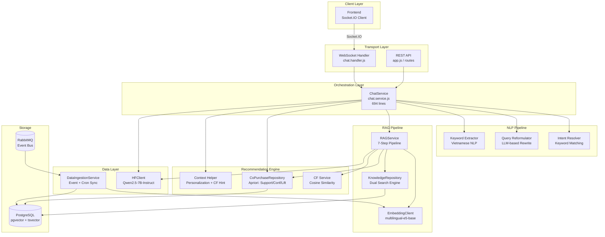

# Chatbot Service — Deep Scan: Thuật toán & Kỹ thuật

> **Service**: `chatbot-service` (Port 3008)  
> **Files scanned**: 15/15  
> **Tech stack**: Node.js, Socket.IO, PostgreSQL (pgvector), RabbitMQ, HuggingFace Inference API

---

## Tổng quan Kiến trúc



---

## Danh sách Thuật toán & Kỹ thuật

### 1. 🎯 Intent Classification — Keyword Pattern Matching

| Thuộc tính | Chi tiết |
|---|---|
| **File** | [intent.resolver.js](file:///e:/UIT/backend/microservices/services/chatbot/src/services/intent.resolver.js) |
| **Loại thuật toán** | Rule-based / Deterministic |
| **Độ phức tạp** | O(n × k) — n = message length, k = total keywords |

**Cách hoạt động:**
- Định nghĩa 6 intents cố định: `CHECK_STOCK`, `CHECK_PRICE`, `ORDER_STATUS`, `RECOMMENDATION`, `SEARCH_PRODUCT`, `HELP`
- Mỗi intent có danh sách keywords tiếng Việt + tiếng Anh
- Scan message theo thứ tự khai báo → trả về intent đầu tiên match
- Fallback: `FREE_CHAT` nếu không match keyword nào

**Ưu điểm**: Nhanh, không cần AI, latency ~0ms  
**Hạn chế**: Không hiểu ngữ cảnh, phụ thuộc keyword cố định

```js
// Ví dụ: "sữa ông thọ bao nhiêu tiền" → match "bao nhiêu" → CHECK_PRICE
// "gợi ý sản phẩm" → match "gợi ý" → RECOMMENDATION
```

---

### 2. 🔄 Query Reformulation — LLM-based Coreference Resolution

| Thuộc tính | Chi tiết |
|---|---|
| **File** | [query-reformulator.js](file:///e:/UIT/backend/microservices/services/chatbot/src/services/query-reformulator.js) |
| **Loại thuật toán** | NLP — Coreference Resolution via LLM |
| **Model** | Qwen/Qwen2.5-7B-Instruct |
| **Trigger** | Phát hiện đại từ tiếng Việt (nó, cái đó, loại này...) |

**Cách hoạt động:**
1. **Detect**: Scan message cho 12 đại từ mơ hồ tiếng Việt (`nó`, `cái đó`, `cái này`, `loại này`, `món đó`...)
2. **Context**: Lấy 4 messages gần nhất từ chat history
3. **Rewrite**: Gửi prompt yêu cầu LLM viết lại thành câu hoàn chỉnh, độc lập
4. **Validate**: Chỉ chấp nhận kết quả 3-200 ký tự, ngắn gọn

```
User history: "Tìm sữa ông thọ" → Bot: "Sữa đặc Ông Thọ 380g..."
User message: "Cái đó giá bao nhiêu?"
→ Reformulated: "Giá sữa đặc Ông Thọ 380g bao nhiêu?"
```

**Hyperparameters**: `temperature=0.3`, `maxTokens=100`

---

### 3. 📝 Keyword Extraction — Vietnamese NLP Heuristics

| Thuộc tính | Chi tiết |
|---|---|
| **File** | [chat.service.js#L460-L498](file:///e:/UIT/backend/microservices/services/chatbot/src/services/chat.service.js#L460-L498) |
| **Loại thuật toán** | Rule-based NLP |

**Cách hoạt động:**
1. **Trigger removal**: Tìm trigger keyword (ví dụ "giá bán"), lấy phần trước/sau
2. **Filler stripping**: Loại bỏ 18 từ đệm tiếng Việt cuối câu (`không`, `nào`, `ạ`, `nhé`, `vậy`...)
3. **Noise removal**: Loại bỏ 14 noise words đầu câu (`sản phẩm`, `mặt hàng`, `kiểm tra`...)
4. **Longest-first matching**: Sort triggers theo length giảm dần để tránh partial match

```
"Giá bán sữa ông thọ bao nhiêu vậy ạ?"
→ Trigger: "giá bán" → after: "sữa ông thọ bao nhiêu vậy ạ?"
→ Strip fillers: "sữa ông thọ"
```

---

### 4. 🧠 Sentence Embedding — Multilingual E5 Base (ONNX)

| Thuộc tính | Chi tiết |
|---|---|
| **File** | [embedding.client.js](file:///e:/UIT/backend/microservices/services/chatbot/src/services/embedding.client.js) |
| **Model** | `Xenova/multilingual-e5-base` |
| **Dimensions** | 768 |
| **Runtime** | ONNX (CPU, quantized) |
| **Library** | `@xenova/transformers` |

**Cách hoạt động:**
- Load model 1 lần khi startup (cached sau lần đầu download)
- **Mean Pooling**: Lấy trung bình tất cả token embeddings → 1 vector 768d
- **L2 Normalization**: Chuẩn hóa vector để dùng cosine similarity
- **Batch mode**: Embed tuần tự (sequential) để tránh OOM trên CPU

**Sử dụng tại**:
- `RAGService` — embed user query
- `DataIngestionService` — embed product content khi sync

---

### 5. 🔍 Semantic Search — pgvector Cosine Similarity + HNSW Index

| Thuộc tính | Chi tiết |
|---|---|
| **File** | [knowledge.repository.js#L19-L36](file:///e:/UIT/backend/microservices/services/chatbot/src/repositories/knowledge.repository.js#L19-L36) |
| **Thuật toán** | Cosine Distance (`<=>` operator) |
| **Index** | HNSW (Hierarchical Navigable Small World) |
| **Index config** | `vector_cosine_ops` |

**SQL Query:**
```sql
SELECT *, 1 - (embedding <=> $1::vector) AS score
FROM product_knowledge_base
WHERE store_id = $2 AND is_in_stock = TRUE
ORDER BY embedding <=> $1::vector ASC
LIMIT $3
```

**HNSW Index**: Approximate Nearest Neighbor search — O(log n) thay vì brute-force O(n).

---

### 6. 🔑 Full-Text Keyword Search — PostgreSQL tsvector + GIN Index

| Thuộc tính | Chi tiết |
|---|---|
| **File** | [knowledge.repository.js#L46-L64](file:///e:/UIT/backend/microservices/services/chatbot/src/repositories/knowledge.repository.js#L46-L64) |
| **Thuật toán** | PostgreSQL Full-Text Search (tsvector/tsquery) |
| **Config** | `'simple'` (no stemming — phù hợp tiếng Việt) |
| **Index** | GIN (Generalized Inverted Index) |
| **Ranking** | `ts_rank()` |

**SQL Query:**
```sql
SELECT *, ts_rank(fts_content, plainto_tsquery('simple', $1)) AS score
FROM product_knowledge_base
WHERE store_id = $2 AND is_in_stock = TRUE
  AND fts_content @@ plainto_tsquery('simple', $1)
ORDER BY score DESC
```

**Bổ trợ**: Content text được augment với keywords không dấu (NFD normalization) để tăng recall:
```js
// "Sữa đặc" → fts_content chứa: "sữa đặc sua dac"
```

---

### 7. ⚡ Reciprocal Rank Fusion (RRF) — Hybrid Search Fusion

| Thuộc tính | Chi tiết |
|---|---|
| **File** | [rag.service.js#L130-L152](file:///e:/UIT/backend/microservices/services/chatbot/src/services/rag.service.js#L130-L152) |
| **Thuật toán** | RRF (Courcier et al., 2009) |
| **Công thức** | `score(d) = Σ 1/(k + rank_i)` |
| **Hyperparameter** | `k = 60` (constant) |

**Cách hoạt động:**
1. Nhận 2 ranked lists: **Semantic** (top 10) + **Keyword** (top 10)
2. Với mỗi document, tính RRF score = tổng `1/(60 + rank)` qua cả 2 lists
3. Document xuất hiện ở **cả 2 lists** → score cao hơn (boosted)
4. Sort by RRF score → lấy Top 5

```
Semantic: [A(rank1), B(rank2), C(rank3)]
Keyword:  [B(rank1), D(rank2), A(rank3)]

RRF(A) = 1/(60+1) + 1/(60+3) = 0.0163 + 0.0159 = 0.0322  ← appears in both
RRF(B) = 1/(60+2) + 1/(60+1) = 0.0161 + 0.0163 = 0.0324  ← highest (rank1 in keyword)
RRF(C) = 1/(60+3) = 0.0159  ← only semantic
RRF(D) = 1/(60+2) = 0.0161  ← only keyword
```

**Tại sao k=60?**: Giá trị chuẩn từ paper gốc. Giảm k → ưu tiên top ranks hơn. Tăng k → các ranks gần bằng nhau.

---

### 8. 🤖 Augmented Generation — Qwen/Qwen2.5-7B-Instruct

| Thuộc tính | Chi tiết |
|---|---|
| **File** | [hf.client.js](file:///e:/UIT/backend/microservices/services/chatbot/src/services/hf.client.js) + [rag.service.js#L159-L201](file:///e:/UIT/backend/microservices/services/chatbot/src/services/rag.service.js#L159-L201) |
| **Model** | Qwen/Qwen2.5-7B-Instruct |
| **API** | HuggingFace Inference API (serverless) |
| **Modes** | Batch (REST) + Streaming (WebSocket) |

**2 chế độ generation:**

| Mode | Dùng cho | Hyperparameters |
|---|---|---|
| **RAG Generation** | RECOMMENDATION, SEARCH_PRODUCT | `temperature=0.6`, `maxTokens=400` |
| **Free Chat** | FREE_CHAT + Data Enrichment | `temperature=0.7`, `maxTokens=512` |
| **Query Reformulation** | Coreference resolution | `temperature=0.3`, `maxTokens=100` |

**Grounding technique**: Inject product data + co-purchase hints + personalization vào system prompt → LLM chỉ format lại, KHÔNG bịa thêm.

---

### 9. 🛒 Co-Purchase Frequency Analysis — Pairwise Counting

| Thuộc tính | Chi tiết |
|---|---|
| **File** | [copurchase.repository.js](file:///e:/UIT/backend/microservices/services/chatbot/src/repositories/copurchase.repository.js) + [data-ingestion.service.js#L113-L136](file:///e:/UIT/backend/microservices/services/chatbot/src/services/data-ingestion.service.js#L113-L136) |
| **Thuật toán** | Pairwise Frequency Counting (tiền đề của Apriori) |
| **Trigger** | Event `order.completed` |
| **Threshold** | `co_purchase_count >= 3` (mới hiển thị gợi ý) |

**Cách hoạt động:**
1. Khi nhận event `order.completed` với N items
2. Tạo tất cả cặp `(A, B)` với `A < B` (sorted để tránh duplicate) → N*(N-1)/2 cặp
3. UPSERT vào `co_purchase_stats`: tăng `co_purchase_count + 1`
4. Khi query: lấy top 3 related products có `count >= 3`

```sql
-- Ví dụ: Order {Mì, Trứng, Nước mắm}
-- → Pairs: (Mì,Trứng), (Mì,Nước mắm), (Trứng,Nước mắm)
-- Sau 5 orders chứa cả Mì+Trứng → co_purchase_count = 5 → gợi ý
```

**Đây chính là nền tảng cho Apriori** (Phase 1 trong `chatbot_phase.md`). Hiện tại đã có counting step, chỉ thiếu support & confidence calculation.

---

### 10. 👤 Role-based Personalization — Customer Profiling

| Thuộc tính | Chi tiết |
|---|---|
| **File** | [context.helper.js#L13-L38](file:///e:/UIT/backend/microservices/services/chatbot/src/services/context.helper.js#L13-L38) |
| **Loại** | Rule-based segmentation |

**3 customer types:**

| Type | Prompt Injection | Behavior |
|---|---|---|
| `vip` | "Ưu tiên sản phẩm premium, deal đặc biệt" | Gợi ý sản phẩm cao cấp |
| `wholesale` | "Gợi ý số lượng lớn, giá sỉ, đơn vị thùng/lốc" | Bulk pricing |
| `retail` | "Gợi ý sản phẩm giá tốt, deal đang có" | Default, value-focused |

**Response differentiation** (Employee vs Customer):
- **Employee**: Hiển thị raw data (ID, on-hand, reserved, available)
- **Customer**: Chỉ hiển thị on-shelf count, giá, trạng thái hết hàng

---

### 11. 📡 Event-Driven Data Ingestion — RabbitMQ + Cron Fallback

| Thuộc tính | Chi tiết |
|---|---|
| **File** | [data-ingestion.service.js](file:///e:/UIT/backend/microservices/services/chatbot/src/services/data-ingestion.service.js) (330 lines) |
| **Pattern** | Event Sourcing + Scheduled Sync |
| **Idempotency** | `processed_events` table (UNIQUE constraint) |

**Dual ingestion strategy:**

| Channel | Trigger | Latency | Events |
|---|---|---|---|
| **Primary** | RabbitMQ events | Near real-time (~ms) | `product.created/updated/deleted`, `inventory.updated`, `order.completed` |
| **Fallback** | Cron job (`*/30 * * * *`) | 30 min max | Full sync all products × all stores |
| **Startup** | 10s delay after boot | One-time | Full initial sync |

**Content Building** (cho embedding + FTS):
```
Sản phẩm "Sữa đặc Ông Thọ", danh mục "Sữa, sản phẩm từ sữa",
giá 32.000 VND, nhà cung cấp "Vinamilk", hiện còn 15 sản phẩm trên kệ.
Từ khóa: sữa, đặc, ông, thọ, sua, dac, ong, tho, vinamilk.
```

**Smart re-embedding**: Chỉ re-embed khi `is_in_stock` thay đổi. Nếu chỉ quantity thay đổi → light UPDATE (không gọi embedding model).

---

### 12. 🌐 Real-time Streaming — Socket.IO + Async Generator

| Thuộc tính | Chi tiết |
|---|---|
| **File** | [chat.handler.js](file:///e:/UIT/backend/microservices/services/chatbot/src/ws/chat.handler.js) + [chat.service.js#L594-L690](file:///e:/UIT/backend/microservices/services/chatbot/src/services/chat.service.js#L594-L690) |
| **Protocol** | Socket.IO (WebSocket upgrade) |
| **Auth** | JWT verification trên handshake |

**2 streaming modes:**

| Mode | Intent | Technique |
|---|---|---|
| **Real LLM Stream** | `FREE_CHAT` | `hfClient.chatCompletionStream()` → yield từng token |
| **Simulated Stream** | Data intents (CHECK_STOCK, etc.) | Fetch full response → split 6 words/chunk → 10ms delay |

**Protocol flow:**
```
Client → chat:join_session { sessionId }
Server → chat:session_ready { sessionId, messages[], restored }
Client → chat:send_message { session_id, message }
Server → chat:typing { is_typing: true }
Server → chat:stream_chunk { text } (×N)
Server → chat:stream_complete { intent, products[], fullText }
```

---

## RAG Pipeline End-to-End Flow

```
User: "Có sữa tươi nào ngon không?"
         │
    ┌────▼────┐
    │ Step 1  │ Query Reformulation (nếu có đại từ mơ hồ)
    │ QR.js   │ → "Có sữa tươi nào ngon không?" (không đổi)
    └────┬────┘
    ┌────▼────┐
    │ Step 2  │ Embed query → 768d vector
    │ E5-base │ → [0.023, -0.145, 0.089, ...]
    └────┬────┘
    ┌────▼────────────────────────▼────┐
    │ Step 3a: Semantic Search   │ Step 3b: Keyword Search    │
    │ pgvector cosine (HNSW)     │ tsvector ts_rank (GIN)     │
    │ → 10 results by meaning    │ → 10 results by keywords   │
    └────┬────────────────────────┬────┘
    ┌────▼────┐
    │ Step 4  │ RRF Fusion (k=60)
    │         │ → Merge + re-rank → Top 5
    └────┬────┘
    ┌────▼────┐
    │ Step 5  │ Co-purchase Enrichment
    │         │ → "Khách mua sữa thường mua kèm bánh mì"
    └────┬────┘
    ┌────▼────┐
    │ Step 6  │ Personalization
    │         │ → VIP/Wholesale/Retail prompt injection
    └────┬────┘
    ┌────▼────┐
    │ Step 7  │ Augmented Generation (Qwen 2.5-7B)
    │         │ → "Chào bạn! Mình gợi ý mấy loại sữa tươi..."
    └─────────┘
```

---

## Mapping với Roadmap (chatbot_phase.md)

| Phase | Thuật toán | Trạng thái hiện tại |
|---|---|---|
| **Phase 1A** | Content-Based (FTS + Embedding Search) | ✅ **Verified** — TC-1.1 + TC-1.2 PASS |
| **Phase 1A** | Apriori (Pairwise counting + seeding) | ✅ **Verified** — TC-2.1 + TC-2.2 PASS, 1770 pairs |
| **Phase 1A** | Order pipeline fix (product_id) | ✅ **Verified** — TC-BUG PASS, 6280/6280 rows |
| **Phase 1B** | Apriori metrics (support/confidence/lift) | ✅ **DONE** — max lift=4.74, max conf=88.1% |
| **Phase 2** | Item-based Collaborative Filtering | ✅ **DONE** — Cosine Similarity, 206 pairs, 4 user clusters |
| **Phase 3** | Hybrid Ensemble + Session Context | ✅ **DONE** — α+β+γ+δ=1, rule-based session, 12/12 PASS |
| **Phase 4** | Production Hardening + Feedback Loop | ✅ **DONE** — Nightly cron, purchase attribution, CTR/CVR monitoring |

### Automated Test Results (2026-04-20) — 12/12 PASS ✅

| TC | Phase | Kết quả | Chi tiết |
|---|---|---|---|
| TC-1.1 | P1 | ✅ PASS | FTS: Gia vị lẩu, Hạt nêm, Bột ngọt — 50% match (3/6) |
| TC-1.2 | P1 | ✅ PASS | Content: Bia, Coca, Trà, Nước khoáng — 100% match (7/7) |
| TC-2.1 | P1 | ✅ PASS | Bò→Nấm **conf=88.1% lift=2.28**, 100% cluster match |
| TC-2.2 | P1 | ✅ PASS | BánhMì→Sữa **conf=81.0% lift=1.67**, 100% cluster match |
| TC-CF-1 | P2 | ✅ PASS | User 50 (Nội trợ) → Nấm ✓, 0 avoid leaked |
| TC-CF-2 | P2 | ✅ PASS | User 200 (Sinh viên) → Sữa, Bánh mì ✓, 40% cluster match |
| TC-CF-3 | P2 | ✅ PASS | Cold start user 99999 → 0 recs, no crash |
| **TC-HY-1** | **P3** | ✅ PASS | **19 products scored — Nấm(2) final=0.639 [content+cf]** |
| **TC-HY-2** | **P3** | ✅ PASS | **β redistributed → content=1.0, cf=0, no crash** |
| **TC-SES-1** | **P3** | ✅ PASS | **[Bò,Nấm] → "lau_bo" confidence=1.0, boost=0.15** |
| **TC-SES-2** | **P3** | ✅ PASS | **[Bò,Sữa] → "exploring" confidence=0.29, boost=0** |
| TC-BUG | P1 | ✅ PASS | product_id BIGINT exists, 6280/6280 rows |

### Data Orchestration — Hoàn thành ✅

| Script | Chức năng | Trạng thái |
|---|---|---|
| `clear-orders.js` | Xóa sạch sale_order + sale_order_detail | ✅ Đã chạy |
| `clear-payment-customer.js` | Xóa sạch payment + vnpay_transaction | ✅ Đã chạy |
| `clear-customers.js` | Xóa sạch customer + user_account (role=Customer) | ✅ Đã chạy |
| `mock-orders.js` | Seed 500 đơn hàng (4 clusters) | ✅ Đã chạy — 500 orders, 6892 detail rows |
| `populate-copurchase.js` | Populate co_purchase_stats (v2: batch, 5.1s) | ✅ Đã chạy — 1770 unique pairs |
| `apriori-batch.js` | Tính support/confidence/lift cho 1770 pairs | ✅ Đã chạy — 7s, max lift=4.74 |
| **`mock-interactions.js`** | **Seed 3735 user-product interactions (4 persona clusters)** | **✅ Đã chạy — 500 users, 206 similarity pairs** |

### Phase 1 — All Gaps Filled ✅

| Feature | Phase 1A | Phase 1B (done) |
|---|---|---|
| Apriori metrics | `co_purchase_count` only | ✅ `support`, `confidence`, `lift` |
| Ranking | Sort by raw frequency | ✅ Sort by `lift DESC` + filter lift > 1 |
| LLM prompt | "Product #X → Product #Y" | ✅ "Nấm kim châm (88% mua kèm)" |
| Batch job | Manual script only | ✅ `apriori-batch.js` — 1770 pairs, 7s |

### Bugs phát hiện

| Bug | Mức độ | Mô tả |
|---|---|---|
| **Order event productId: null** | ✅ **Đã fix** | Thêm `product_id BIGINT` vào `sale_order_detail` + `allocateBatchesFEFO` preserve product_id + event payload đọc từ DB thay vì null |
| **populate-copurchase v1 treo >1h** | ✅ **Đã fix** (v2) | Root cause: 3500+ individual SQL queries qua remote Supabase. Fix: in-memory aggregation + batch INSERT |

### Files đã sửa (P0 Fix — 2026-04-18)

| File | Thay đổi |
|---|---|
| `order/src/db/init.sql` | Thêm `product_id BIGINT` vào `sale_order_detail` + migration + index |
| `order/src/repositories/order-detail.repository.js` | INSERT thêm `product_id` |
| `order/src/services/order.service.js` | FEFO preserve, formatOrderDetail, 2 event publishers |
| `docs/chatbot/seed-product/mock-orders.js` | INSERT thêm `product_id` |
| `docs/chatbot/seed-product/test-algorithm.js` | **[NEW]** Automated test suite |

### Files đã sửa (Phase 1B — 2026-04-20)

| File | Thay đổi |
|---|---|
| `chatbot/src/db/init.sql` | +5 Apriori columns + `product_order_frequency` table |
| `chatbot/src/repositories/copurchase.repository.js` | `ORDER BY lift DESC`, `getAprioriMetrics()` |
| `chatbot/src/services/context.helper.js` | Prompt: `(88% mua kèm)` format |
| **[NEW]** `docs/chatbot/seed-product/apriori-batch.js` | Batch job: 1770 pairs, div-by-zero guard, 7s |
| `docs/chatbot/seed-product/test-algorithm.js` | Upgraded queries with confidence/lift columns |

### Files đã sửa (Phase 2 — 2026-04-20)

| File | Thay đổi |
|---|---|
| `chatbot/src/db/init.sql` | +2 CF tables (`user_product_interaction`, `item_similarity`) + 3 indexes |
| **[NEW]** `chatbot/src/services/cf.service.js` | Cosine Similarity + `getRecommendations()` + `getItemSimilarities()` |
| `chatbot/src/services/rag.service.js` | Step 5.5 CF Enrichment, `cfService` injection, cfContext in prompt |
| `chatbot/src/services/context.helper.js` | +`getCFHint()` for prompt injection |
| `chatbot/src/index.js` | Wire `CollaborativeFilteringService` → `RAGService` |
| **[NEW]** `docs/chatbot/seed-product/mock-interactions.js` | 4-cluster persona seeder (3735 rows, 500 users) |
| `docs/chatbot/seed-product/test-algorithm.js` | +3 CF test cases (TC-CF-1/2/3) |

### Phase 2 — Cosine Similarity Results ✅

| Pair | Similarity | Cluster | ✅/❌ |
|---|---|---|---|
| Bò(1) ↔ Nấm(2) | **0.81** | Nội trợ (cùng cluster) | ✅ |
| XúcXích(11) ↔ Coca(19) | **0.80** | Sinh viên (cùng cluster) | ✅ |
| Bia(17) ↔ KhôGà(21) | **0.61** | Dân nhậu (cùng cluster) | ✅ |
| Bò(1) ↔ Mì(12) | N/A (< threshold) | Cross-cluster | ✅ |

### Design Decisions — Phase 2

| Quyết định | Lý do |
|---|---|
| **Cosine thay Adjusted Cosine** | Adjusted Cosine trừ mean → items cùng cluster đều có frequency tương tự → R-mean ≈ 0 → sim ≈ 0. Plain Cosine giữ magnitude → cluster separation đúng. |
| **4 User Persona clusters** | Tạo rõ ràng Nội trợ/Sinh viên/Dân nhậu/Random để validate CF phân biệt được hành vi. |
| **minCommonUsers = 2** | Lọc noise pairs (chỉ 2 users cùng mua → sim có thể = 1.0 nhưng vô nghĩa thống kê). |
| **RAG Step 5.5** | CF inject SAU Apriori (Step 5) và TRƯỚC Personalization (Step 6) — đúng thứ tự enrichment. |

### Files đã sửa (Phase 3 — 2026-04-20)

| File | Thay đổi |
|---|---|
| `chatbot/src/db/init.sql` | +2 tables (`recommendation_feedback`, `ensemble_weights`) + 2 indexes |
| **[NEW]** `chatbot/src/services/hybrid.service.js` | Ensemble α+β+γ+δ=1, in-memory cache, Local Max norm, warmUp |
| **[NEW]** `chatbot/src/services/weight-learner.js` | Adaptive weight learning (smoothing 0.8/0.2, clamp [0.05, 0.60]) |
| **[NEW]** `chatbot/src/services/session-context.service.js` | 5-cluster rule-based intent detection + session boost |
| `chatbot/src/services/rag.service.js` | Phase 3 hybrid pipeline (Step 5 Ensemble + Step 6 Session) + Phase 2 fallback |
| `chatbot/src/index.js` | Wire Hybrid + Session + warmUp at startup |
| `docs/chatbot/seed-product/test-algorithm.js` | +4 Phase 3 test cases (TC-HY-1/2, TC-SES-1/2) |

### Phase 3 — Hybrid Ensemble Results ✅

**Ensemble Scoring với User 50 (Nội trợ):**

| Product | Final Score | Sources | Top Source |
|---|---|---|---|
| Nấm kim châm (2) | **0.639** | content, cf | content |
| Ba chỉ bò (1) | 0.430 | content | content |
| Hạt nêm Knorr (52) | 0.368 | cf, apriori | cf |
| Gia vị lẩu (4) | 0.333 | content | content |
| Bột ngọt (53) | 0.280 | cf | cf |

**Session Context Detection:**

| Session | Detected Cluster | Confidence | Boost |
|---|---|---|---|
| [Bò(1), Nấm(2)] + "lẩu" | `lau_bo` | **1.00** | +0.15 |
| [Bò(1), Sữa(8)] + "ngon" | `exploring` | 0.29 | 0 |

### Design Decisions — Phase 3

| Quyết định | Lý do |
| **Local Max normalization** | RRF score rất nhỏ (0.016) → dùng max của kết quả hiện tại để normalize, đảm bảo top đầu luôn gần 1.0 |
| **In-memory cache** | CF + Apriori chỉ update 1 lần/ngày → load vào RAM tại warmUp, query từ RAM thay vì DB mỗi request |
| **β redistribution** | Cold-start user không có CF data → chuyển β sang α (Content-Based) thay vì bỏ trống |
| **Exploring mode** | Khi session không có cluster rõ ràng (confidence < 0.4) → không boost, giữ diversity |
| **Phase 2 fallback** | Nếu hybridService = null → dùng pipeline cũ (Phase 2) → không breaking change |

### Phase 3 — Gap Closure (2026-04-20 18:30) ✅

> Sau khi kiểm tra chi tiết, phát hiện 4 gaps. Đã đóng tất cả.

| Gap | Vấn đề | Fix |
|---|---|---|
| 🔴 Feedback API | Không có route `POST /feedback` | ✅ Tạo `feedback.routes.js`, register trong `app.js` |
| 🔴 Auto-track | `rag.service.js` không gọi `recordFeedback()` | ✅ Thêm fire-and-forget auto-track sau hybrid response |
| 🟡 WeightLearner unwired | `index.js` không require/instantiate | ✅ Thêm `require + new WeightLearner(pool)` |
| 🟡 Schema chưa migrate | `ensemble_weights` table chưa tồn tại trên Supabase | ✅ Chạy `migrate-phase3.js` → 2 tables + default weights |

**Files bổ sung (Gap Closure):**

| File | Thay đổi |
|---|---|
| **[NEW]** `chatbot/src/routes/feedback.routes.js` | `POST /feedback` — validates source/action, calls `hybridService.recordFeedback()` |
| `chatbot/src/app.js` | Register feedback route, inject `hybridService` dependency |
| `chatbot/src/services/rag.service.js` | Auto-track top 5 recommended products (fire-and-forget) |
| `chatbot/src/index.js` | Wire `WeightLearner`, pass `hybridService` to `createApp` |
| **[NEW]** `docs/chatbot/seed-product/migrate-phase3.js` | One-time Supabase migration for Phase 3 tables |

**Migration Result:**

```
✅ ensemble_weights: store_id=1, α=0.40, β=0.25, γ=0.25, δ=0.10
✅ recommendation_feedback: 9 columns (id, user_id, product_id, store_id, source, action, session_id, recommendation_score, created_at)
```

---

## Phase 3 vs. Original Plan — Traceability

> Cross-reference `implementation_plan.md` Section 3A + 3B:

| Planned | Status | Notes |
|---|---|---|
| 3A.1 Ensemble Scoring (α+β+γ+δ) | ✅ Done | `hybrid.service.js` — Local Max norm + weighted sum |
| 3A.2 Adaptive Weight Learning | ✅ Done | `weight-learner.js` — smoothing 0.8/0.2, clamp [0.05, 0.60] |
| 3A.3 HybridRecommendationService | ✅ Done | Score + warmUp + in-memory cache |
| 3B.1 Session-based Context | ✅ Done (Rule-based B1) | `session-context.service.js` — 5 clusters, keyword detection |
| 3B.2 GRU/Attention Model | ⏳ Deferred | Requires ≥5000 sessions — không đủ data |
| 3B.3 Integration vào Chat Flow | ✅ Done | Wired in `rag.service.js` Step 5 + Step 6 |
| 3B.4 Test Cases (TC-DL-1..4) | ✅ Adapted | TC-SES-1/2 replaces TC-DL-1..4 (rule-based proxy) |
| Feedback API | ✅ Done | `POST /api/chatbot/feedback` |
| Nightly Cron Pipeline | ✅ Done | `nightly-batch.js` — Apriori→CF→Weights→Warmup (2:00 AM) |
| Purchase Event Tracking | ✅ Done | ORDER_CONFIRMED attribution (24h window) |
| Monitoring API | ✅ Done | `/stats/recommendations` (CTR/CVR) + `/stats/latency` (P95) |

### Files đã sửa (Phase 4 — 2026-04-21)

| File | Thay đổi |
|---|---|
| **[NEW]** `chatbot/src/jobs/nightly-batch.js` | Cron orchestrator: Apriori→CF→Weights→Warmup, isolated try/catch per step |
| **[NEW]** `chatbot/src/routes/stats.routes.js` | `/stats/recommendations` (CTR/CVR funnel) + `/stats/latency` (P95 breakdown) |
| `chatbot/src/index.js` | +NightlyBatch wiring, +ORDER_CONFIRMED attribution subscriber, +ENABLE_CRON gate |
| `chatbot/src/app.js` | Register stats route, accept `pool` + `nightlyBatch` deps |

### Design Decisions — Phase 4

| Quyết định | Lý do |
|---|---|
| **Isolated try/catch per step** | Nếu Apriori fail → CF vẫn chạy với data cũ → hệ thống không bao giờ "sập" vì batch job |
| **node-cron on instance** | Đơn giản cho single-instance. Scale note: dùng Redis Lock (bullmq/redlock) khi multi-pod |
| **24h attribution window** | Khách thường không mua ngay → "Thêm vào giỏ" → dạo tiếp → Checkout. 24h bắt trọn vẹn CVR thực tế |
| **Latency from metadata** | Parse `chat_message.metadata` JSON → tách bottleneck hybrid vs LLM generation, không cần thêm table |
| **ENABLE_CRON env gate** | `ENABLE_CRON=false` → disable nightly batch (dev/test environments) |

---

## Phase 4B — Customer Frontend Integration ✅ (2026-04-22)

### PDP + FEFO Batch Display

| File | Thay đổi |
|---|---|
| `inventory/src/routes/inventory.routes.js` | `GET /public/batches/:storeId/:productId` — Public FEFO-sorted batch API (no auth) |
| `gateway/nginx.conf` | `/api/inventory/public` proxy route |
| `customer/src/services/productService.js` | `getProductById()` + `getProductBatches()` |
| **[NEW]** `customer/src/pages/ProductDetail.jsx` | PDP page: 2-column layout, FEFO batch table, color-coded expiry, add-to-cart |
| `customer/src/App.jsx` | Route: `/product/:productId` |
| `customer/src/components/Product/ProductCard.jsx` | Card click → PDP navigation (was: addToCart) |

### Customer Chatbot UI

| File | Thay đổi |
|---|---|
| `customer/package.json` | +`socket.io-client`, `react-markdown` |
| `customer/vite.config.js` | +`/ws/chat` WebSocket proxy |
| `chatbot/src/ws/chat.handler.js` | Dual-auth middleware (JWT + guestId UUID) |
| **[NEW]** `customer/src/services/chatSocketService.js` | Socket.IO singleton (dual-auth connect) |
| **[NEW]** `customer/src/contexts/ChatContext.jsx` | State: messages, streaming, session, guest UUID |
| **[NEW]** `customer/src/services/chatFeedbackService.js` | Fire-and-forget tracking (`POST /chatbot/feedback`) |
| **[NEW]** `customer/src/components/ChatWidget/` (9 files) | Emerald-themed ChatWidget, ChatProductCard (PDP nav + feedback) |
| `customer/src/App.jsx` | +ChatProvider wrapping, +ChatWidget global render |
| `customer/src/App.css` | +slide-up, fade-in animations, scrollbar styles |

### Conversion Funnel (End-to-End) ✅

```
Chatbot recommend → Click ChatProductCard → PDP → Add to Cart → Checkout → ORDER_CONFIRMED
                         ↓                           ↓                          ↓
                   action: 'clicked'           'added_to_cart'            'purchased'
                   (frontend POST)             (frontend POST)          (backend subscriber)
```

---

## Phase 5 — AI Dashboard (POS Admin) ✅ (2026-04-22)

### Mục tiêu

Biến Dashboard từ báo cáo tĩnh → **Command Center** theo dõi real-time hệ thống AI recommendation, với:
- Conversion Funnel (Recommended → Click → Cart → Purchase)
- Weight Evolution (α β γ δ biến thiên theo thời gian)
- Source Performance (CTR/CVR per algorithm)
- System Health (Pipeline Latency P95 + Nightly Batch Status)
- Live Feedback Stream (bảng tương tác gần nhất)
- Force Learn button (ép AI học trọng số ngay lập tức)

### Backend Changes

| File | Thay đổi |
|---|---|
| **[NEW]** `docs/chatbot/seed-product/migrate-phase5.js` | Tạo bảng `ensemble_weights_history` + seed initial row |
| `chatbot/src/services/weight-learner.js` | +`triggerType` param, +INSERT history log sau mỗi lần learn |
| `chatbot/src/routes/stats.routes.js` | +3 endpoints: `feedback-stream`, `weight-history`, `admin/force-learn` |
| `chatbot/src/app.js` | +`weightLearner` dependency injection |
| `chatbot/src/index.js` | +`weightLearner` truyền vào `createApp()` |

### New API Endpoints

| Method | Path | Description |
|---|---|---|
| GET | `/api/chatbot/stats/feedback-stream?storeId=1&limit=50` | 50 recent feedback rows + product name (JOIN product_knowledge_base) |
| GET | `/api/chatbot/stats/weight-history?storeId=1&limit=30` | Weight history log (chronological) for trend chart |
| POST | `/api/chatbot/admin/force-learn` | Trigger WeightLearner.learn() + hybridService.warmUp() immediately |

### Frontend Changes

| File | Thay đổi |
|---|---|
| `frontend/src/pages/Dashboard.jsx` | Tab system: Overview (existing) + AI Insights (new) |
| `frontend/src/components/Dashboard/index.js` | +AIDashboardTab export |
| **[NEW]** `Dashboard/AIDashboardTab.jsx` | Container: 4 parallel API fetch, period selector, force-learn button |
| **[NEW]** `Dashboard/widgets/ConversionFunnel.jsx` | 4-step horizontal funnel with drop-off rates |
| **[NEW]** `Dashboard/widgets/WeightEvolutionChart.jsx` | recharts LineChart: α β γ δ over time, manual trigger dots |
| **[NEW]** `Dashboard/widgets/SourcePerformance.jsx` | recharts BarChart: per-algorithm CTR/CVR comparison |
| **[NEW]** `Dashboard/widgets/SystemHealth.jsx` | Latency P95 bars + Nightly Batch step status card |
| **[NEW]** `Dashboard/widgets/LiveFeedbackStream.jsx` | Scrollable table: time, user, action badge, product, source, AI score |

### New DB Table

```sql
CREATE TABLE ensemble_weights_history (
    id BIGSERIAL PRIMARY KEY,
    store_id BIGINT NOT NULL,
    alpha NUMERIC NOT NULL,
    beta NUMERIC NOT NULL,
    gamma NUMERIC NOT NULL,
    delta NUMERIC NOT NULL,
    feedback_count INT DEFAULT 0,
    trigger_type TEXT DEFAULT 'nightly',  -- 'nightly' | 'manual' | 'initial'
    created_at TIMESTAMPTZ DEFAULT NOW()
);
```

### Design Decisions — Phase 5

| Quyết định | Lý do |
|---|---|
| **Tab-based Dashboard** | Không phá vỡ Overview hiện tại, AI Insights là tab riêng biệt |
| **recharts cho AI widgets** | Đã có trong dependencies (v3.2.1), hỗ trợ tốt LineChart/BarChart với custom tooltips |
| **ensemble_weights_history (INSERT log)** | Bảng `ensemble_weights` dùng UPSERT → chỉ giữ record mới nhất. History table cho phép vẽ trend chart |
| **Force Learn = learn() + warmUp()** | learn() tính trọng số mới → warmUp() load vào RAM → hiệu lực ngay lập tức |
| **Product name từ knowledge_base** | JOIN `product_knowledge_base.content` rồi regex extract tên sản phẩm, tránh cross-service call |
| **triggerType tracking** | Phân biệt nightly/manual trên chart → dots lớn hơn cho manual events |