# SƠ ĐỒ THIẾT KẾ HỆ THỐNG — POSMART
## Hệ thống Quản lý Chuỗi Siêu thị Mini (Microservices & Multi-tenancy)

**Dự án:** POSMART — Online-to-Offline (O2O) Mini-Mart Management System  
**Kiến trúc:** Microservices + Event-Driven + Saga Pattern  
**Ngày tạo:** 2026-03-31

---

## 1. SƠ ĐỒ KIẾN TRÚC TỔNG QUAN HỆ THỐNG

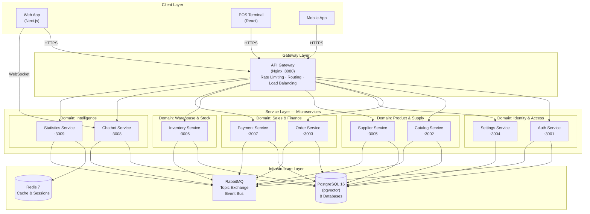

---

## 2. SƠ ĐỒ CƠ SỞ DỮ LIỆU — DATABASE PER SERVICE

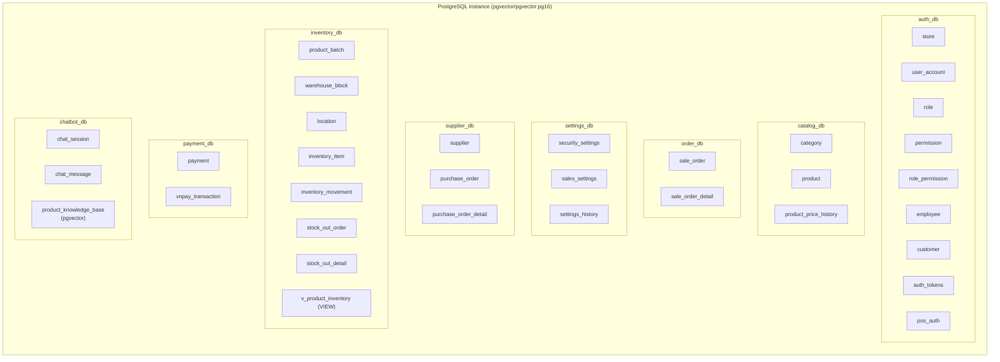

---

## 3. SƠ ĐỒ QUAN HỆ THỰC THỂ (ER) — CROSS-SERVICE

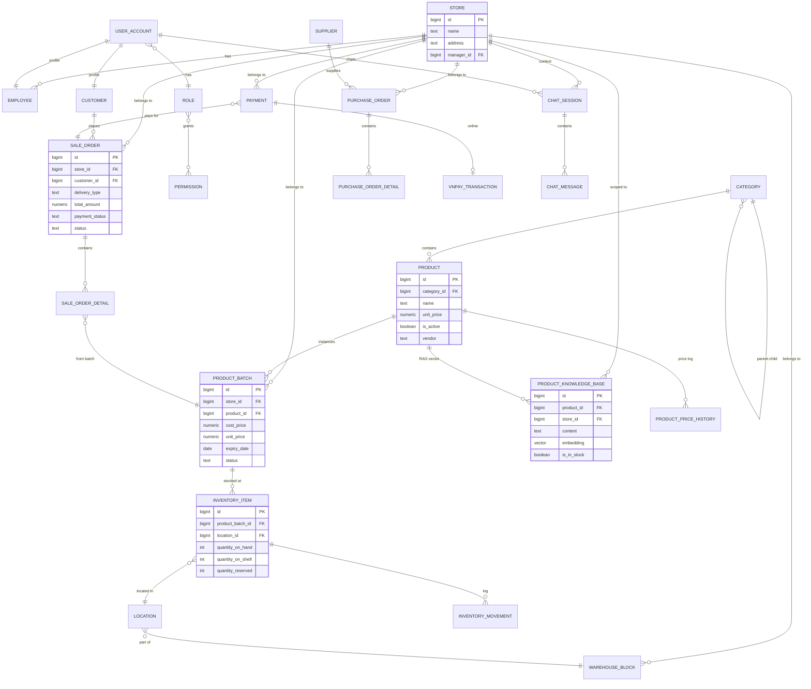

---

## 4. SƠ ĐỒ GIAO TIẾP GIỮA CÁC SERVICE

### 4.1 Event-Driven Communication (RabbitMQ)

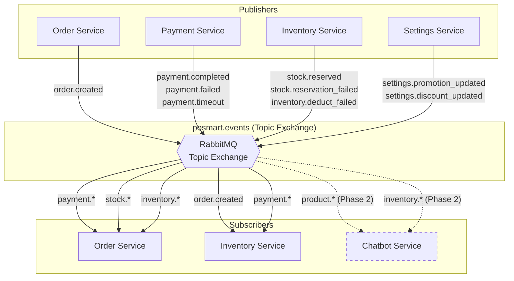

### 4.2 Synchronous HTTP Communication

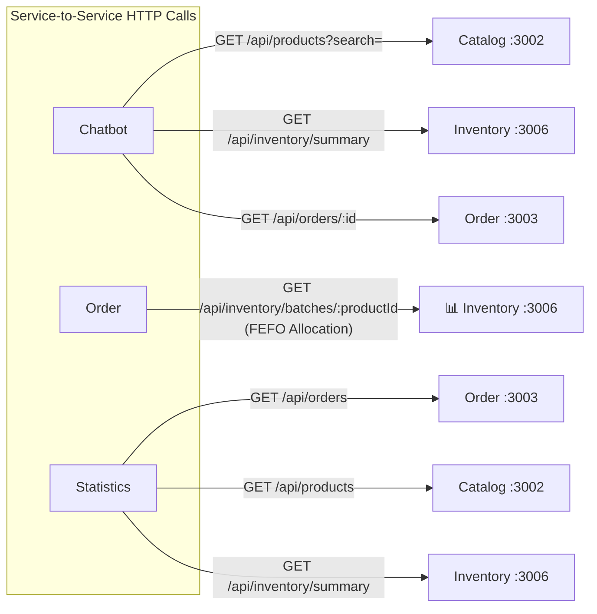

---

## 5. SƠ ĐỒ LUỒNG NGHIỆP VỤ CHÍNH

### 5.1 Luồng Bán Hàng POS (Point of Sale)

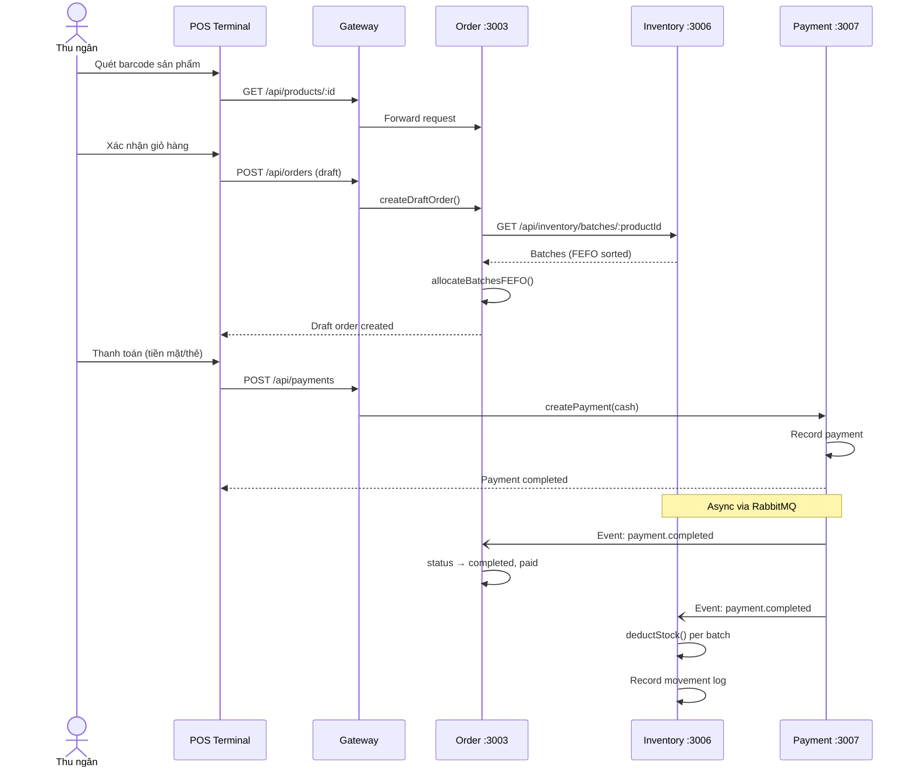

### 5.2 Luồng Đặt Hàng Online (Saga Pattern)

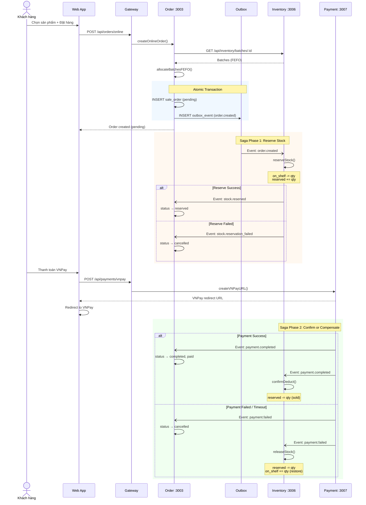

### 5.3 Luồng Nhập Hàng (Purchase Order)

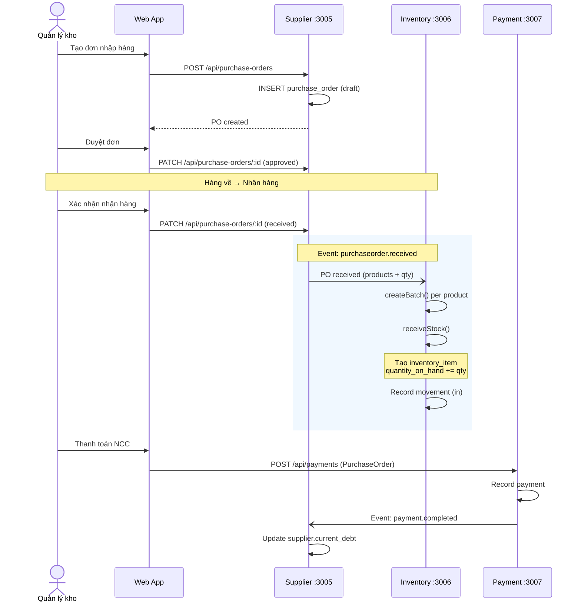

---

## 6. SƠ ĐỒ LUỒNG CHATBOT RAG RECOMMENDATION

### 6.1 Data Ingestion Pipeline

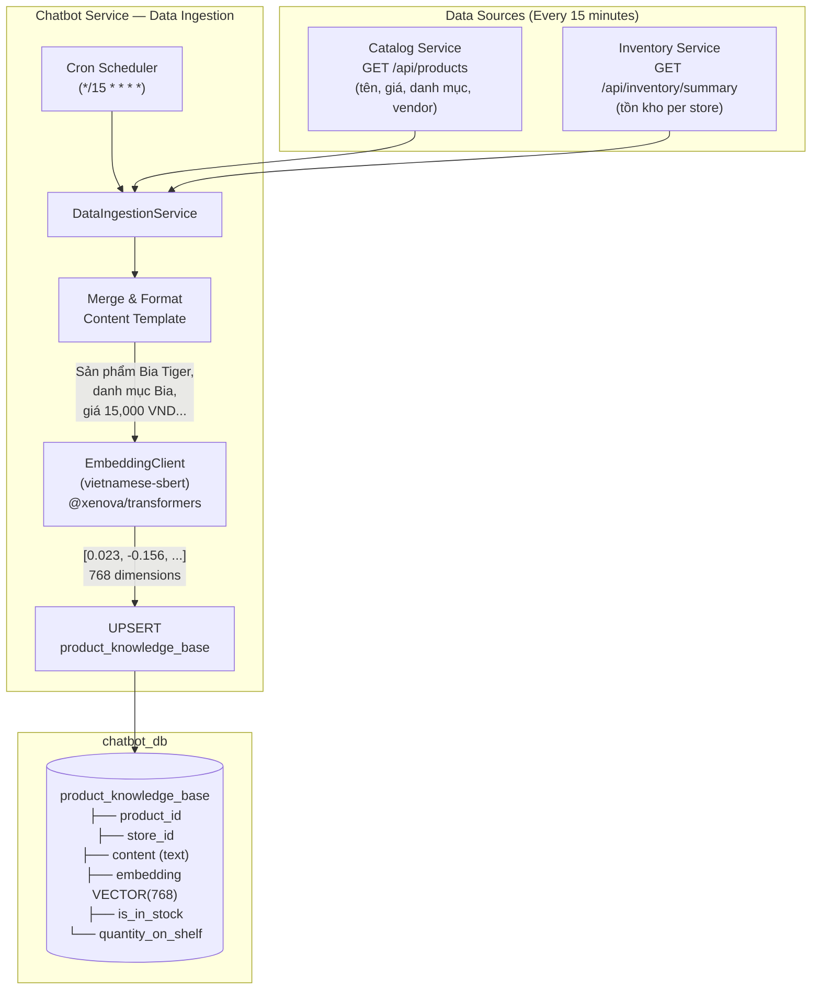

### 6.2 RAG Query Flow (User Recommendation)

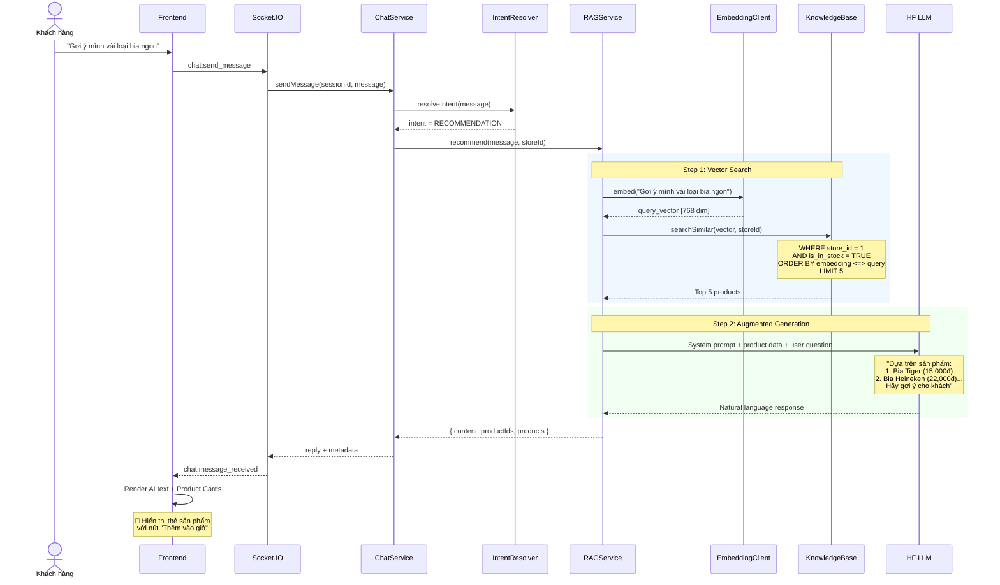

---

## 7. SƠ ĐỒ MÔ HÌNH MULTI-TENANCY

```mermaid
graph TB
    subgraph "Chain Level (Shared)"
        UP["user_account<br/>(all users)"]
        ROLE["role + permission<br/>(RBAC)"]
        PROD["product + category<br/>(Catalog centralized)"]
        SUPP2["supplier<br/>(shared pool)"]
        SET["sales_settings<br/>(chain-wide policy)"]
    end

    subgraph "Store Level (Isolated by store_id)"
        subgraph "Store A (id=1)"
            S1_EMP["employee<br/>store_id=1"]
            S1_BATCH["product_batch<br/>store_id=1"]
            S1_INV["inventory_item<br/>(via batch)"]
            S1_WH["warehouse_block<br/>store_id=1"]
            S1_ORDER["sale_order<br/>store_id=1"]
            S1_PAY["payment<br/>store_id=1"]
            S1_CHAT["chat_session<br/>store_id=1"]
            S1_KB["knowledge_base<br/>store_id=1"]
        end

        subgraph "Store B (id=2)"
            S2_EMP["employee<br/>store_id=2"]
            S2_BATCH["product_batch<br/>store_id=2"]
            S2_INV["inventory_item<br/>(via batch)"]
            S2_WH["warehouse_block<br/>store_id=2"]
            S2_ORDER["sale_order<br/>store_id=2"]
            S2_PAY["payment<br/>store_id=2"]
            S2_CHAT["chat_session<br/>store_id=2"]
            S2_KB["knowledge_base<br/>store_id=2"]
        end
    end

    UP --> S1_EMP & S2_EMP
    PROD --> S1_BATCH & S2_BATCH
    PROD --> S1_KB & S2_KB
```

---

## 8. SƠ ĐỒ LUỒNG XÁC THỰC & PHÂN QUYỀN (RBAC)

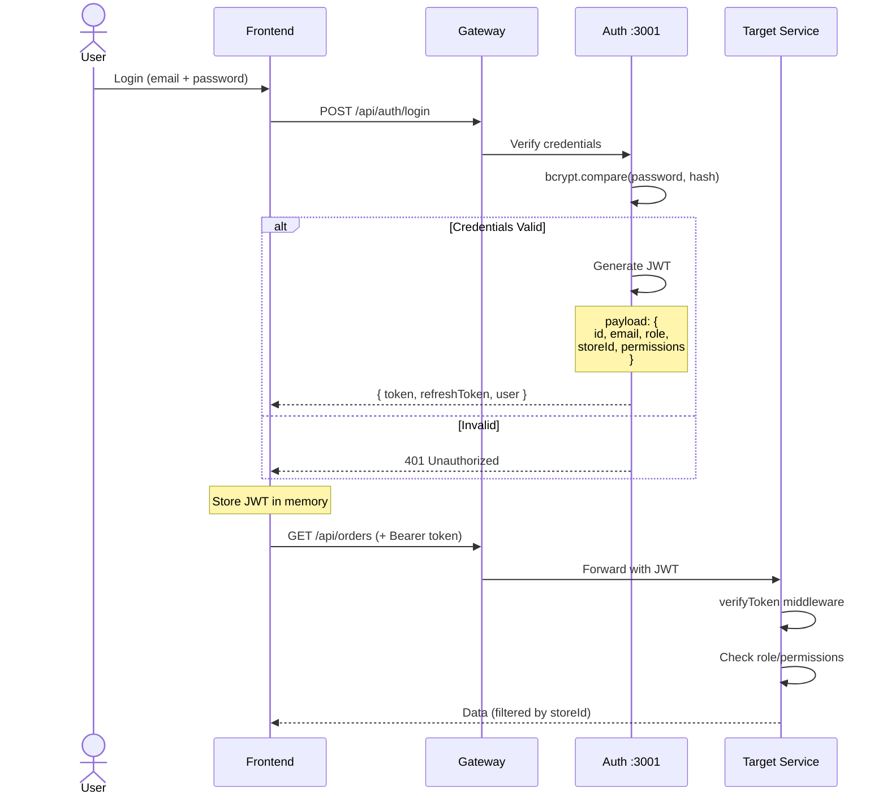

---

## 9. SƠ ĐỒ QUẢN LÝ TỒN KHO (Inventory Flow)

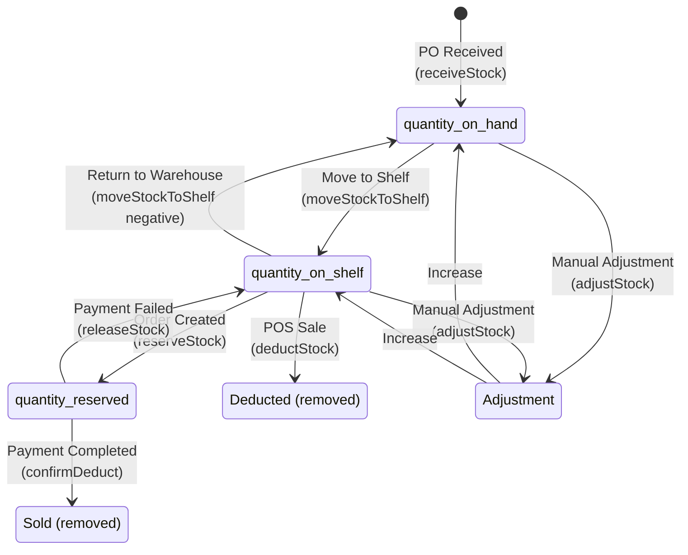

---

## 10. SƠ ĐỒ DEPLOYMENT (Docker Compose)

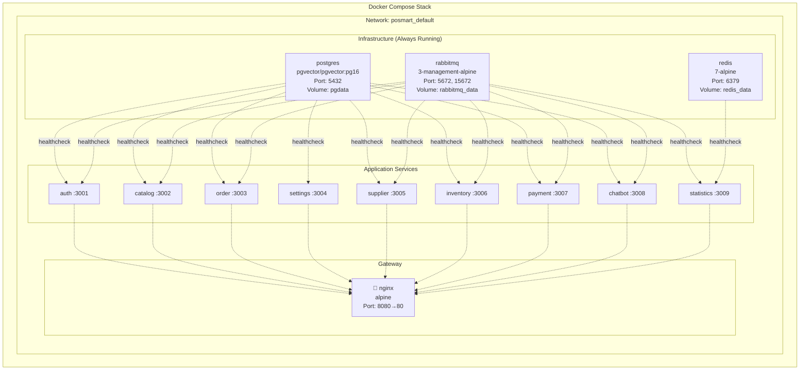

---

## 11. SƠ ĐỒ TECH STACK

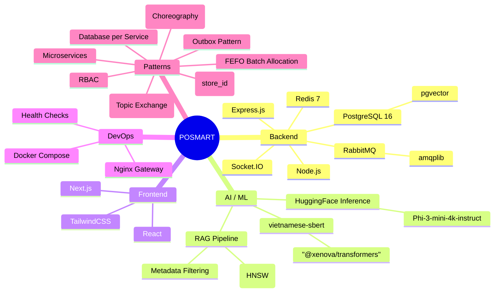

---

## 12. BẢN ĐỒ PHỤ THUỘC GIỮA CÁC SERVICE

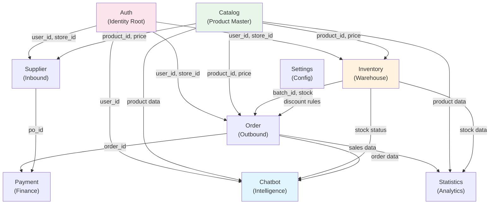

---

## DANH MỤC SƠ ĐỒ

| # | Tên Sơ Đồ | Loại | Mục đích |
|---|-----------|------|----------|
| 1 | Kiến trúc Tổng Quan | Architecture | Full system overview |
| 2 | Cơ Sở Dữ Liệu | Database | 8 databases, all tables |
| 3 | Quan Hệ Thực Thể (ER) | ER Diagram | Cross-service entity relationships |
| 4 | Giao Tiếp Service | Communication | Event-driven + HTTP patterns |
| 5.1 | Luồng Bán Hàng POS | Sequence | POS checkout flow |
| 5.2 | Luồng Đặt Hàng Online | Sequence | Saga pattern (reserve → pay → confirm) |
| 5.3 | Luồng Nhập Hàng | Sequence | Purchase order → receive → stock |
| 6.1 | RAG Data Ingestion | Data Flow | Cron sync pipeline |
| 6.2 | RAG Query Flow | Sequence | Vector search → LLM generation |
| 7 | Multi-Tenancy | Architecture | Store-level data isolation |
| 8 | Xác Thực & RBAC | Sequence | JWT auth + role-based access |
| 9 | Quản Lý Tồn Kho | State Machine | Inventory state transitions |
| 10 | Deployment | Infrastructure | Docker Compose topology |
| 11 | Tech Stack | Mindmap | All technologies used |
| 12 | Phụ Thuộc Service | Dependency | Inter-service data dependencies |
