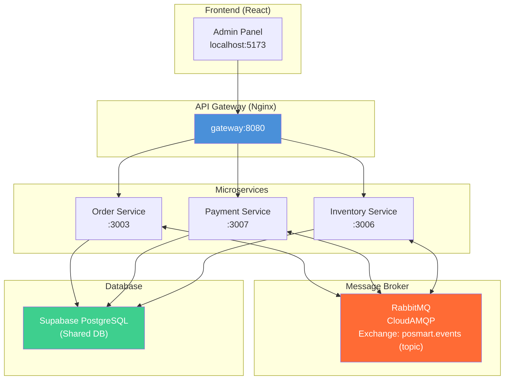
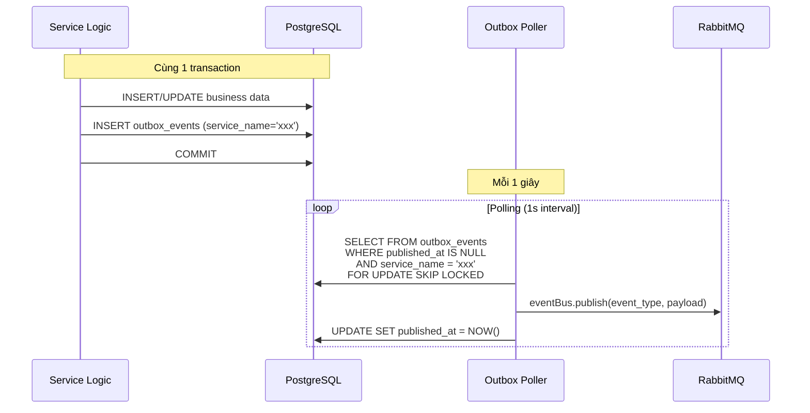
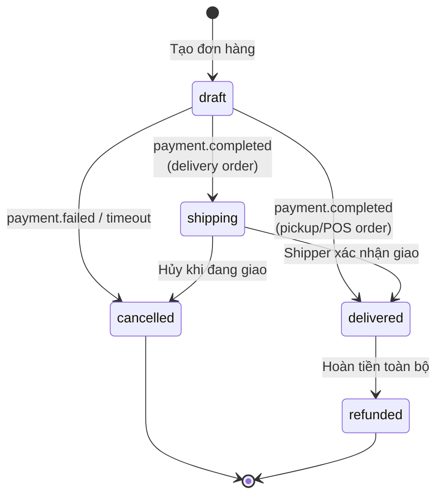
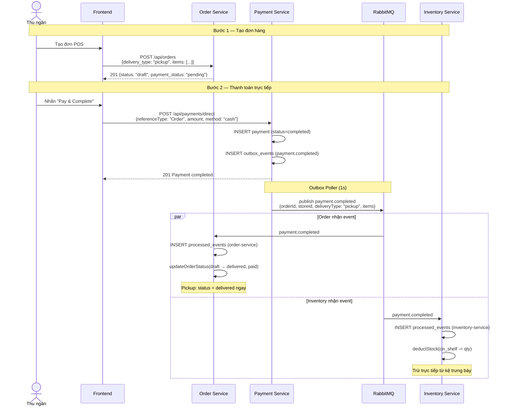
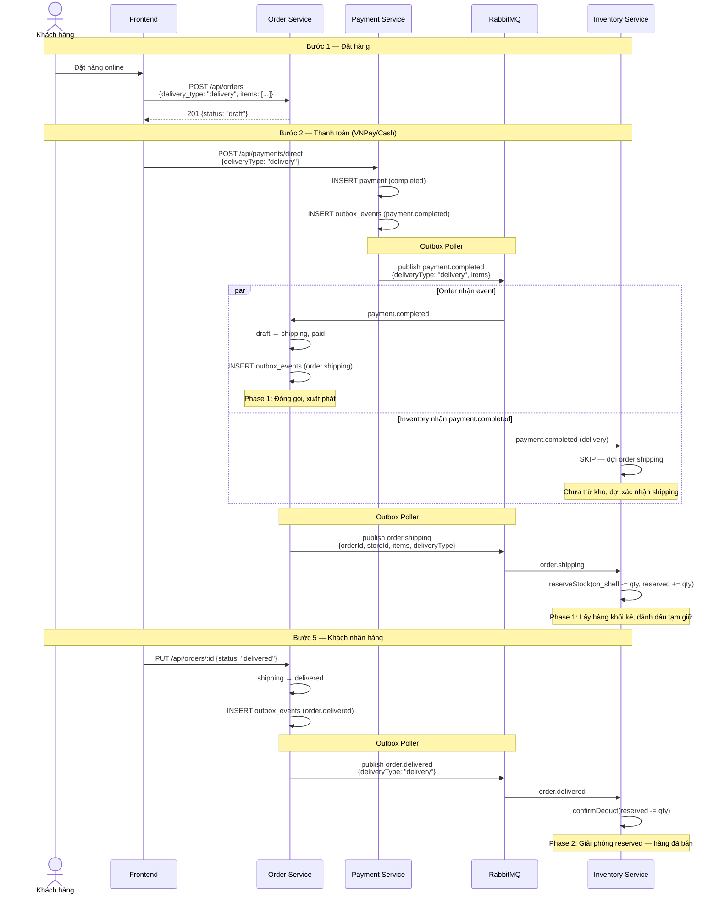
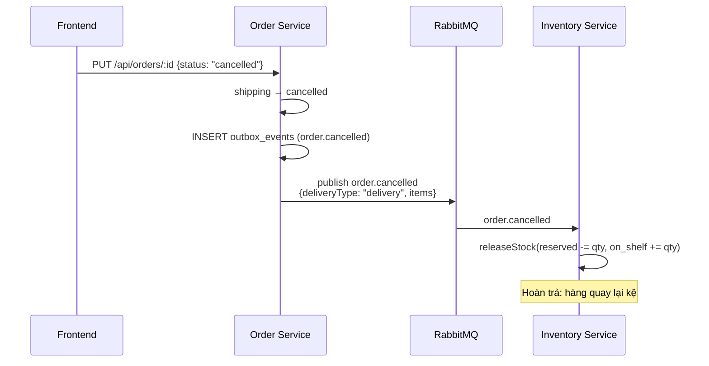
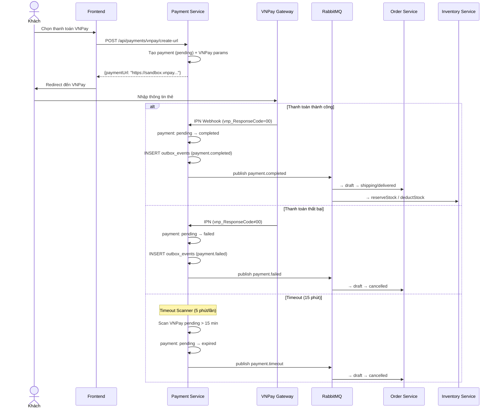
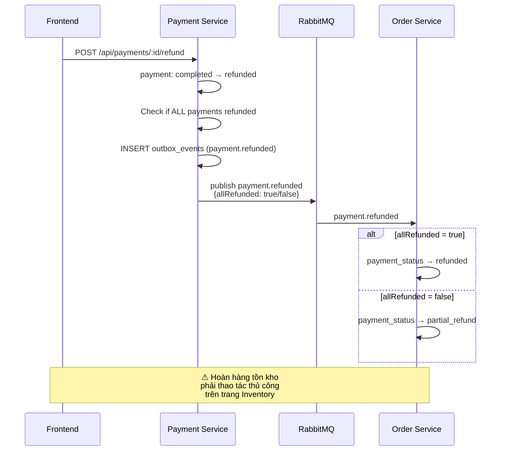
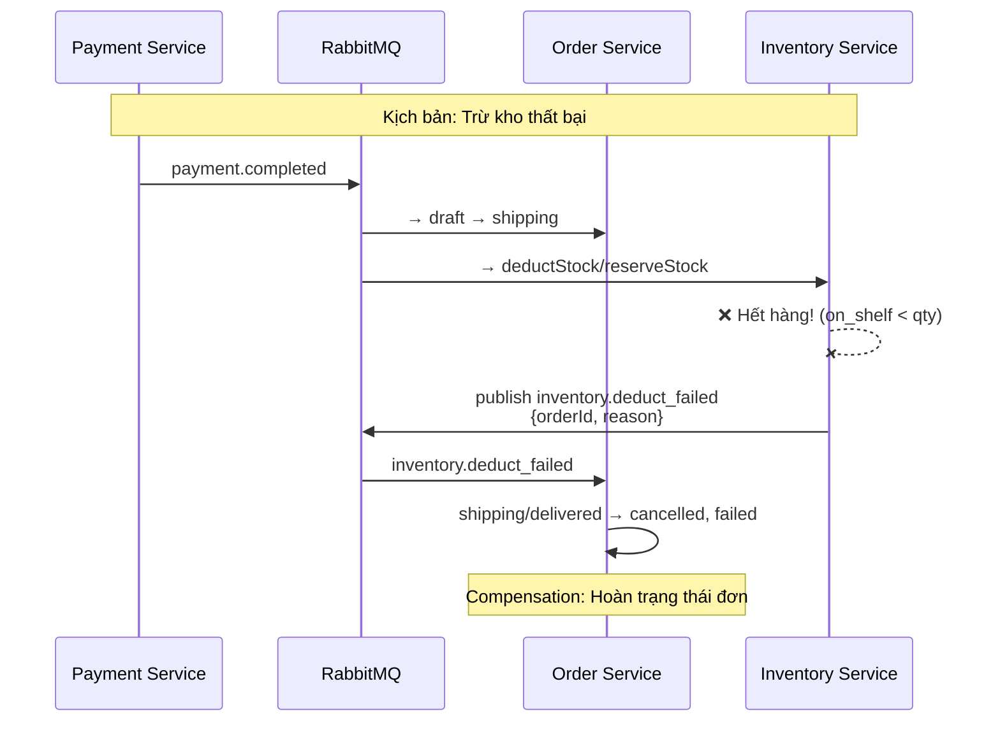
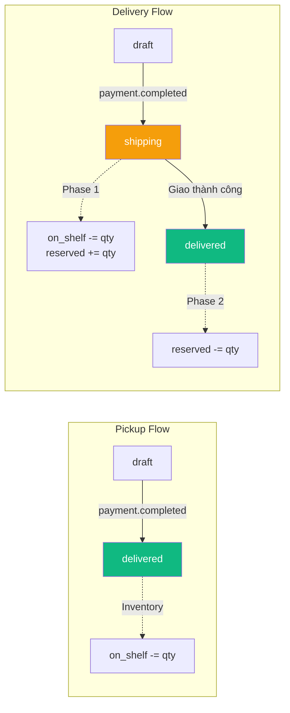

# Báo cáo Kỹ thuật: Hệ thống Saga Choreography — 3 Service Core

## 1. Tổng quan Kiến trúc

Hệ thống Mini-Mart sử dụng **kiến trúc microservices** với 3 service lõi phối hợp qua **Saga Choreography** (event-driven, không có orchestrator trung tâm):

| Service | Port | Vai trò | DB |
|---------|------|---------|-----|
| **Order Service** | 3003 | Quản lý đơn hàng, trạng thái đơn | Shared Supabase PostgreSQL |
| **Payment Service** | 3007 | Xử lý thanh toán (Cash, Bank Transfer, VNPay) | Shared Supabase PostgreSQL |
| **Inventory Service** | 3006 | Quản lý tồn kho, xuất/nhập/reserve | Shared Supabase PostgreSQL |

### Hạ tầng giao tiếp



> [!IMPORTANT]
> **Shared Database**: Tất cả services dùng chung 1 Supabase PostgreSQL. Đây là anti-pattern trong microservices nhưng được chọn vì đây là hệ thống học thuật. Để tránh xung đột, hệ thống sử dụng **`service_name` isolation** trên các bảng `outbox_events` và `processed_events`.

---

## 2. Transactional Outbox Pattern

Mỗi service sử dụng **Transactional Outbox** để đảm bảo **exactly-once delivery** giữa database write và event publish:



### Idempotency — Bảng `processed_events`

Mỗi service ghi lại event đã xử lý vào `processed_events` với **composite unique constraint** `(event_id, service_name)`:

```sql
-- Cho phép Order và Inventory cùng xử lý event "payment.completed-xxx" mà KHÔNG xung đột
UNIQUE(event_id, service_name)
```

> [!WARNING]
> **Bug đã fix**: Trước đây `UNIQUE(event_id)` khiến service nào INSERT trước thì "thắng", service còn lại bị skip duplicate. Bây giờ mỗi service có namespace riêng.

---

## 3. Order Status Machine



**Payment Status**: `pending` → `paid` / `failed` / `partial_refund` / `refunded`

---

## 4. Luồng nghiệp vụ chi tiết

### 4.1. Bán hàng tại quầy (POS / Pickup)

Luồng **đồng bộ**, khách nhận hàng và thanh toán ngay tại quầy.



**Kết quả cuối cùng:**
- Order: `status = delivered`, `payment_status = paid`
- Inventory: `on_shelf -= quantity` (đã trừ), `reserved` không thay đổi
- Movement: ghi nhận `out` — xuất kho bán hàng

---

### 4.2. Bán hàng Online (Delivery) — Two-Phase

Luồng **bất đồng bộ**, có 2 pha: tạm giữ kho khi giao và xác nhận khi khách nhận.



**Inventory thay đổi theo 2 pha:**

| Pha | Event | on_shelf | reserved | Ý nghĩa |
|-----|-------|----------|----------|---------|
| Phase 1 | `order.shipping` | −qty | +qty | Hàng rời kệ, đang giao |
| Phase 2 | `order.delivered` | — | −qty | Xác nhận đã bán xong |

---

### 4.3. Hủy đơn hàng đang giao



**Inventory rollback:**
- `reserved -= qty` (giải phóng hàng tạm giữ)
- `on_shelf += qty` (trả lại kệ trưng bày)
- Movement type: `release`

---

### 4.4. Thanh toán VNPay (Online Payment Gateway)



---

### 4.5. Hoàn tiền (Refund)



> [!NOTE]
> **Refund chỉ xử lý dòng tiền.** Hoàn trả hàng vào kho (inventory return) phải thao tác riêng trên trang Inventory — đây là quyết định thiết kế để tách biệt nghiệp vụ tài chính và logistics.

---

## 5. Saga Compensation (Xử lý lỗi)



---

## 6. Event Catalog

### Events do **Payment Service** publish

| Event | Trigger | Payload | Consumers |
|-------|---------|---------|-----------|
| `payment.completed` | Payment thành công | `{paymentId, orderId, storeId, referenceType, amount, method, items, deliveryType, totalPaidSoFar}` | Order, Inventory |
| `payment.failed` | VNPay thất bại | `{paymentId, orderId, storeId, reason}` | Order |
| `payment.timeout` | VNPay hết hạn (15m) | `{paymentId, orderId, storeId, reason}` | Order |
| `payment.refunded` | Admin hoàn tiền | `{paymentId, orderId, storeId, referenceType, amount, allRefunded}` | Order |

### Events do **Order Service** publish

| Event | Trigger | Payload | Consumers |
|-------|---------|---------|-----------|
| `order.shipping` | `draft → shipping` (delivery) | `{orderId, storeId, items, deliveryType}` | Inventory |
| `order.delivered` | `shipping → delivered` | `{orderId, storeId, items, deliveryType}` | Inventory |
| `order.cancelled` | `shipping → cancelled` | `{orderId, storeId, items, deliveryType}` | Inventory |

### Events do **Inventory Service** publish

| Event | Trigger | Payload | Consumers |
|-------|---------|---------|-----------|
| `inventory.deduct_failed` | Stock operation lỗi | `{orderId, storeId, reason}` | Order |

---

## 7. Shared-DB Isolation Pattern

Vì tất cả services dùng chung 1 database, 2 bảng hệ thống cần cột `service_name` để cách ly:

### `outbox_events`
```sql
CREATE TABLE outbox_events (
    id BIGINT PRIMARY KEY GENERATED ALWAYS AS IDENTITY,
    event_type TEXT NOT NULL,
    payload JSONB NOT NULL,
    service_name TEXT,         -- 🔑 Filter: mỗi poller chỉ đọc event của mình
    created_at TIMESTAMPTZ DEFAULT NOW(),
    published_at TIMESTAMPTZ   -- NULL = chưa publish
);
```

**Poller query**: `WHERE published_at IS NULL AND service_name = $1`

### `processed_events`
```sql
CREATE TABLE processed_events (
    id BIGINT PRIMARY KEY GENERATED ALWAYS AS IDENTITY,
    event_id TEXT NOT NULL,
    event_type TEXT NOT NULL,
    service_name TEXT NOT NULL, -- 🔑 Mỗi service track riêng
    processed_at TIMESTAMPTZ DEFAULT NOW(),
    UNIQUE(event_id, service_name)  -- Cho phép cùng 1 event xử lý ở nhiều service
);
```

---

## 8. Tổng kết: Bảng so sánh Pickup vs Delivery

| Bước | Pickup (POS) | Delivery (Online) |
|------|-------------|-------------------|
| **Tạo đơn** | draft | draft |
| **Thanh toán** | payment.completed → **delivered** | payment.completed → **shipping** |
| **Inventory @ payment** | `deductStock` (on_shelf -= qty) | **skip** (đợi shipping) |
| **Inventory @ shipping** | — | `reserveStock` (on_shelf → reserved) |
| **Giao hàng** | — | shipping → **delivered** |
| **Inventory @ delivered** | **skip** (đã trừ) | `confirmDeduct` (reserved -= qty) |
| **Hủy đơn** | Không cho hủy (đã delivered) | `releaseStock` (reserved → on_shelf) |


